# Carátula

<div align="center">

<br>

<strong>Universidad Peruana de Ciencias Aplicadas</strong><br>
<strong>Ingeniería de Software</strong><br>
<strong>Periodo: 2026-1</strong><br>
<strong>Curso: 1ACC0238 - Aplicaciones para Dispositivos Móviles</strong><br>
<strong>NRC: 3248</strong><br>
<strong>Docente: David Gerardo Quevedo Velasco</strong><br>

<br><strong>Informe de Trabajo Final</strong><br><br>

<strong>Startup: HuariqueHub</strong><br>
<strong>Producto: PuntoSabor</strong><br>

<br>

<strong>Relación de integrantes en orden alfabético por apellido</strong>

| Código | Apellidos y nombres |
|:------:|:--------------------|
| u20171a518 | Becerra Llempen, Fabiola Dayane |
| u202321843 | Delgado Carrasco, Schneider |
| u202312700 | Lopez Goitia, Carlos Alberto |
| u20241c134 | Tumi Oliden, Manuel Ignacio |
| u202019871 | Vasquez Goicochea, Erick Alessander |

<strong>Abril 2026</strong><br>

</div>

# Registro de Versiones del Informe

<table>
  <tr>
    <th>Versión</th>
    <th>Fecha</th>
    <th>Autor</th>
    <th>Descripción de modificación</th>
  </tr>

  <tr>
    <td>AV1</td>
    <td>2026-04-20</td>
    <td>
      <ul> 
        <li>Delgado Carrasco, Schneider</li> 
        <li>Lopez Goitia, Carlos Alberto</li> 
        <li>Tumi Oliden Manuel Ignacio</li>
        <li>Becerra Llempen, Fabiola Dayane</li>
        <li>Vasquez Goicochea, Erick Alessander</li>
      </ul>
    </td>
    <td> Se han incluido los siguientes capítulos:
        <ul>
          <li>Carátula</li>
          <li>Registro de Versiónes del informe</li>
          <li>Project Report Collaboration Insights</li>
          <li>Contenido</li>
          <li>Student Outcome</li>
          <li>Capítulo I: Presentación</li>
        <li>Capítulo II: Requirements Development and Software Solution Design</li>
        <li>Conclusiones</li>
        <li>Bibliografía</li>
        <li>Anexos</li>
      </ul>
    </td>
  </tr>

  <tr>
    <td>TB1</td>
    <td>2026-05-11</td>
    <td>
      <ul> 
        <li>Delgado Carrasco, Schneider</li> 
        <li>Lopez Goitia, Carlos Alberto</li> 
        <li>Tumi Oliden Manuel Ignacio</li>
        <li>Becerra Llempen, Fabiola Dayane</li>
        <li>Vasquez Goicochea, Erick Alessander</li>
      </ul>
    </td>
    <td>
      Se han actualizado y complementado los capítulos desarrollados en la AV1. Asimismo, se han incluido los siguientes apartados:
      <ul>
        <li>Corrección y mejora de User Stories</li>
        <li>Incorporación de criterios de aceptación enfocados en requisitos funcionales</li>
        <li>Product Backlog</li>
        <li>Strategic-Level Domain-Driven Design (DDD)</li>
        <li>Context Mapping</li>
        <li>Software Architecture</li>
        <li>Capítulo IV: Mobile Applications UX/UI Design</li>
        <li>Mobile Applications Wireflow</li>
        <li>Mobile Applications Wireflow Diagrams</li>
        <li>Mobile Applications Mock-ups</li>
        <li>Mobile Applications User Flow Diagrams</li>
        <li>Mobile Applications Prototyping</li>
        <li>Sprint Planning</li>
        <li>Sprint Backlog</li>
        <li>Development Evidence for Sprint Review</li>
        <li>Testing Suite Evidence for Sprint Review</li>
        <li>Services Documentation Evidence for Sprint Review</li>
        <li>Software Deployment Evidence for Sprint Review</li>
        <li>Actualización de conclusiones</li>
        <li>Actualización de bibliografía y anexos</li>
      </ul>
    </td>
  </tr>
</table>

# Project Report Collaboration Insights

URL del repositorio del informe: _Pendiente de colocar._

Para la entrega AV1, el equipo elaboró el informe de manera colaborativa en formato Markdown, organizando los aportes por secciones asignadas y registrando las modificaciones mediante commits en GitHub.

Evidencias de colaboración:

- Captura de commits del repositorio del informe: _Pendiente de insertar._
- Captura de contributors/insights de GitHub: _Pendiente de insertar._
- Resumen de participación por integrante: _Pendiente de completar._

# Contenido

## Tabla de contenidos

- [Registro de Versiones del Informe](#registro-de-versiones-del-informe)
- [Project Report Collaboration Insights](#project-report-collaboration-insights)
- [Contenido](#contenido)
- [Student Outcome](#student-outcome)
- [Objetivos SMART](#objetivos-smart)
- [Capítulo I: Presentación](#capítulo-i-presentación)
  - [1.1. Startup Profile](#11-startup-profile)
    - [1.1.1. Descripción de la Startup](#111-descripción-de-la-startup)
    - [1.1.2. Perfiles de integrantes del equipo](#112-perfiles-de-integrantes-del-equipo)
  - [1.2. Solution Profile](#12-solution-profile)
    - [1.2.1. Antecedentes y problemática](#121-antecedentes-y-problemática)
    - [1.2.2. Lean UX Process](#122-lean-ux-process)
      - [1.2.2.1. Lean UX Problem Statements](#1221-lean-ux-problem-statements)
      - [1.2.2.2. Lean UX Assumptions](#1222-lean-ux-assumptions)
      - [1.2.2.3. Lean UX Hypothesis Statements](#1223-lean-ux-hypothesis-statements)
      - [1.2.2.4. Lean UX Canvas](#1224-lean-ux-canvas)
  - [1.3. Segmentos objetivo](#13-segmentos-objetivo)
- [Capítulo II: Requirements Development and Software Solution Design](#capítulo-ii-requirements-development-and-software-solution-design)
  - [2.1. Competidores](#21-competidores)
    - [2.1.1. Análisis competitivo](#211-análisis-competitivo)
    - [2.1.2. Estrategias y tácticas frente a competidores](#212-estrategias-y-tácticas-frente-a-competidores)
  - [2.2. Entrevistas](#22-entrevistas)
    - [2.2.1. Diseño de entrevistas](#221-diseño-de-entrevistas)
    - [2.2.2. Registro de entrevistas](#222-registro-de-entrevistas)
    - [2.2.3. Análisis de entrevistas](#223-análisis-de-entrevistas)
  - [2.3. Needfinding](#23-needfinding)
    - [2.3.1. User Personas](#231-user-personas)
    - [2.3.2. User Task Matrix](#232-user-task-matrix)
    - [2.3.3. User Journey Mapping](#233-user-journey-mapping)
    - [2.3.4. Empathy Mapping](#234-empathy-mapping)
    - [2.3.5. Big Picture EventStorming](#235-big-picture-eventstorming)
    - [2.3.6. Ubiquitous Language](#236-ubiquitous-language)
  - [2.4. Requirements specification](#24-requirements-specification)
    - [2.4.1. User Stories](#241-user-stories)
    - [2.4.2. Impact Mapping](#242-impact-mapping)
    - [2.4.3. Product Backlog](#243-product-backlog)
  - [2.5. Strategic-Level Domain-Driven Design](#25-strategic-level-domain-driven-design)
    - [2.5.1. EventStorming](#251-eventstorming)
      - [2.5.1.1. Candidate Context Discovery](#2511-candidate-context-discovery)
      - [2.5.1.2. Domain Message Flows Modeling](#2512-domain-message-flows-modeling)
      - [2.5.1.3. Bounded Context Canvases](#2513-bounded-context-canvases)
    - [2.5.2. Context Mapping](#252-context-mapping)
    - [2.5.3. Software Architecture](#253-software-architecture)
      - [2.5.3.1. Software Architecture Context Level Diagrams](#2531-software-architecture-context-level-diagrams)
      - [2.5.3.2. Software Architecture Container Level Diagrams](#2532-software-architecture-container-level-diagrams)
      - [2.5.3.3. Software Architecture Deployment Diagrams](#2533-software-architecture-deployment-diagrams)
  - [2.6. Tactical-Level Domain-Driven Design](#26-tactical-level-domain-driven-design)
- [Capítulo III: Solution UI/UX Design](#capítulo-iii-solution-uiux-design)
  - [3.1. Product design](#31-product-design)
    - [3.1.1. Style Guidelines](#311-style-guidelines)
      - [3.1.1.1. General Style Guidelines](#3111-general-style-guidelines)
    - [3.1.2. Information Architecture](#312-information-architecture)
      - [3.1.2.1. Organization Systems](#3121-organization-systems)
      - [3.1.2.2. Labelling Systems](#3122-labelling-systems)
      - [3.1.2.3. SEO Tags and Meta Tags](#3123-seo-tags-and-meta-tags)
      - [3.1.2.4. Searching Systems](#3124-searching-systems)
      - [3.1.2.5. Navigation Systems](#3125-navigation-systems)
    - [3.1.3. Landing Page UI Design](#313-landing-page-ui-design)
      - [3.1.3.1. Landing Page Wireframe](#3131-landing-page-wireframe)
      - [3.1.3.2. Landing Page Mock-up](#3132-landing-page-mock-up)
    - [3.1.4. Mobile Applications UX/UI Design](#314-mobile-applications-uxui-design)
      - [3.1.4.1. Mobile Applications Wireframes](#3141-mobile-applications-wireframes)
      - [3.1.4.2. Mobile Applications Wireflow Diagrams](#3142-mobile-applications-wireflow-diagrams)
      - [3.1.4.3. Mobile Applications Mock-ups](#3143-mobile-applications-mock-ups)
      - [3.1.4.4. Mobile Applications User Flow Diagrams](#3144-mobile-applications-user-flow-diagrams)
      - [3.1.4.5. Mobile Applications Prototyping](#3145-mobile-applications-prototyping)
- [Capítulo IV: Product Implementation & Validation](#capítulo-iv-product-implementation--validation)
  - [4. Product Implementation & Validation](#4-product-implementation--validation)
  - [4.1. Software Configuration Management](#41-software-configuration-management)
    - [4.1.1. Software Development Environment Configuration](#411-software-development-environment-configuration)
    - [4.1.2. Source Code Management](#412-source-code-management)
    - [4.1.3. Source Code Style Guide & Conventions](#413-source-code-style-guide--conventions)
    - [4.1.4. Software Deployment Configuration](#414-software-deployment-configuration)
  - [4.2. Landing Page & Mobile Application Implementation](#42-landing-page--mobile-application-implementation)
    - [4.2.1. Sprint n](#421-sprint-n)
      - [4.2.1.1. Sprint Planning n](#4211-sprint-planning-n)
      - [4.2.1.2. Sprint Backlog n](#4212-sprint-backlog-n)
      - [4.2.1.3. Development Evidence for Sprint Review](#4213-development-evidence-for-sprint-review)
      - [4.2.1.4. Testing Suite Evidence for Sprint Review](#4214-testing-suite-evidence-for-sprint-review)
      - [4.2.1.5. Execution Evidence for Sprint Review](#4215-execution-evidence-for-sprint-review)
      - [4.2.1.6. Services Documentation Evidence for Sprint Review](#4216-services-documentation-evidence-for-sprint-review)
      - [4.2.1.7. Software Deployment Evidence for Sprint Review](#4217-software-deployment-evidence-for-sprint-review)
      - [4.2.1.8. Team Collaboration Insights during Sprint](#4218-team-collaboration-insights-during-sprint)
  - [4.3. Validation Interviews](#43-validation-interviews)
    - [4.3.1. Diseño de Entrevistas](#431-diseño-de-entrevistas)
    - [4.3.2. Registro de Entrevistas](#432-registro-de-entrevistas)
    - [4.3.3. Evaluaciones según heurísticas](#433-evaluaciones-según-heurísticas)
- [Conclusiones](#conclusiones)
  - [Conclusiones y recomendaciones.](#conclusiones-y-recomendaciones)
- [Video App Validation](#video-app-validation)
- [Video About the product](#video-about-the-product)
- [Video About the team](#video-about-the-team)
- [Glosario](#glosario)
- [Bibliografía](#bibliografía)
- [Anexos](#anexos)

# Student Outcome

ABET – EAC - Student Outcome 5 Criterio: La capacidad de funcionar efectivamente en un equipo cuyos miembros juntos proporcionan liderazgo, crean un entorno de colaboración e inclusivo, establecen objetivos, planifican tareas y cumplen objetivos.
<div>
<table>
  <thead>
    <tr>
      <th>Criterio específico</th>
      <th>Nombre</th>
      <th>Acciones realizadas</th>
      <th>Conclusiones</th>
    </tr>
  </thead>
  <tbody>
    <!-- Criterio 1 -->
    <tr>
      <td rowspan="5">Trabaja en equipo para proporcionar liderazgo en forma conjunta</td>
      <td>Delgado Carrasco, Schneider</td>
      <td>
        <strong> AV1:</strong><br>
        Identifiqué con claridad la problemática central de nuestra startup, definí los segmentos a los que está dirigida y realicé la investigación necesaria para establecer los requisitos de la aplicación web. Además, llevé a cabo una entrevista con un usuario representativo del público objetivo.
        <br>
      </td>
      <td rowspan="5">El equipo se comunicó de forma clara y estructurada, aportando conjuntamente al análisis técnico y estratégico del proyecto.</td>
    </tr>
    <tr>
      <td>Lopez Goitia, Carlos Alberto</td>
      <td>
        <strong> AV1:</strong><br>
        Realicé entrevistas para la extracción de requisitos críticos y definí la arquitectura del sistema bajo el enfoque de Domain-Driven Design (DDD), documentando la estructura mediante diagramas de contexto, contenedores y componentes.<br>
      </td>
    </tr>
    <tr>
      <td>Tumi Oliden, Manuel Ignacio</td>
      <td>
        <strong> AV1:</strong><br>
        Durante esta etapa redacté el análisis de antecedentes y problemática mediante las 5W's y 2H's, identificando los principales grupos afectados: propietarios de huariques y usuarios que buscan gastronomía local auténtica. Asimismo,  desarrollé los Lean UX Problem Statements, las Business y User Assumptions, y los Lean UX Hypothesis Statements con sus respectivos criterios de validación, estableciendo así las bases para la dirección estratégica del producto.<br>
        <br>
      </td>
    </tr>
    <tr>
      <td>Becerra Llempen, Fabiola Dayane</td>
      <td>
        <strong> AV1:</strong><br>
        Durante este trabajo realice los análisis competitivos de mercado para obtener las ventajas y encontrar oportunidades de mejora para nuestro proyecto. Asimismo, desarrolle los perfiles del user persona , user task matrix y el journey mapping con sus respectivas conclusiones. <br>
        <strong> TB1:</strong><br>
        En esta fase, trabajé en el diseño UX/UI de la app móvil PuntoSabor. Para ello, creé los Wireflows de aplicaciones móviles, diagramas Wireflow, maquetas, diagramas de flujo de usuario y un prototipo interactivo de la aplicación. Además, colaboré en documentar las evidencias del Sprint Review, que incluían pruebas de desarrollo, de testing, documentación sobre servicios y la implementación del software. Esto ayudó a preservar la coherencia tanto a nivel funcional como visual del proyecto.
        <br>
      </td>
    </tr>
    <tr>
  <td>Vasquez Goicochea Erick Alessander</td>
  <td>
    <strong> AV1:</strong><br>
    Apoyé en la revisión del contenido del capítulo 2, mejorando la redacción para que sea más clara y entendible. Además, reforcé el análisis en las secciones de competidores y entrevistas para que reflejen mejor las necesidades de los usuarios.<br>
  </td>
</tr>
    <tr>
    </tr>
    <!-- Criterio 2 -->
    <tr>
      <td rowspan="6">Crea un entorno colaborativo e inclusivo, establece metas, planifica tareas y cumple objetivos</td>
      <td>Delgado Carrasco, Schneider</td>
      <td>
        <strong> AV1:</strong><br>
        Como parte de las user stories, apoye en el desarrollo, su contexto y antecedentes; tambien realice algunos puntos del lean UX; realicé un análisis competitivo y definí los segmentos del público objetivo respaldados con datos estadísticos.<br>
      </td>
      <td rowspan="6">La comunicación escrita se realizó con claridad, ajustando el contenido según las necesidades tanto de públicos técnicos como de lectores no especializados.</td>
    </tr>
    <tr>
      <td>Lopez Goitia, Carlos Alberto</td>
      <td>
        <strong> AV1:</strong><br>
        Diseñé instrumentos de entrevista estructurados para validar las decisiones arquitectónicas y propuse soluciones técnicas fundamentadas en una investigación previa, asegurando que el proyecto mantuviera un enfoque sólido y justificado.<br>
        <br>
      </td>
    </tr>
    <tr>
      <td>Tumi Oliden Manuel Ignacio</td>
      <td>
        <strong> AV1:</strong><br>
        Me encargué de redactar las secciones de antecedentes, problemática y supuestos del proyecto, adaptando el lenguaje según el destinatario: un enfoque analítico para la documentación técnica del equipo y un enfoque estratégico para los Lean UX Statements e Hypothesis, asegurando que el contenido fuera claro y coherente para todos los involucrados.<br>
        <br>
      </td>
    </tr>
    <tr>
      <td> Becerra Llempen, Fabiola Dayane </td>
      <td>
        <strong> AV1:</strong><br>
        Realice entrevistas y análisis de entrevistas para poder obtener fundamentos en la investigación. Tambien, realice un enfoque estratégico con el empathy Mapping y As-is Scenario Mapping de los segmentos obtenidos junto con el Big Picture Event Storming y Ubiquitous Language.<br>
        <strong> TB1:</strong><br>
Colaboré en la planificación y la organización de los entregables vinculados con el diseño y la validación de la aplicación móvil, garantizando que lo requerido funcionalmente, los flujos de navegación y la experiencia visual del sistema fueran coherentes. Asimismo, colaboré en la recolección y organización de las pruebas técnicas del Sprint Review, fomentando una comunicación precisa y coordinada al interior del equipo para alcanzar los objetivos fijados para el proyecto.
      </td>
    </tr>
  <tr>
    <td>Vasquez Goicochea Erick Alessander</td>
    <td>
      <strong> AV1:</strong><br>
      Colaboré con el equipo revisando y mejorando la claridad del documento, asegurando que el contenido sea comprensible tanto para lectores técnicos como no técnicos. También apoyé en la organización de la información del capítulo 2 para mantener coherencia en el análisis.<br>
    </td>
  </tr>
    <tr>

  </tbody>
</table>
</div>

# Objetivos SMART

## Delgado Carrasco, Schneider

- _Pendiente de completar objetivo SMART 1._
- _Pendiente de completar objetivo SMART 2._

## Lopez Goitia, Carlos Alberto

- _Pendiente de completar objetivo SMART 1._
- _Pendiente de completar objetivo SMART 2._

## Tumi Oliden, Manuel Ignacio

- _Pendiente de completar objetivo SMART 1._
- _Pendiente de completar objetivo SMART 2._

## Becerra Llempen, Fabiola Dayane

- _Pendiente de completar objetivo SMART 1._
- _Pendiente de completar objetivo SMART 2._

## Vasquez Goicochea, Erick Alessander

- _Pendiente de completar objetivo SMART 1._
- _Pendiente de completar objetivo SMART 2._

# Capítulo I: Presentación

## 1.1. Startup Profile

### 1.1.1. Descripción de la Startup

HuariqueHub es una startup dedicada a la creación de soluciones tecnológicas diseñadas para impulsar la competitividad y el crecimiento de pequeños comercios locales, con un énfasis particular en el rubro gastronómico. Su propuesta central, PuntoSabor, consiste en una plataforma móvil que vincula a los comensales con "huariques", establecimientos de cocina tradicional que destacan por su autenticidad y calidad, pero que suelen carecer de exposición en el entorno digital.

El proyecto surge para resolver la brecha de visibilidad que enfrentan estos negocios frente a las grandes cadenas en las aplicaciones convencionales. 

Mediante una interfaz intuitiva, la herramienta permite a la comunidad descubrir y recomendar estos locales, validando un modelo de negocio sostenible basado en planes de visibilidad y membresías que fortalecen el ecosistema emprendedor local.

### 1.1.2. Perfiles de integrantes del equipo

|                             Miembro                             |                                                                                                                                                                                   .
|:---------------------------------------------------------------:|:-------------------------------------------------------------------------------------------------------------------------------------------------------------------------------------------------------------------------------------------------------------------------------------------------------------------------------------------------------------------------------:|
|  || 
|                                                                 || 
|                                                                 || 
|                                                                 || 
|                                                                  ||

## 1.2. Solution Profile

### 1.2.1. Antecedentes y problemática

#### Las 5W's y 2H's

#### What? (¿Qué?)
El problema central radica en que los huariques, negocios gastronómicos pequeños y poco conocidos que ofrecen comida tradicional, tienen una presencia casi nula en el entorno digital, lo que impide que los consumidores puedan acceder fácilmente a alternativas de comida auténtica y a precios razonables más allá de los restaurantes con mayor popularidad.

#### Why? (¿Por qué?)
Los grandes establecimientos y cadenas dominan las plataformas de comida digitales gracias a su mayor capacidad de inversión y volumen de operaciones, desplazando a los huariques que no disponen de los recursos para competir en ese terreno. Esto crea un vacío importante: los usuarios no logran encontrar estos lugares con facilidad, y los huariques pierden potenciales oportunidades de crecimiento.

#### Where? (¿Dónde?)
El fenómeno ocurre principalmente en zonas urbanas y comunidades donde los huariques tienen presencia física, pero carecen de representación digital. Se hace especialmente evidente en mercados hispanohablantes, donde la gastronomía local es culturalmente rica, pero aún escasamente digitalizada.

#### When? (Cuándo?)
Se trata de una problemática persistente, cuya gravedad ha aumentado con la acelerada transformación digital del mercado gastronómico en los últimos años.

#### Who? (¿Quién?)
Existen dos grupos directamente perjudicados:

1. Los propietarios de huariques, quienes enfrentan dificultades para captar clientes y sostenerse frente a la competencia de restaurantes y cadenas con mayor presencia en medios digitales.

2. Los usuarios que buscan experiencias gastronómicas locales, económicas y genuinas, pero no cuentan con herramientas digitales adecuadas para encontrarlas.

#### How? (¿Cómo?)
El problema se expresa en la escasa o inexistente promoción digital de estos negocios, su ausencia en aplicaciones y mapas de referencia, la poca interacción con posibles clientes y la carencia de una comunidad que los recomiende y divulgue.

#### How much? (¿Cuánto?)
Esta brecha representa no solo una oportunidad económica sin aprovechar para los dueños de huariques, sino también una pérdida del patrimonio gastronómico cultural. A escala de mercado, miles de negocios pequeños y millones de usuarios permanecen al margen del ecosistema digital gastronómico.

### 1.2.2. Lean UX Process

#### 1.2.2.1. Lean UX Problem Statements

- Los huariques no cuentan con una plataforma digital especializada y de fácil acceso donde puedan promover su negocio, lo que restringe su capacidad para crecer y captar nuevos clientes.

- Quienes desean descubrir gastronomía local, auténtica y accesible económicamente tienen pocas opciones digitales orientadas a ese fin, ya que los huariques casi no aparecen en las aplicaciones convencionales.

- La inexistencia de un sistema de reseñas y valoraciones enfocado en huariques dificulta generar confianza y construir una comunidad sólida entre usuarios y propietarios de estos negocios.

- Las aplicaciones gastronómicas más populares favorecen a los grandes restaurantes y cadenas, dejando a los huariques sin visibilidad ni alcance en el mercado digital.

- Los propietarios de huariques, que habitualmente trabajan con recursos escasos, necesitan una herramienta práctica que les permita gestionar su presencia en línea sin complicaciones técnicas ni inversiones elevadas.

#### 1.2.2.2. Lean UX Assumptions
#### Business Assumptions
- Se estima que PuntoSabor logrará convocar a un número considerable de dueños de huariques que buscan mayor visibilidad digital a través de membresías o planes publicitarios.

- Se prevé que la implementación de planes de membresía o publicidad genere ingresos recurrentes y estables para la startup.

- Se considera que el mercado gastronómico local está preparado para adoptar soluciones digitales accesibles que impulsen a los pequeños negocios y mejoren la experiencia de descubrimiento para los usuarios.

- Se parte del supuesto de que una comunidad activa de usuarios y propietarios de huariques favorecerá el crecimiento orgánico y la fidelización dentro de la plataforma.

#### User Assumptions
- Se estima que los usuarios priorizan hallar opciones de comida local genuina, económica y diferente a las que ofrecen las grandes aplicaciones.

- Se espera que los usuarios no solo exploren huariques a través de la app, sino que también contribuyan con calificaciones y reseñas que orienten a otros.

- Se considera que una interfaz sencilla, combinada con acceso a fotografías, especialidades del lugar, rangos de precios y mapas integrados, motivará un uso frecuente de la plataforma.

- Se supone que funciones como guardar favoritos y consultar rankings impulsarán a los usuarios a volver y recomendar PuntoSabor en su entorno cercano.

- Se asume que los propietarios o administradores de huariques valorarán y encontrarán sencillo el proceso de registrar y gestionar su negocio dentro de la app, con miras a aumentar su visibilidad.

- Se espera que estos usuarios proporcionen información completa y actualizada —fotos, especialidades, precios— para enriquecer la experiencia de quienes los visiten.

- Se estima que beneficios como la membresía y la dinámica comunitaria fomentarán que los propietarios mantengan su perfil activo y atractivo.

#### 1.2.2.3. Lean UX Hypothesis Statements

- Creemos que ofrecer una plataforma fácil e intuitiva para descubrir huariques auténticos y económicos aumentará la cantidad de usuarios que visitan estos negocios. Sabremos que esto es cierto cuando al menos el 60% de los usuarios activos reporten haber visitado un huarique recomendado en la plataforma durante el primer mes de uso.

- Creemos que permitir a los dueños de huariques registrar y gestionar su negocio con fotos, especialidades y precios incentivará su participación activa y mejorará la calidad del contenido disponible. Sabremos que esto es cierto cuando al menos el 50% de los huariques registrados actualicen su información o respondan a reseñas dentro de los primeros tres meses tras su registro.

- Creemos que la integración de mapas y funciones de geolocalización facilitará a los usuarios encontrar huariques cercanos, aumentando la interacción y el uso recurrente de la app. Sabremos que esto es cierto cuando al menos el 70% de las búsquedas y accesos diarios incluyan el uso del mapa durante el primer mes de lanzamiento.

- Creemos que un sistema confiable de reseñas y calificaciones incentivará la confianza en los usuarios y motivará a más personas a utilizar PuntoSabor como su app de referencia para descubrir huariques. Sabremos que esto es cierto cuando el 80% de los huariques tengan al menos cinco reseñas activas y una valoración promedio superior a 4 estrellas en los primeros tres meses.

- Creemos que la oferta de planes de membresía y publicidad atraerá a suficientes dueños de huariques para generar ingresos recurrentes sostenibles. Sabremos que esto es cierto cuando el 30% de los huariques registrados contraten al menos un plan pago durante los primeros seis meses.

#### 1.2.2.4. Lean UX Canvas


## 1.3. Segmentos objetivo
### Exploradores Gastronómicos

- Edad: 18 a 40 años.

- Estilo de vida: Activos, curiosos, buscan descubrir comida auténtica y económica.

- Uso de tecnología: Frecuente, usuarios habituales de apps móviles y web para buscar lugares para comer.

- Necesidad principal: Encontrar huariques poco conocidos con buena sazón y precios accesibles.

- Beneficios buscados: Acceso a recomendaciones confiables, mapas con ubicación cercana, y sistema de reseñas para tomar decisiones informadas.

### Dueños y Administradores de Huariques

- Perfil: Emprendedores y pequeños negocios de comida tradicional o casera.

- Necesidad principal: Promocionar su negocio, aumentar la visibilidad y atraer nuevos clientes de manera sencilla, accesible y rentable.

- Beneficios buscados: Herramienta accesible para gestionar su información en la plataforma, recibir retroalimentación valiosa y utilizar planes de membresía o publicidad para crecer.

# Capítulo II: Requirements Development and Software Solution Design

## 2.1. Competidores
### 2.1.1. Análisis competitivo

Actualmente existen varias plataformas que permiten a los usuarios buscar lugares para comer, como Google Maps, Uber Eats, Yelp o Rappi. Estas aplicaciones ofrecen una gran variedad de opciones, pero en la mayoría de casos dan mayor visibilidad a restaurantes conocidos o cadenas, dejando de lado a negocios más pequeños como los huariques.

En ese sentido, muchos de estos locales no logran aparecer fácilmente en los resultados o no cuentan con suficiente información para generar confianza en los usuarios. Esto hace que las personas tengan dificultades para descubrir nuevas opciones fuera de lo común.

Frente a esta situación, PuntoSabor propone un enfoque diferente, ya que se centra únicamente en huariques. Esto permite ofrecer una experiencia más específica y enfocada en comida local auténtica, algo que las plataformas tradicionales no priorizan.

Además, al incluir funciones pensadas para este tipo de negocios, como la gestión directa del perfil y un sistema de reseñas más enfocado, se genera una mejor conexión entre usuarios y dueños. Por eso, se puede ver que existe una oportunidad clara para diferenciarse en el mercado.

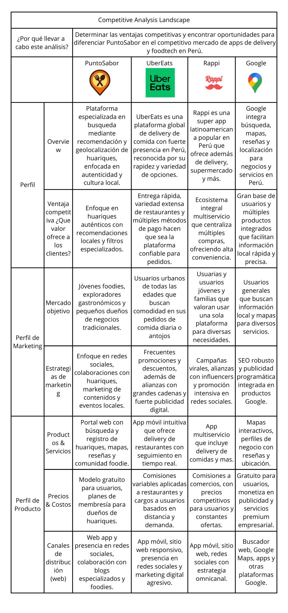
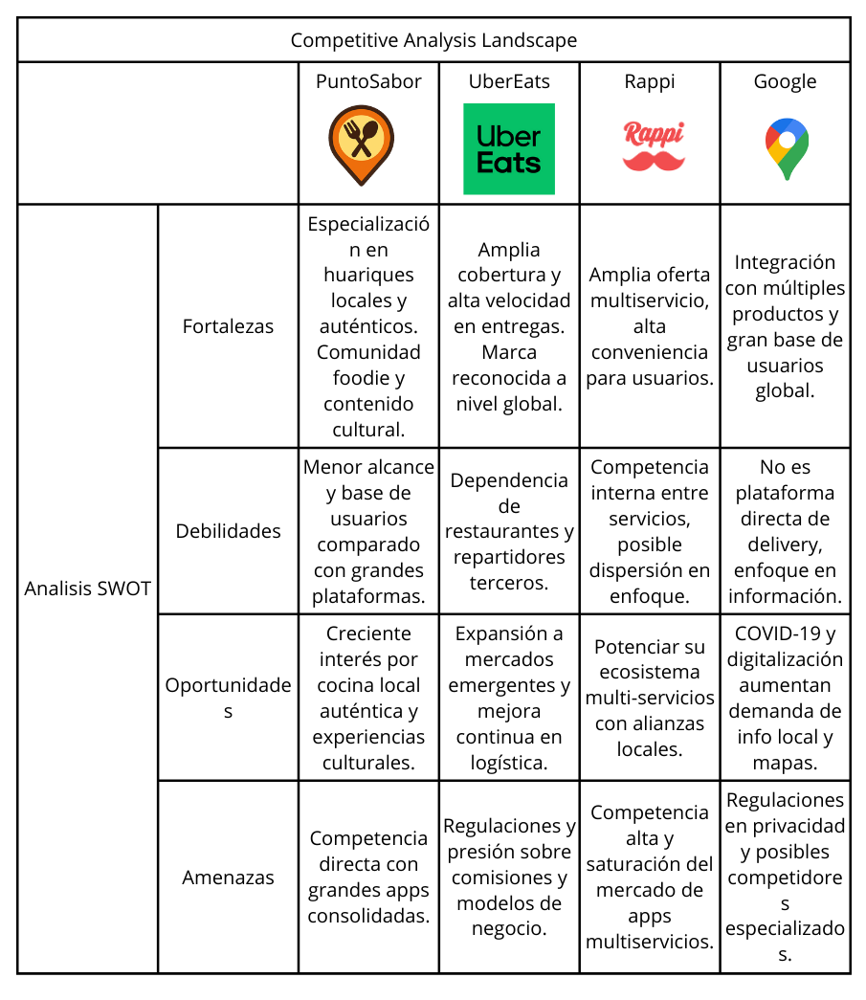

PuntoSabor se distingue por su enfoque exclusivo en huariques, brindando un lugar especializado para pequeños establecimientos de comida tradicional que normalmente no son resaltados en otras plataformas. Asimismo, incluye funciones concretas como la administración directa de huariques por sus propietarios, un sistema de reseñas y evaluaciones enfocado en estos establecimientos y un modelo de membresía para aumentar la visibilidad.

### 2.1.2. Estrategias y tácticas frente a competidores.  

Con el fin de diferenciar a PuntoSabor de otras plataformas más grandes y posicionarse dentro del mercado de huariques, se plantean las siguientes estrategias y tácticas:

Estrategias:

- Enfocar la plataforma en huariques y pequeños negocios de comida local poco conocidos, permitiendo ofrecer una experiencia más auténtica que no suele encontrarse en aplicaciones tradicionales.

- Incentivar la participación de usuarios y propietarios mediante reseñas, recomendaciones y contenido real, con el objetivo de generar mayor confianza dentro de la plataforma.

- Implementar un modelo de ingresos basado en membresías y publicidad accesible, pensado para que los dueños de huariques puedan promocionarse sin necesidad de realizar grandes inversiones.

Tácticas:

- Utilizar publicidad en redes sociales y buscadores, enfocada en zonas urbanas donde existe presencia de huariques, para atraer tanto usuarios como propietarios.

- Establecer alianzas con ferias, eventos y organizaciones gastronómicas para dar mayor visibilidad a la plataforma e incorporar nuevos huariques.

- Asegurar que la aplicación sea fácil de usar, rápida y accesible, incluyendo herramientas simples para registrar y actualizar información, así como un sistema de mapas intuitivo.

- Promover la participación mediante incentivos como descuentos, beneficios o reconocimientos para usuarios y dueños que interactúan activamente.

- Implementar un sistema de retroalimentación que permita recoger sugerencias y mejorar la plataforma de manera continua.

## 2.2. Entrevistas
### 2.2.1. Diseño de entrevistas

Segmento 1: Exploradores Gastronómicos (Usuarios de la app móvil)

Objetivo: Entender sus motivaciones, comportamientos y expectativas al usar una app móvil para descubrir comida local auténtica.

Preguntas Segmento 1:
- ¿Con qué frecuencia usas aplicaciones móvil para buscar lugares para comer fuera de lo común?
- ¿Cómo sueles descubrir huariques o lugares de comida poco conocidos en la móvil?
- ¿Qué aspectos valoras más al elegir un lugar para comer usando una app móvil (precio, ubicación, reseñas, fotos, etc.)?
- ¿Qué dificultades has tenido al usar apps móvil para buscar lugares de comida local?
- ¿Qué te motivaría a usar una app móvil dedicada exclusivamente a huariques?
- ¿Qué funcionalidades en la app móvil considerarías imprescindibles para usarla con regularidad?
- ¿Qué preocupaciones o barreras tendrías al usar una app móvil para descubrir huariques?

Segmento 2: Dueños y Administradores de Huariques (Usuarios que usan la app móvil para gestionar su huarique).

Objetivo: Entender lo que necesita y espera al utilizar la aplicación móvil para gestionar y publicitar sus huariques.

Preguntas Segmento 2:
- ¿Actualmente usas alguna plataforma móvil o digital para promocionar tu huarique? ¿Cuál?
- ¿Qué retos has enfrentado al tratar de gestionar tu negocio a través de plataformas digitales?
- ¿Qué tan cómodo te sientes usando aplicaciones móvil para actualizar la información de tu negocio?
- ¿Qué características te harían decidirte a usar una app móvil especializada para huariques?
- ¿Qué tipo de soporte o facilidades esperarías al usar esta app móvil para gestionar tu perfil o negocio?
- ¿Qué modelo de tarifas o membresías considerarías justo para usar esta plataforma?
- ¿Qué resultados te gustaría ver después de usar esta aplicación móvil para promocionar tu huarique?

### 2.2.2. Registro de entrevistas
**Segmento #1: Exploradores Gastronómicos (Usuarios de la app móvil)**
| Número de entrevista | Datos del entrevistado                                                                 | Evidencia de entrevista |
|-----------------------|-----------------------------------------------------------------------------------------|--------------------------|
| 1                     | **Nombre:**  Vitaly Baca  <br> **Edad:** 20  <br> **Distrito:** Lurin <br><br> **Resumen:** Vitaly Baca, un estudiante de 20 años que está estudiando Ingeniería de Software en la UPC, emplea estas aplicaciones durante casi todos los fines de semana, ya que le gusta salir a conocer lugares nuevos con su pareja o amigos. Encuentra la mayoría de los huariques en Instagram y TikTok siguiendo a foodies, además de buscar en Google Maps. Lo que primero aprecia es el precio, puesto que como estudiante posee un presupuesto limitado, y después las fotos y los comentarios de confianza para no terminar en un lugar inapropiado. Señala entre los obstáculos que ha tenido que afrontar que, a veces, llega a lugares que parecen abiertos pero están cerrados, y también que muchas huariques pequeñas no aparecen en las aplicaciones. Siempre que contenga críticas honestas de usuarios semejantes a él, se sentiría motivado para utilizar una aplicación exclusiva de huariques. Considera esenciales recomendaciones personalizadas, filtros según tipo de comida y precio, así como un mapa rápido e intuitivo. Sus inquietudes más importantes serían que la aplicación esté saturada de anuncios, contenga información poco confiable o incluya escasos sitios en su ciudad, lo que haría que pierda su valor. | 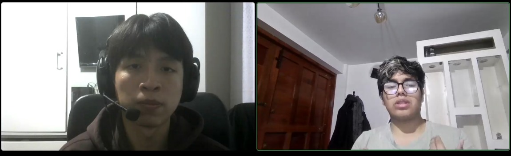 <br> [📂 Ver entrevista](https://drive.google.com/file/d/1NSQkOkLNAq3A-IIhc4_lm2q3UwWDaylk/view?usp=sharing) 00:00 - 05:37|


| Número de entrevista | Datos del entrevistado                                                                 | Evidencia de entrevista |
|-----------------------|-----------------------------------------------------------------------------------------|--------------------------|
| 2                     | **Nombre:** Sebastian del Rio  <br> **Edad:** 20  <br> **Distrito:** Chorrillos <br><br> **Resumen:** Sebastián del Río, un estudiante de 20 años que estudia Ingeniería de Software en la UTP, no tiene el hábito de emplear con regularidad aplicaciones móvil para encontrar huariques; lo hace solamente una o dos veces al mes cuando desea salir con sus amigos o experimentar algo diferente. Con frecuencia, encuentra la mayoría de los lugares a través de Google Maps, pero principalmente por sugerencias en Instagram y TikTok. Para él, lo fundamental al seleccionar un lugar es la proximidad, el precio y las imágenes y comentarios auténticos de otros clientes. Indica como mayor obstáculo el hecho de que los huariques no suelen aparecer en las aplicaciones, y que son más frecuentes los restaurantes conocidos. También menciona que la información está frecuentemente incompleta o carece de buenas imágenes. Lo incentivaría a utilizar una aplicación que sea simple y que muestre sitios verdaderos y seguros. Ten en cuenta elementos indispensables como fotografías auténticas, reseñas sinceras, un mapa con la ubicación, filtros de precio y la posibilidad de guardar favoritos. Lo que más le inquietaría es que la información no fuera confiable, que la aplicación lo dirija a lugares cerrados o de baja calidad, o que sea lenta y compleja. |  <br> [📂 Ver entrevista](https://drive.google.com/file/d/1NSQkOkLNAq3A-IIhc4_lm2q3UwWDaylk/view?usp=sharing) 05:37 - 09:56|


| Número de entrevista | Datos del entrevistado                                                                 | Evidencia de entrevista |
|-----------------------|-----------------------------------------------------------------------------------------|--------------------------|
| 3                     | **Nombre:** Luis Fernandez  <br> **Edad:** 20  <br> **Distrito:** Pueblo Libre <br><br> **Resumen:** Luis Fernández, un estudiante de 20 años que se encuentra cursando la carrera de Ingeniería de Sistemas en la UTP, explora sitios nuevos cada semana, especialmente los fines de semana cuando está con su pareja. Se orienta por cuentas de amantes de la comida en Instagram y TikTok, guarda videos para ver más tarde y revisa críticas en Google Maps o grupos de Facebook. Para él, el precio es crucial, pero también le da importancia a la experiencia total: comentarios sobre la calidad de los alimentos y el servicio, así como imágenes de los platos. Ha enfrentado dificultades con horarios obsoletos en aplicaciones, al llegar a sitios que estaban cerrados y con la escasa visibilidad de huariques menos famosos. Lo motivaría una aplicación fiable que se centre en huariques y tenga opiniones de personas del lugar. Un mapa interactivo, sugerencias personalizadas y filtros por tipo de comida, ubicación y costo son elementos que consideras esenciales. Sus inquietudes son que la aplicación tenga demasiada publicidad, información falsa o que no ofrezca suficientes alternativas locales. |  <br> [📂 Ver entrevista](https://drive.google.com/file/d/1P5WpXLAtHH9lsgnF7tXXyMJiK7xsN05h/view?usp=sharing) 09:56 - 13:01|

**Segmento #2: Dueños y Administradores de Huariques (Usuarios que usan la app móvil para gestionar su huarique)**
| Número de entrevista | Datos del entrevistado                                                                 | Evidencia de entrevista |
|-----------------------|-----------------------------------------------------------------------------------------|--------------------------|
| 1                     | **Nombre:** Wildor Villalobos  <br> **Edad:** 28  <br> **Distrito:** Santiago de Surco <br><br> **Resumen:** Dueño de un establecimiento que vende pan con chicharrón. Utiliza Instagram y TikTok (principalmente IG Reels); las publicaciones son útiles para promociones, pero los reels generan más movimiento. Obstáculos: competencia y algoritmo, es necesario pagar para llegar a más personas. Desea que la aplicación le deje destacar su negocio y observar métricas claras (cuántas personas lo encuentran, qué tan eficaz es para atraer clientes), a través de gráficos directos y un panel sencillo. Estaría dispuesto a pagar S/ 20–50/mes si rinde igual o mejor que IG/TikTok. Objetivo: aumentar ventas. |  <br> [📂 Ver entrevista](https://drive.google.com/file/d/1P5WpXLAtHH9lsgnF7tXXyMJiK7xsN05h/view?usp=sharing) 00:00 - 03:15|


| Número de entrevista | Datos del entrevistado                                                                 | Evidencia de entrevista |
|-----------------------|-----------------------------------------------------------------------------------------|--------------------------|
| 2                     | **Nombre:** Piero Tapia  <br> **Edad:** 26  <br> **Distrito:** Jesús María <br><br> **Resumen:** Dueño de un establecimiento de venta de sándwiches. Hoy en día, la falta de presupuesto y experiencia limitada en redes y pagos en línea hacen que dependa de la afluencia local; no le parece intuitiva la afiliación a aplicaciones. Es importante que la aplicación sea sencilla de aprender y utilizar, así como que tenga comisiones bajas (que no encarezcan sus productos). Solicita orientación y soporte para aprender a utilizar la herramienta y optimizar el negocio, además de visibilidad. Sugiere planes de forma escalonada (principiante, intermedio y avanzado). Éxito esperado: un mayor número de personas que consuman en el local (no solo lo visiten). |  <br> [📂 Ver entrevista](https://drive.google.com/file/d/1P5WpXLAtHH9lsgnF7tXXyMJiK7xsN05h/view?usp=sharing) 03:15 - 08:14|


| Número de entrevista | Datos del entrevistado                                                                 | Evidencia de entrevista |
|-----------------------|-----------------------------------------------------------------------------------------|--------------------------|
| 3                     | **Nombre:** Gabriela Vasquez  <br> **Edad:** 23  <br> **Distrito:** Pueblo libre <br><br> **Resumen:** Dueña de un establecimiento de jugos artesanales. Hasta el momento, está principalmente condicionado por los clientes que pasan por la zona, debido a que su presupuesto es reducido y no tiene mucha experiencia con las plataformas digitales de venta o las redes sociales. Se queja de que le parece un poco confuso afiliarse a aplicaciones de pago o de entrega. Encuentra una aplicación que sea fácil de usar, que tenga comisiones bajas y que le permita hacer publicidad de sus productos sin dificultades. Asimismo, le gustaría tener a su disposición tutoriales o asesoramiento que la asistan en el aprendizaje del empleo de la herramienta y en el fomento de su negocio. Sugiere tener niveles de uso progresivos para avanzar gradualmente. Su objetivo es aumentar la cantidad de clientes que visitan su juguería, no solo establecer una presencia en línea. | 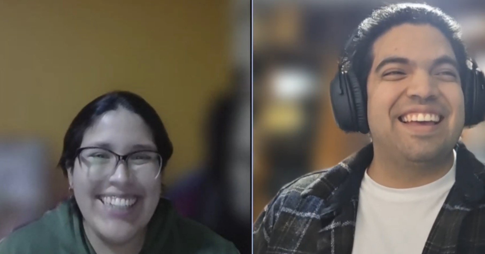 <br> [📂 Ver entrevista](https://drive.google.com/file/d/15Qma_86tWBnnfWBWlx28-MLKOQJRCrI2/view?usp=drive_link) |


### 2.2.3. Análisis de entrevistas
**Segmento #1: Exploradores Gastronómicos (Usuarios de la app móvil)**
---
**Hallazgos:**
**👨 Vitaly Baca**

Le gusta salir con su pareja o sus amigos para conocer sitios nuevos, por lo que usa aplicaciones móvil casi todos los fines de semana. Utiliza Google Maps y sigue a foodies en Instagram y TikTok para descubrir la mayoría de huariques. Aprecia el precio por ser estudiante, pero también la fiabilidad de las fotos y los comentarios. Además de que numerosas tiendas pequeñas no aparecen en las aplicaciones, ha habido inconvenientes con locales que se muestran abiertos pero estaban cerrados.Si cuenta con críticas honestas de usuarios parecidos, se incentivaría el uso de una aplicación enfocada únicamente en huariques. Piensa que son imprescindibles los filtros de tipo de comida y precio, un mapa rápido e intuitivo y sugerencias personalizadas. Sus inquietudes son que la aplicación contenga escasa información en su ciudad, que esté llena de publicidad o que tenga datos poco fiables.
**Puntos clave:**
- Usa apps de búsqueda gastronómica con frecuencia (fines de semana).  
- Descubre lugares principalmente en **TikTok, Instagram y Google Maps**.  
- Valora sobre todo el **precio**, seguido de **fotos y reseñas confiables**.  
- Ha tenido problemas con **información desactualizada** y huariques que no aparecen.  
- Se motiva por una app exclusiva con reseñas sinceras.  
- Considera imprescindibles **filtros, mapa interactivo y recomendaciones personalizadas**.  
- Le preocupa la **publicidad excesiva** y la **poca cobertura local**.  


**👨 Sebastián del Río**

No utiliza con mucha regularidad aplicaciones para buscar huariques, solamente una o dos veces al mes cuando tiene ganas de salir con amigos o hacer algo diferente. Conoce los lugares, sobre todo en Instagram y TikTok, y de vez en cuando en Google Maps. Cuando se trata de escoger un lugar, considera principalmente las reseñas y fotos verdaderas, además del precio y la proximidad. Ha presentado como problema el que los huariques escasean en las aplicaciones, ya que se imponen los restaurantes conocidos y la información es frecuentemente incompleta o carece de fotos de calidad. Siempre que sea fácil de usar, se sentiría motivado a emplear una aplicación que realmente exhiba lugares auténticos y fiables. Para él, son indispensables fotografías auténticas, calificaciones sinceras, un mapa interactivo con la localización y filtros de precio, así como la oportunidad de guardar elementos favoritos. Su inquietud es que la información no sea fiable, que lo envíen a sitios de mala calidad o cerrados y que la aplicación sea lenta o complicada.

**Puntos clave:**
- Usa apps **esporádicamente** (1–2 veces al mes).  
- Descubre huariques en **redes sociales** y a veces en Google Maps.  
- Valora **fotos, reseñas reales, precio y cercanía**.  
- Problemas: **huariques invisibles, info incompleta y fotos deficientes**.  
- Se motiva por una app **auténtica y confiable**.  
- Imprescindibles: **fotos reales, reseñas honestas, mapa interactivo, filtros y favoritos**.  
- Preocupaciones: **información falsa, lugares cerrados, app lenta o complicada**.  

**👨 Luis Fernández**

Cada semana busca sitios nuevos, especialmente los fines de semana con su pareja. Se orienta por las cuentas de amantes de la comida en TikTok e Instagram, guarda videos para consultarlos después y examina opiniones en Facebook y Google Maps. Valora mucho el precio, aunque también le da relevancia a la experiencia total: comentarios sobre la atención, calidad de los alimentos y fotografías de los platos. Entre los obstáculos que menciona, se encuentran los horarios de las aplicaciones desactualizados, que lo conducen a locales cerrados, y la escasa visibilidad de huariques menos populares. Se incentivaría el uso de una aplicación fiable que dé prioridad a los huariques que tengan reseñas escritas por personas del lugar. Un mapa interactivo, sugerencias personalizadas y filtros por tipo de comida, ubicación y costo son elementos que consideras esenciales. Sus inquietudes son las siguientes: que la aplicación contenga demasiada publicidad, información engañosa o no ofrezca suficientes alternativas locales.

**Puntos clave:**
- Usa apps **frecuentemente**, casi cada semana.  
- Descubre lugares en **TikTok, Instagram, Google Maps y Facebook**.  
- Valora **precio, experiencia completa, fotos y reseñas sobre atención/comida**.  
- Problemas: **horarios desactualizados, falta de visibilidad de huariques pequeños**.  
- Se motiva por una app **confiable y enfocada en huariques**.  
- Imprescindibles: **filtros por comida, precios y ubicación, mapa interactivo, recomendaciones**.  
- Preocupaciones: **publicidad excesiva, información falsa, pocas opciones locales**.

A partir de los resultados obtenidos en este segmento, se puede ver que existe un patrón claro en el comportamiento de los usuarios. En general, los exploradores gastronómicos buscan constantemente nuevas opciones, pero dependen en gran parte de redes sociales como TikTok e Instagram para descubrir lugares.

Sin embargo, todos coinciden en que las aplicaciones actuales no muestran suficientes huariques o presentan información poco confiable, como horarios desactualizados o falta de reseñas reales. Esto genera una experiencia poco segura al momento de elegir un lugar.

Además, se repite la importancia de contar con filtros, mapas interactivos y recomendaciones personalizadas, lo que indica que los usuarios valoran herramientas que faciliten la búsqueda y reduzcan el riesgo de equivocarse.

Por eso, se puede entender que existe una necesidad clara de una plataforma más confiable, enfocada en huariques y con información actualizada.

---
**Segmento #2: Dueños y Administradores de Huariques**
**👨 Wildor Villalobos (28 años)**

Para difundir su negocio de pan con chicharrón, emplea sobre todo **Instagram y TikTok**, aunque los **reels** son más eficaces que las publicaciones habituales. El principal desafío que afronta es la **competencia**, el obstáculo de **comprender el algoritmo** y la exigencia de destinar dinero a publicidad para obtener más visibilidad.

Se siente **a gusto** al utilizar aplicaciones móvil, siempre que sean **útiles y sencillas de manejar**. Aprecia bastante las **métricas claras** acerca de cuántos clientes lo descubren y cómo llegan a su restaurante. Le agradan las interfaces sencillas, con gráficos directos y comunicación lineal.

En cuanto al **modelo de pago**, ya invierte mensualmente entre **S/ 20 y S/ 50 en Instagram**. Por lo tanto, estaría dispuesto a invertir la misma cantidad en una aplicación especializada, siempre que esta le proporcione un rendimiento igual o superior en términos de atracción de clientes. La principal expectativa que tiene es que la aplicación **eleve sus ventas** de un modo significativo.

**Puntos clave:**  
- Usa **Instagram y TikTok** (prefiere reels).  
- Problemas: **competencia alta, algoritmos complicados, inversión en publicidad**.  
- Cómodo con apps móvil si son **efectivas y simples**.  
- Valora **métricas claras y directas** (clientes alcanzados, interacciones, impacto real).  
- Prefiere **interfaz simple con gráficos directos y comunicación lineal**.  
- Dispuesto a pagar **20–50 soles/mes** si rinde igual o mejor que Instagram/TikTok.  
- Expectativa central: que la app **genere más clientes y ventas**.  
**👨 Piero Tapia (26 años)**

Propietario de un local de sándwiches. Su clientela llega sobre todo por la localización física de su negocio; hoy en día no usa plataformas web para promocionarse. Señala que tiene escaso conocimiento en redes sociales y que no dispone de un presupuesto adecuado para campañas de marketing digital, lo cual le dificulta proyectar una buena imagen online.

La **falta de conocimientos sobre el manejo digital**, la complejidad para atraer al público adecuado y las dificultades para entender procedimientos como **las afiliaciones a aplicaciones de entrega o los pagos online** son algunos de sus principales desafíos. Como cliente ha utilizado aplicaciones de pedidos, pero como empresa no siente que pueda afiliarse porque no le parecen intuitivas. 

Si una aplicación especializada es **fácil de entender y utilizar**, con **comisiones bajas** que no encarecen sus productos, se incentivaría su uso porque eso tiene un impacto negativo en la demanda. Además, espera que la aplicación le proporcione **guía y soporte** para adquirir habilidades en su uso y optimizar su gestión a lo largo del tiempo. Sugiere que el modelo de tarifas/membresías sea **escalonado** (para principiantes, negocios intermedios y avanzados) a fin de no dejar fuera a las empresas que están en sus inicios.

Su principal expectativa es que la aplicación le produzca **un incremento en el número de clientes reales y las ventas**, no solamente visibilidad sin conversión.

**Puntos clave:**  
-En la actualidad, no emplea plataformas en línea; su negocio depende del **tráfico físico** en el local.  
- Problemas: **Dificultades con los pagos online y las afiliaciones, falta de presupuesto, escaso conocimiento digital.**  
- Como cliente, emplea aplicaciones de comida, pero no las utiliza como negocio (no son intuitivas).  
- Evalúa: **la sencillez de uso, las comisiones bajas y la guía o soporte práctico para aprender**.  
- Propone un **sistema de tarifas escalonado** (para principiantes, intermedios y avanzados).  
- Expectativa: **Incrementar las ventas y atraer a más clientes reales**, además de la visibilidad.

**👩‍🦰 Gabriela Vasquez (23 años)**

Propietaria de una **juguería artesanal** situada en un barrio con mucho tráfico. En la actualidad, su negocio se basa en el **boca a boca y el tránsito local**, puesto que no emplea plataformas digitales o redes sociales para hacer publicidad. Dice que no tiene mucha familiaridad con las herramientas en línea y que le parecen **poco intuitivas** las alternativas de suscribirse a aplicaciones de delivery o de pagos online.

Su mayor desafío es **obtener visibilidad sin sacrificar la simplicidad** que distingue a su juguería. Intenta captar nuevos clientes sin la necesidad de invertir sumas elevadas en publicidad o de enredarse con procesos tecnológicos. Ten en cuenta que la aplicación sea **fácil de usar, clara y atractiva**, incluso para aquellos que no tienen un conocimiento previo del marketing digital.

Además, le gustaría que la aplicación proporcionara **soporte y consejos prácticos** para aprender a utilizar la herramienta de manera óptima, lo que incluye sugerencias para sobresalir su empresa frente a otras competidoras. Piensa que es beneficioso un **sistema de planes por niveles** (básico, intermedio, avanzado) que se ajuste al crecimiento de la empresa sin requerir grandes desembolsos iniciales.

Su objetivo fundamental es que la aplicación lo asista para **incrementar el número de clientes en su negocio de jugos**, sobre todo aquellos que buscan alternativas naturales o saludables en las cercanías.

**Puntos clave:**  
- No utiliza aplicaciones ni redes sociales para hacer publicidad; se basa en el **tráfico local y el boca a boca**.  
- Problemas: **poca experiencia en el ámbito digital, dificultades con las suscripciones y los pagos online**.  
- Valora: **Diseño atractivo, facilidad de uso y guía por pasos**.  
- Busca **visibilidad verdadera sin altos costos de publicidad**.  
- Se inclina por un **modelo de membresía escalonado** (básico, intermedio y avanzado).  
- Expectativa: **Consolidar la identidad de su negocio y hacer crecer la clientela que va en persona**.

En el caso de los dueños de huariques, se puede ver que la mayoría enfrenta dificultades relacionadas con el uso de herramientas digitales. Muchos no utilizan plataformas por falta de conocimiento o porque consideran que son complicadas.

También se repite el problema del presupuesto, ya que no pueden invertir grandes cantidades en publicidad como lo hacen los negocios más grandes. A pesar de esto, muestran interés en soluciones que sean simples, accesibles y que realmente les generen resultados.

Otro punto importante es que valoran mucho el acompañamiento, como guías o soporte, lo que indica que no solo necesitan una plataforma, sino también ayuda para aprender a usarla.

Por eso, se puede concluir que la solución debe ser fácil de usar, económica y enfocada en generar resultados como atraer más clientes y aumentar las ventas.

## 2.3. Needfinding
### 2.3.1. User Personas
Se han creado dos perfiles de usuario o personas representativas para entender con mayor precisión las motivaciones, necesidades y conductas de los usuarios principales de PuntoSabor. Estos perfiles resumen los rasgos, metas y desafíos comunes de los segmentos principales, lo que simplifica el desarrollo de la plataforma al diseñarla con enfoque en el usuario y tomar decisiones estratégicas.

- Persona  1: Carla, la Exploradora Gastronómica

   Carla simboliza a los usuarios jóvenes y activos, que buscan probar nuevas opciones de comida, especialmente aquellas que son auténticas y económicas. Este tipo de usuario valora poder encontrar huariques de forma sencilla a través de plataformas digitales, siempre que estas ofrezcan información clara, fotos reales y reseñas confiables.

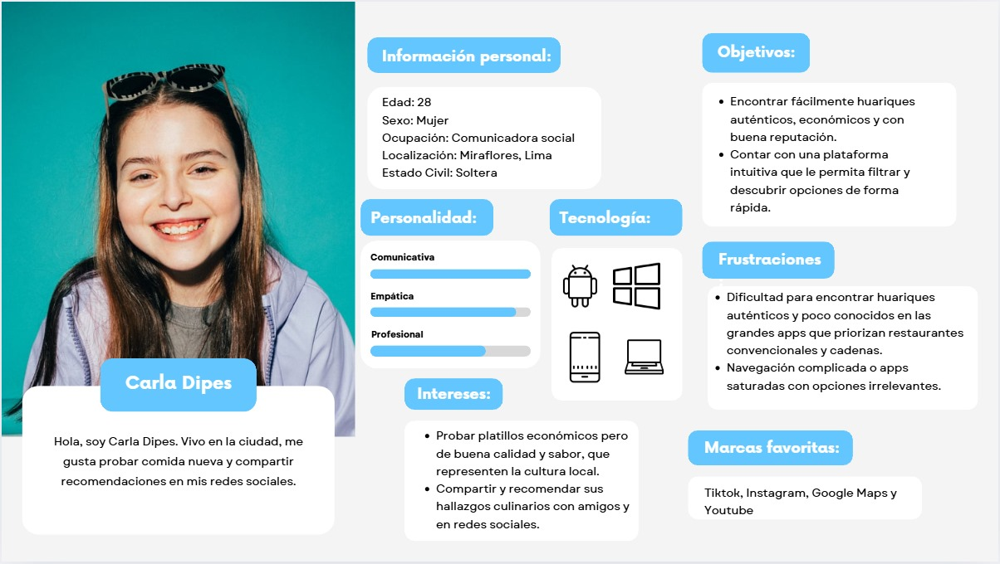

- Persona 2: Don Luis, dueño de huarique tradicional
Don Luis representa a los dueños de huariques y a los emprendedores pequeños que buscan una forma simple de dar a conocer su negocio. No tiene mucha experiencia con tecnología, por lo que necesita herramientas fáciles de usar y que no impliquen gastos altos.
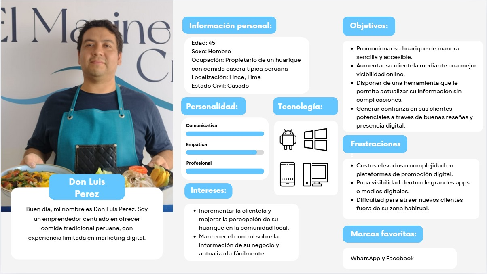

### 2.3.2. User Task Matrix


Los perfiles de usuario en PuntoSabor presentan diferencias notables en sus tareas habituales, dependiendo de las necesidades y el rol de cada uno. Como exploradora gastronómica, Carla Dípes emplea la aplicación móvil de manera continua y activa para buscar huariques, leer reseñas y utilizar la función de mapas con geolocalización. Para ella, estas actividades son fundamentales para su experiencia. Por otro lado, Don Luis Pérez, propietario de huarique, no suele emplear la aplicación para buscar o ver mapas; su interés principal es actualizar la información de su huarique, tarea que lleva a cabo con frecuencia y considera esencial. Los dos individuos se comunican de vez en cuando utilizando la función de responder reseñas y compartir fotografías u opiniones, aunque Don Luis lo hace con menos frecuencia, pero sigue siendo significativo en términos de importancia.

Coincidencias:
- Ambos utilizan, en menor medida, la función de responder reseñas, considerándola de importancia media.

- Carla tiene una frecuencia más alta que los demás en lo que respecta a compartir fotos y opiniones, aunque todos comparten una actitud media hacia la importancia de hacerlo.

- Para los dos perfiles, las funciones que tienen que ver con la interacción social y la comunidad son de importancia media.
  
Diferencias:
- Carla usa con frecuencia la búsqueda de huariques y el mapa, mientras que Don Luis casi no utiliza estas funciones debido a su enfoque más administrativo.

- La actualización de la información de su huarique es una tarea que Carla no lleva a cabo, pero Don Luis invierte más tiempo y la considera importante.

- Carla presenta un alto nivel de interacción con funciones de exploración, mientras que Don Luis tiene una participación menor en este aspecto.

### 2.3.3. User Journey Mapping
Segmento 1

Con el uso de este artefacto se analizará y entenderá cómo los usuarios del segmento 1 (Exploradores Gastronómicos) llevan a cabo sus tareas con el fin de lograr sus metas desde su punto de vista. Este segmento está constituido por individuos que persiguen vivencias gastronómicas auténticas y asequibles, indagando en huariques menos conocidos y apreciando los datos fidedignos suministrados por medio de imágenes, mapas de localización y reseñas.

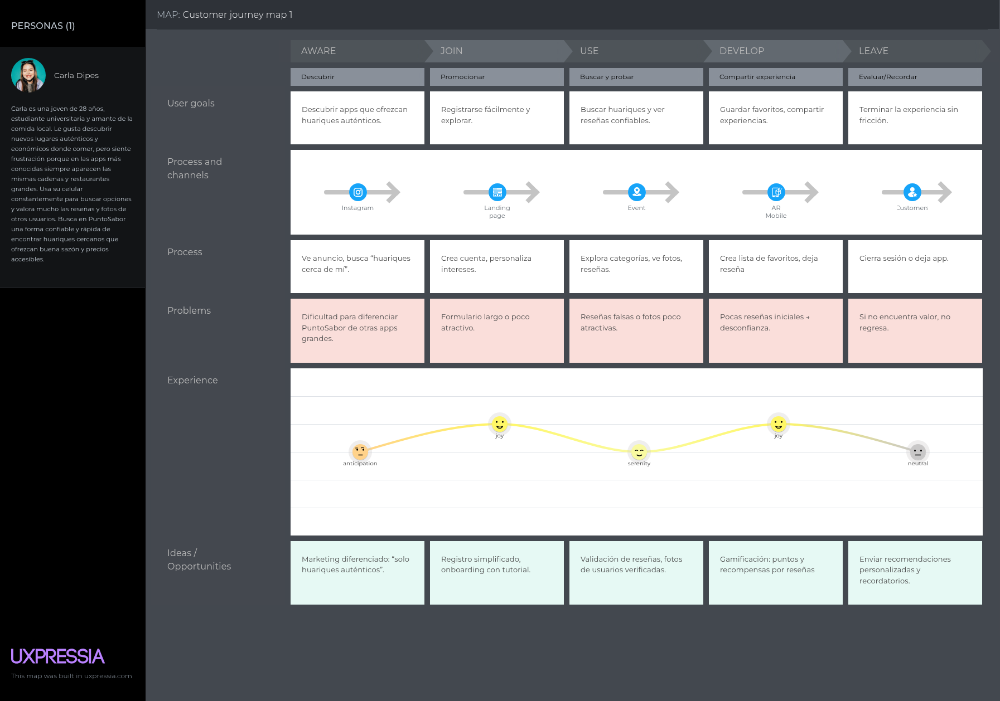

Segmento 2

Este artefacto permitirá explicar y entender la manera en que los usuarios del segmento 2 (dueños y administradores de huariques) llevan a cabo sus actividades para lograr sus metas desde su punto de vista. Este segmento está conformado por pequeños empresarios que buscan promover su empresa, incrementar su visibilidad y captar nuevos clientes a través de una plataforma fácil de administrar y accesible, sin requerir conocimientos técnicos sofisticados.

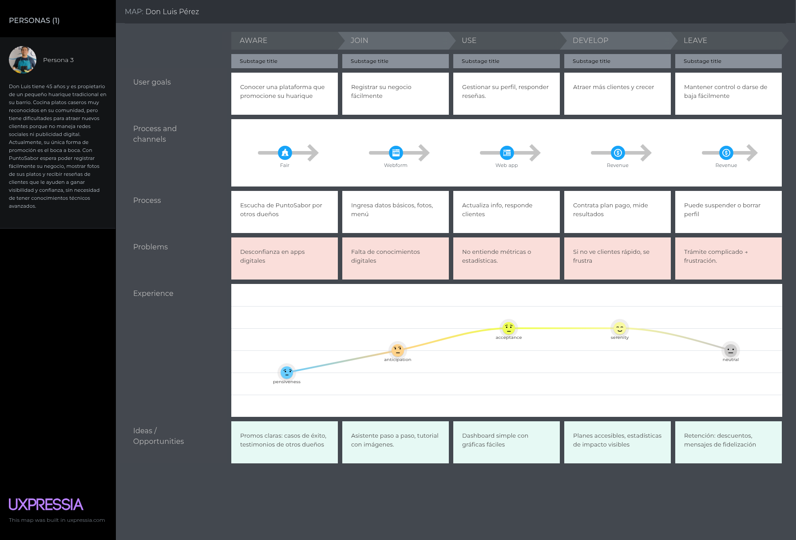

### 2.3.4. Empathy Mapping
Los siguientes mapas de empatía corresponden a los dos perfiles principales de usuarios de PuntoSabor: Carla Dípes, la exploradora de la gastronomía, y Don Luis Pérez, propietario de un huarique tradicional. Estos mapas posibilitan entender a fondo sus sentimientos, pensamientos, necesidades y conductas, lo que contribuye a que el diseño esté orientado hacia el usuario.

- Segmento 1:

La carta de empatía de Carla revela que es una clienta que desea experiencias culinarias locales únicas y autenticidad. Considera que es fácil hallar información fiable y se siente frustrada por la abundancia de opciones genéricas en otras plataformas.
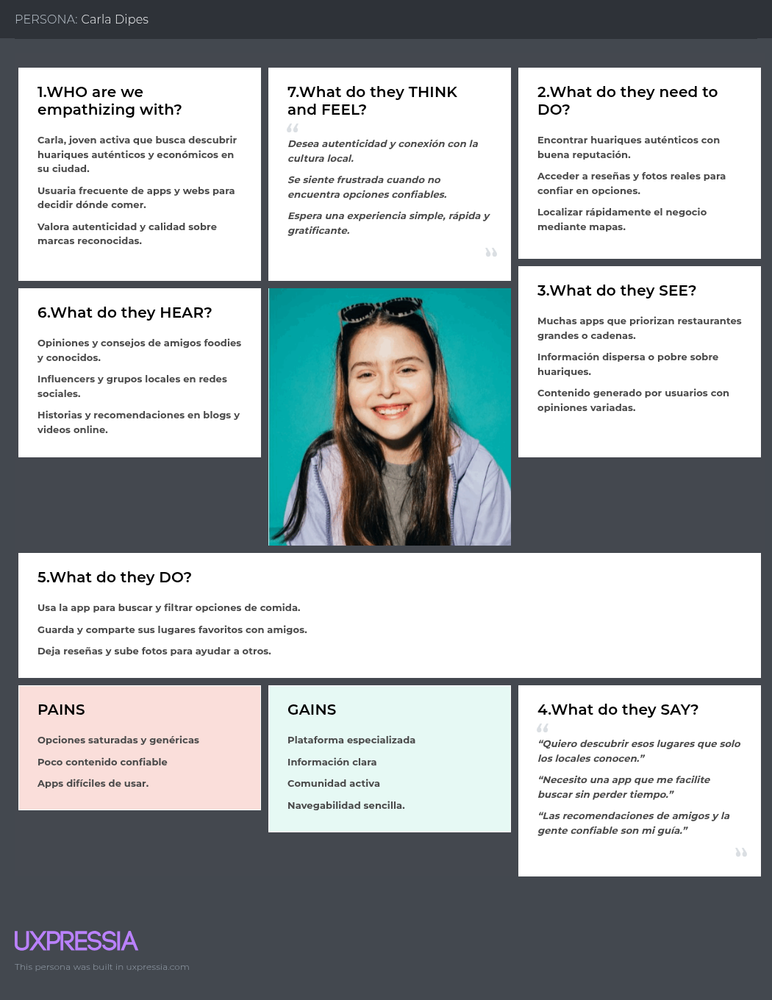

- Segmento 2:

El mapa de empatía de Don Luis muestra a un empresario con restricciones tecnológicas, que requiere una herramienta simple para administrar su huarique y expandir su clientela. Busque apoyo y soluciones asequibles que le permitan tener presencia en línea sin altos costos.


**As-is Scenario Mapping**
Segmento 1

Con este artefacto, se ha desarrollado el As-is Scenario Mapping para la primera franja (Exploradores Gastronómicos). Este panorama muestra la manera en que los usuarios que desean descubrir huariques llevan a cabo sus actividades hoy en día, los obstáculos a los que se enfrentan al buscar alternativas económicas y auténticas, además de las sensaciones y percepciones que sienten en cada fase de su recorrido.

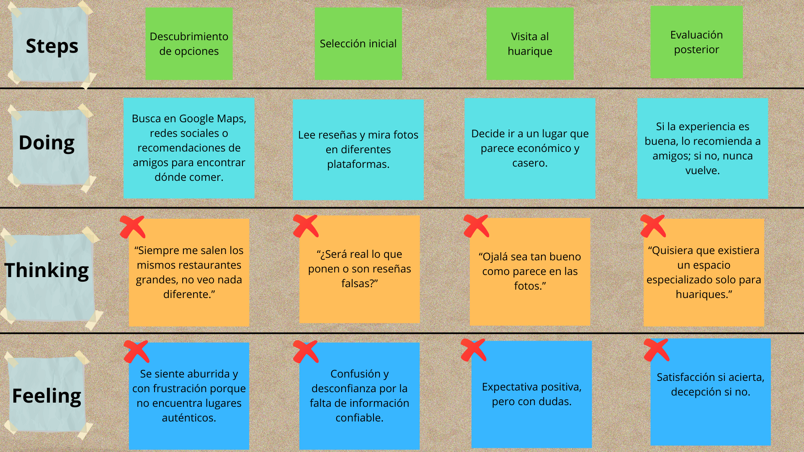

Segmento 2

Con este instrumento se ha realizado el As-is Scenario Mapping para el segundo grupo (los propietarios y administradores de huariques). Esta situación muestra la manera en que los emprendedores de pequeña escala administran hoy en día la promoción y organización de sus negocios, destacando las limitaciones tecnológicas, los procesos manuales y las emociones relacionadas con su necesidad de atraer nuevos clientes y obtener más visibilidad.

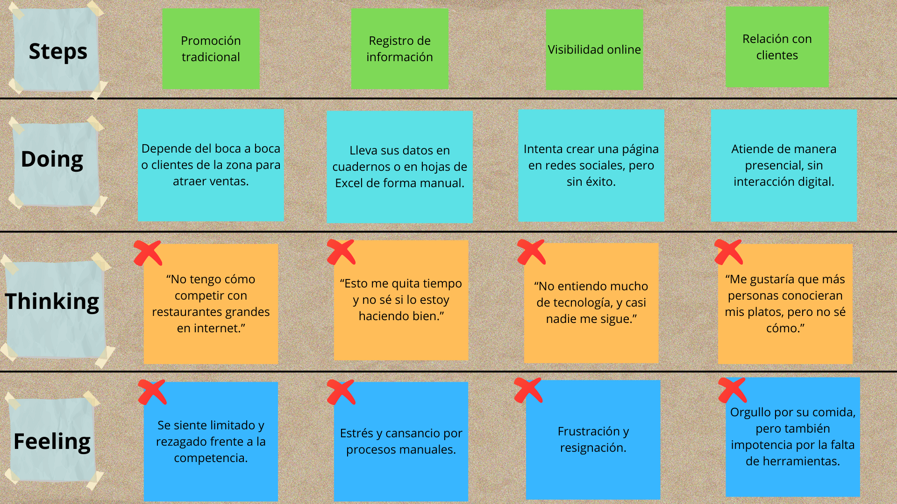

### 2.3.5. Big Picture EventStorming

Pasos para el event storming:

Step 1: Unstructured Exploration


Step 2: Timelines


Step 3: Paint Points


Step 4: Pivotal Points


Step 5: commands


Step 6: Policies


Step 7: Read Models


Step 8: External system


Step 9: Aggregates


Step 10: Bounded Contexts


Link del miro: 

https://miro.com/welcomeonboard/N1ZUMVF3dkJEMXY1VTIvR0hhWisyQlFnU1VFYU1UVVFGOFNVKzdGS3FVOFJ1ZWRaNUI3L3NyMGcxNTRqSkN4bUZTZGo1N2VVbVNITTIvc3p2c1V6emNGUEprWThGdVg0SGsvRmtwSWJzTzR3dTVQVG5Hb1ZzWlRuK0tUM2hZSU9nbHpza3F6REdEcmNpNEFOMmJXWXBBPT0hdjE=?share_link_id=673091896888

### 2.3.6. Ubiquitous Language

En esta parte se muestra el glosario de términos fundamentales del ámbito de PuntoSabor, que están escritos en inglés y acompañados de su traducción al español entre paréntesis. Cada definición tiene como objetivo que la comunicación entre todos los miembros del equipo y los interesados sea coherente y clara, así como eliminar ambigüedades y alinear el lenguaje de la empresa.

Glosario:

- Huarique (Huarique): Restaurante peruano tradicional, que normalmente es familiar o local, famoso por su cocina auténtica, accesible y casera. Es el núcleo de la propuesta de PuntoSabor.

- Gastronomic Explorer (Explorador culinario): Persona interesada en descubrir nuevas experiencias gastronómicas, especialmente huariques auténticos, económicos y poco conocidos.

- Huarique Owner (Propietario de Huarique): Persona encargada de administrar un huarique, que incluye la elaboración de los platos, la atención al cliente y la gestión general del negocio.

- Review (reseña): Opinión o valoración escrita por un consumidor acerca de su vivencia en un huarique, que contiene observaciones sobre la calidad de los platos, el servicio y el ambiente.

- Recommendation (Recomendación): Recomendación hecha por un cliente para que otros visitantes tengan la oportunidad de conocer o probar un huarique específico.

- Favorite (Favorito): Huarique es un cliente que recuerda o enfatiza como favorito debido a la calidad de su experiencia, y al que desea volver a visitar o sugerir.

- Culinary Tradition (Tradición Culinaria): Conjunto de hábitos, recetas y prácticas culinarias típicas de los huariques, que enriquecen culturalmente la vivencia gastronómica.

- Community Interaction (Interacción Comunitaria): Interacción entre los clientes y los propietarios de huariques a través del intercambio de experiencias, reseñas, sugerencias y conversaciones que aumentan la confianza y el reconocimiento de sus empresas.
  X
- Membership (Membresía): Plan o suscripción que permite a los propietarios obtener mayor visibilidad y beneficios dentro de la plataforma.

## 2.4. Requirements specification

### 2.4.1. User Stories

_Pendiente de completar._

### 2.4.2. Impact Mapping

_Pendiente de completar._

### 2.4.3. Product Backlog

_Pendiente de completar._

## 2.5. Strategic-Level Domain-Driven Design

### 2.5.1. EventStorming

_Pendiente de completar._

#### 2.5.1.1. Candidate Context Discovery

_Pendiente de completar._

#### 2.5.1.2. Domain Message Flows Modeling

_Pendiente de completar._

#### 2.5.1.3. Bounded Context Canvases

_Pendiente de completar._

### 2.5.2. Context Mapping

_Pendiente de completar._

### 2.5.3. Software Architecture

#### 2.5.3.1. Software Architecture Context Level Diagrams

_Pendiente de completar._

#### 2.5.3.2. Software Architecture Container Level Diagrams

_Pendiente de completar._

#### 2.5.3.3. Software Architecture Deployment Diagrams

_Pendiente de completar._

## 2.6. Tactical-Level Domain-Driven Design

### 2.6.x. Bounded Context: <Bounded Context Name>

_Pendiente de completar._

#### 2.6.x.1. Domain Layer

_Pendiente de completar._

#### 2.6.x.2. Interface Layer

_Pendiente de completar._

#### 2.6.x.3. Application Layer

_Pendiente de completar._

#### 2.6.x.4. Infrastructure Layer

_Pendiente de completar._

#### 2.6.x.5. Bounded Context Software Architecture Component Level Diagrams

_Pendiente de completar._

#### 2.6.x.6. Bounded Context Software Architecture Code Level Diagrams

_Pendiente de completar._

##### 2.6.x.6.1. Bounded Context Domain Layer Class Diagrams

_Pendiente de completar._

##### 2.6.x.6.2. Bounded Context Database Design Diagram

_Pendiente de completar._

# Capítulo III: Solution UI/UX Design

## 3.1. Product design

### 3.1.1. Style Guidelines

#### 3.1.1.1. General Style Guidelines

_Pendiente de completar._

### 3.1.2. Information Architecture

#### 3.1.2.1. Organization Systems

_Pendiente de completar._

#### 3.1.2.2. Labelling Systems

_Pendiente de completar._

#### 3.1.2.3. SEO Tags and Meta Tags

_Pendiente de completar._

#### 3.1.2.4. Searching Systems

La aplicación móvil de HuariqueHub ofrece sistemas de búsqueda diseñados para que el usuario encuentre lo que necesita sin esfuerzo:

- **Búsqueda en catálogo:** localización de huariques por nombre, tipo de comida o distrito.  
- **Filtros avanzados:** por rango de precios, valoración de usuarios, ubicación geográfica y promociones activas.  
- **Mapa interactivo:** permite aplicar filtros visuales y seleccionar huariques desde su ubicación exacta.  
- **Búsqueda en reseñas:** posibilidad de filtrar comentarios por calificación (positivas/negativas) o por temas (precio, atención, sabor).  
De esta manera se evita que el usuario se sienta perdido entre la cantidad de opciones disponibles y se mejora la eficiencia en la exploración.

#### 3.1.2.5. Navigation Systems

La navegación de PuntoSabor combina claridad, consistencia y adaptabilidad:

- **Landing Page (Desktop):** menú superior con navegación horizontal que permite acceder rápidamente a las secciones principales. Desplegada en GitHub Pages.  
- **Landing Page (Móvil):** menú tipo hamburguesa con navegación vertical, optimizado para pantallas pequeñas.  
- **Aplicación Móvil (Android/Kotlin):** navegación entre pantallas mediante Jetpack Compose Navigation, con acceso a Login, Registro, Home, Detalle de Huarique y otras pantallas core.  
- **CTAs estratégicos:** botones prominentes en el color primario de la paleta para guiar al usuario a acciones críticas como buscar huariques, registrar un negocio o activar una promoción.  

En conjunto, estos sistemas garantizan que los usuarios puedan recorrer la plataforma de forma intuitiva, cumpliendo sus metas sin obstáculos.


### 3.1.3. Landing Page UI Design

La interfaz de la landing page es clave para el proyecto, pues constituye la primera impresión del producto. Debe ofrecer una experiencia estética y funcional que atraiga de inmediato a los visitantes y los impulse a seguir explorando.

#### 3.1.3.1. Landing Page Wireframe

Landing Page para Desktop Web Browser


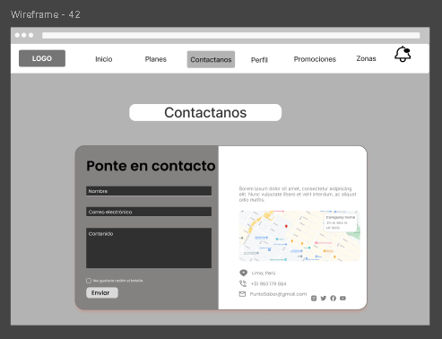

Landing Page para Mobile Web Browse


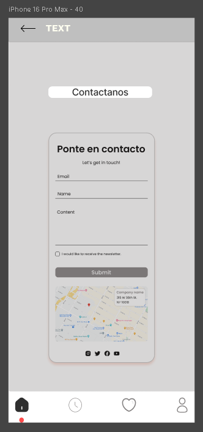

#### 3.1.3.2. Landing Page Mock-up

Esta sección presenta y explica los Mock-ups del Landing Page, tanto en su versión para Desktop Web Browser como Mobile Web Browser. En la propuesta y la explicación debe evidenciarse la aplicación de los principios, elementos de diseño, diseño inclusivo y arquitectura de información, así como el Design System establecido para los productos digitales.


### 3.1.4. Mobile Applications UX/UI Design

El diseño de experiencia de usuario (UX) e interfaz de usuario (UI) en aplicaciones móviles se centra en crear una interacción fluida y optimizada para entornos táctiles y dispositivos portátiles. La UX prioriza la usabilidad en movimiento, diseñando arquitecturas de información y flujos de navegación simplificados que responden a los gestos naturales del usuario. Por otro lado, la UI define la identidad visual mediante la creación de componentes adaptables, tipografías legibles y una paleta de colores coherente que garantiza la claridad en pantallas de diversos tamaños. La integración de ambos aspectos permite desarrollar una aplicación intuitiva, estéticamente profesional y capaz de ofrecer una respuesta rápida y eficiente a las necesidades del usuario final.

#### 3.1.4.1. Mobile Applications Wireframes

Representación esquemática de la estructura y flujo de navegación de la aplicación móvil, diseñada para definir la jerarquía de información y la disposición de los elementos antes de su implementación visual.

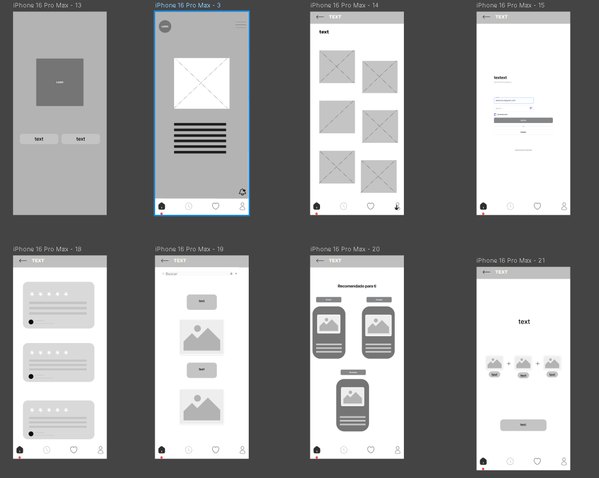


#### 3.1.4.2. Mobile Applications Wireflow Diagrams

_Pendiente de completar._

#### 3.1.4.3. Mobile Applications Mock-ups

Representaciones visuales de alta fidelidad que integran la identidad de marca, incluyendo la paleta de colores, tipografía e iconografía final, para simular la apariencia real y estética de la interfaz en dispositivos móviles.

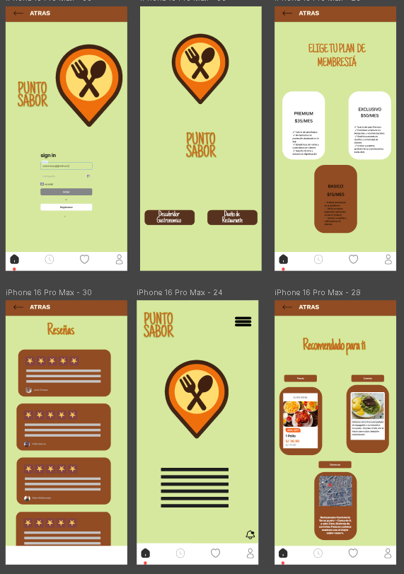


#### 3.1.4.4. Mobile Applications User Flow Diagrams

_Pendiente de completar._

#### 3.1.4.5. Mobile Applications Prototyping

_Pendiente de completar._

# Capítulo IV: Product Implementation & Validation

## 4. Product Implementation & Validation

## 4.1. Software Configuration Management

En esta sección se detalla cómo se implementa, organiza y publica HuariqueHub, compuesto por tres componentes principales:

1. **Landing Page (HTML/CSS/JS estático):** publicada en GitHub Pages.
2. **Backend (C#/.NET 8):** API REST desplegada en Railway.
3. **Aplicación Móvil (Android/Kotlin con Jetpack Compose):** la interfaz principal del usuario, con las pantallas core de la plataforma.

El objetivo es mantener la consistencia del desarrollo entre los tres componentes y documentar las convenciones de código para futuras iteraciones.

### 4.1.1. Software Development Environment Configuration

**Landing Page (HuariqueHub-Landing)**
- Tecnologías: HTML5, CSS3, JavaScript (vanilla).
- Responsive Web Design: CSS (Flexbox/Grid + media queries).
- Editor: Visual Studio Code.
- Control de versiones: Git + GitHub.
- Plataforma de despliegue: GitHub Pages.

Estructura:
- `index.html` (página principal)
- `css/style.css` (hoja de estilos)
- `img/` (recursos de imágenes)

**Backend (HuariqueHub-Backend)**
- Framework: .NET 8
- Lenguaje: C#
- IDE: Visual Studio 2022 o Visual Studio Code con extensión C#.
- Control de versiones: Git + GitHub.
- Plataforma de despliegue: Railway.

**Aplicación Móvil (HuariqueHub-App)**
- Lenguaje: Kotlin
- Framework UI: Jetpack Compose
- Nombre del proyecto: `HuariqueHub-Mobile`
- IDE: Android Studio.
- Control de versiones: Git + GitHub.

### 4.1.2. Source Code Management

**Repositorios GitHub (actual)**
- `HuariqueHub-Landing` (Landing Page estática HTML/CSS/JS, desplegada en GitHub Pages).
- `HuariqueHub-Backend` (API REST en C#/.NET 8, desplegada en Railway).
- `HuariqueHub-App` (Aplicación móvil Android/Kotlin con Jetpack Compose).

**Flujo de trabajo (GitFlow ligero)**
- **Ramas principales**
  - `main`: versión estable publicada.
  - `develop`: integración previa a publicación.
- **Ramas de apoyo**
  - `feature/*`: nuevas funcionalidades o mejoras (p. ej., `feature/US01-home-screen`, `feature/auth-login`).
  - `hotfix/*`: correcciones urgentes sobre `main`.

**Versionado Semántico**
- **X (major)**: cambios incompatibles (reestructura global de navegación/archivos).
- **Y (minor)**: nuevas secciones o funcionalidades compatibles.
- **Z (patch)**: correcciones menores (estilos, textos, enlaces).
- Ejemplos: `v1.0`, `v1.1`.

**Conventional Commits**

Formato general:
```
<type>[scope]: <descripción>
```
Ejemplos:
- `feat: agregar pantalla de home con lista de huariques`
- `feat(auth): implementar pantalla de login con Jetpack Compose`
- `fix(api): corregir endpoint de búsqueda por distrito`
- `docs: actualizar pasos de despliegue en README`

### 4.1.3. Source Code Style Guide & Conventions

**Landing Page — HTML**
- Estructura semántica: `<header>`, `<nav>`, `<main>`, `<section>`, `<footer>`.
- Imágenes siempre con `alt`.
- Enlaces relativos y consistentes entre páginas.
- Scripts JS al final del `body` cuando corresponda.

**Landing Page — CSS**
- Uso de variables CSS (`:root { --color... }`) para colores y espaciados.
- Convención de clases en kebab-case (ej.: `.hero-title`, `.card-grid`).
- Layout con Flexbox y/o Grid.
- Media queries para puntos de quiebre (ej.: 960px, 760px, 560px).
- Estados y accesibilidad: `:hover`, `:focus-visible`, contraste adecuado.

**Landing Page — JavaScript**
- `const` / `let` (evitar `var`), funciones pequeñas y claras.
- Separar lógica de interacción del DOM cuando sea posible.
- Uso moderado de `localStorage` solo para preferencias/estado del cliente (si aplica).

**Backend — C# / .NET 8**
- Nombres en PascalCase para clases, métodos y propiedades.
- Estructura de capas: Domain, Application, Infrastructure, Presentation.
- Inyección de dependencias mediante el contenedor DI nativo de .NET.
- Métodos asíncronos con `async/await` (Task/Task<T>) para operaciones I/O.
- Documentación con comentarios XML (`///`) en métodos y clases públicas.

**Aplicación Móvil — Kotlin / Jetpack Compose**
- Variables y funciones en camelCase; clases y Composables en PascalCase.
- Composables pequeños, reutilizables y sin estado cuando sea posible.
- Navegación centralizada mediante `AppNavigation.kt` con Jetpack Compose Navigation.
- Corrutinas de Kotlin para operaciones asíncronas.
- Separación clara entre UI (`ui/screens/`) y datos (`data/model/`).

### 4.1.4. Software Deployment Configuration

_Pendiente de completar._

## 4.2. Landing Page & Mobile Application Implementation

### 4.2.1. Sprint n

#### 4.2.1.1. Sprint Planning n

_Pendiente de completar._

#### 4.2.1.2. Sprint Backlog n

_Pendiente de completar._

#### 4.2.1.3. Development Evidence for Sprint Review

_Pendiente de completar._

#### 4.2.1.4. Testing Suite Evidence for Sprint Review

_Pendiente de completar._

#### 4.2.1.5. Execution Evidence for Sprint Review

_Pendiente de completar._

#### 4.2.1.6. Services Documentation Evidence for Sprint Review

_Pendiente de completar._

#### 4.2.1.7. Software Deployment Evidence for Sprint Review

_Pendiente de completar._

#### 4.2.1.8. Team Collaboration Insights during Sprint

_Pendiente de completar._

## 4.3. Validation Interviews

### 4.3.1. Diseño de Entrevistas

_Pendiente de completar._

### 4.3.2. Registro de Entrevistas

_Pendiente de completar._

### 4.3.3. Evaluaciones según heurísticas

_Pendiente de completar._

# Conclusiones

## Conclusiones y recomendaciones.

Este primer avance ha permitido establecer las bases conceptuales y analíticas del proyecto PuntoSabor. A través de la definición del problema, el análisis competitivo, las entrevistas con ambos segmentos objetivo y el needfinding, se logró comprender con mayor profundidad la realidad que enfrentan tanto los exploradores gastronómicos como los dueños de huariques en el entorno digital actual.

Los hallazgos obtenidos confirman que existe una oportunidad real y concreta: los huariques carecen de representación digital adecuada, y los usuarios que buscan ese tipo de experiencia gastronómica no cuentan con herramientas diseñadas para ellos. Esta brecha valida la propuesta de PuntoSabor como solución especializada y diferenciada.

Como siguiente paso, el proyecto avanzará hacia la definición de requerimientos funcionales y el diseño de la arquitectura de la solución, tomando como base todo lo trabajado en este primer avance.

# Video App Validation

_Pendiente de completar._

# Video About the product

https://drive.google.com/drive/folders/1Iqb5Lz3YxKQMyos2Oyqczd73CZMvspKV?usp=drive_link

# Video About the team

https://drive.google.com/drive/folders/1Iqb5Lz3YxKQMyos2Oyqczd73CZMvspKV?usp=drive_link

# Glosario

_Pendiente de completar._

# Bibliografía

- Brown, A., & Evans, E. (2004). Domain-Driven Design: Tackling Complexity in the Heart of Software. Addison-Wesley.

- Brandolini, A. (2019). Introducing EventStorming: An Act of Deliberate Collective Learning. Leanpub.

- Gothelf, J., & Seiden, J. (2013). Lean UX: Applying Lean Principles to Improve User Experience. O’Reilly Media.

- Cohn, M. (2004). User Stories Applied: For Agile Software Development. Addison-Wesley.

- Sommerville, I. (2011). Ingeniería de Software (9ª ed.). Pearson Educación.

- DDD By Examples. (s.f.). Design Level Event Storming Guide. Recuperado de: https://github.com/ddd-by-examples/library

- Pressman, R. (2014). Ingeniería del Software: Un Enfoque Práctico. McGraw-Hill.

- Fowler, M. (2003). Patterns of Enterprise Application Architecture. Addison-Wesley.

# Anexos

VIDEOS DEL EQUIPO:

https://drive.google.com/drive/folders/1Iqb5Lz3YxKQMyos2Oyqczd73CZMvspKV?usp=drive_link