<div align="center">

<br>

<strong>Universidad Peruana de Ciencias Aplicadas</strong><br>
<strong>Ingeniería de Software</strong><br>
<strong>Periodo: 202610</strong><br>
<strong>Curso: 1ACC0238 - Aplicaciones para Dispositivos Móviles</strong><br>
<strong>NRC: 3248</strong><br>
<strong>Docente: David Gerardo Quevedo Velasco</strong><br>

<br><strong>Informe de Trabajo Final</strong><br><br>

<strong>Startup: HuariqueHub</strong><br>
<strong>Producto: PuntoSabor</strong><br>

<br>

<strong>Relación de integrantes en orden alfabético por apellido</strong>

| Código | Apellidos y nombres |
|:------:|:--------------------|
| u20171a518 | Becerra Llempen, Fabiola Dayane |
| u202321843 | Delgado Carrasco, Schneider |
| u202312700 | Lopez Goitia, Carlos Alberto |
| u20241c134 | Tumi Oliden, Manuel Ignacio |
| u202019871 | Vasquez Goicochea, Erick Alessander |

<strong>Abril 2026</strong><br>

</div>

<div style="page-break-after: always;"></div>

# Registro de Versiones del Informe

<table>
  <tr>
    <th>Versión</th>
    <th>Fecha</th>
    <th>Autor</th>
    <th>Descripción de modificación</th>
  </tr>

  <tr>
    <td>AV1</td>
    <td>2026-04-20</td>
    <td>
      <ul> 
        <li>Delgado Carrasco, Schneider</li> 
        <li>Lopez Goitia, Carlos Alberto</li> 
        <li>Tumi Oliden Manuel Ignacio</li>
        <li>Becerra Llempen, Fabiola Dayane</li>
        <li>Vasquez Goicochea, Erick Alessander</li>
      </ul>
    </td>
    <td>
      Se han incluido los siguientes capítulos:
      <ul>
        <li>Carátula</li>
        <li>Registro de Versiones del informe</li>
        <li>Project Report Collaboration Insights</li>
        <li>Contenido</li>
        <li>Student Outcome</li>
        <li>Capítulo I: Presentación</li>
        <li>Capítulo II: Requirements Development and Software Solution Design</li>
        <li>Conclusiones</li>
        <li>Bibliografía</li>
        <li>Anexos</li>
      </ul>
    </td>
  </tr>

  <tr>
    <td>TB1</td>
    <td>2026-05-11</td>
    <td>
      <ul> 
        <li>Delgado Carrasco, Schneider</li> 
        <li>Lopez Goitia, Carlos Alberto</li> 
        <li>Tumi Oliden Manuel Ignacio</li>
        <li>Becerra Llempen, Fabiola Dayane</li>
        <li>Vasquez Goicochea, Erick Alessander</li>
      </ul>
    </td>
    <td>
      Se han actualizado y complementado los capítulos desarrollados en la AV1. Asimismo, se han incluido los siguientes apartados:
      <ul>
        <li>Corrección y mejora de User Stories</li>
        <li>Incorporación de criterios de aceptación enfocados en requisitos funcionales</li>
        <li>Product Backlog</li>
        <li>Strategic-Level Domain-Driven Design (DDD)</li>
        <li>Context Mapping</li>
        <li>Software Architecture</li>
        <li>Capítulo IV: Mobile Applications UX/UI Design</li>
        <li>Mobile Applications Wireflow</li>
        <li>Mobile Applications Wireflow Diagrams</li>
        <li>Mobile Applications Mock-ups</li>
        <li>Mobile Applications User Flow Diagrams</li>
        <li>Mobile Applications Prototyping</li>
        <li>Sprint Planning</li>
        <li>Sprint Backlog</li>
        <li>Development Evidence for Sprint Review</li>
        <li>Testing Suite Evidence for Sprint Review</li>
        <li>Services Documentation Evidence for Sprint Review</li>
        <li>Software Deployment Evidence for Sprint Review</li>
        <li>Actualización de conclusiones</li>
        <li>Actualización de bibliografía y anexos</li>
      </ul>
    </td>
  </tr>

  <tr>
    <td>AV2</td>
    <td>2026-06-18</td>
    <td>
      <ul>
        <li>Delgado Carrasco, Schneider</li>
        <li>Lopez Goitia, Carlos Alberto</li>
        <li>Tumi Oliden Manuel Ignacio</li>
        <li>Becerra Llempen, Fabiola Dayane</li>
        <li>Vasquez Goicochea, Erick Alessander</li>
      </ul>
    </td>
    <td>
      Se atendió la retroalimentación del AV1 y se prepararon los artefactos para el AV2. Principales cambios:
      <ul>
        <li>Mejora del Problem Statement mediante la reformulación del 5W2H y Lean UX Problem Statements</li>
        <li>Adecuación de las User Stories a la plantilla oficial, incluyendo las columnas Usuario, Prioridad y Epic</li>
        <li>Definición y organización de Epics EP01–EP10</li>
        <li>Product Backlog vinculado al documento y a la herramienta de gestión Trello, con captura y URL pública</li>
        <li>Roadmap de Sprints hasta la entrega del Trabajo Final, considerando Sprint 1, Sprint 2 y Sprint 3</li>
        <li>Backend desplegado en un sitio público con documentación mediante Swagger en Railway</li>
        <li>Actualización de conclusiones, bibliografía y anexos</li>
      </ul>
    </td>
  </tr>

  <tr>
    <td>TB2</td>
    <td>2026-07-08</td>
    <td>
      <ul>
        <li>Delgado Carrasco, Schneider</li>
        <li>Lopez Goitia, Carlos Alberto</li>
        <li>Tumi Oliden Manuel Ignacio</li>
        <li>Becerra Llempen, Fabiola Dayane</li>
        <li>Vasquez Goicochea, Erick Alessander</li>
      </ul>
    </td>
    <td>
      Se desarrolló y consolidó la versión final del informe para la entrega TB2 - Release Review. Principales cambios:
      <ul>
        <li>Actualización del Registro de Versiones del Informe</li>
        <li>Actualización de Project Report Collaboration Insights</li>
        <li>Actualización de la sección Student Outcome</li>
        <li>Corrección y mejora de los artefactos previamente presentados</li>
        <li>Inclusión del Capítulo IV: Product Implementation &amp; Validation</li>
        <li>Presentación del desarrollo y evidencias correspondientes al Sprint 3</li>
        <li>Actualización final del Product Backlog y Sprint Backlog</li>
        <li>Inclusión de evidencias de implementación para el Sprint Review</li>
        <li>Inclusión de evidencias de pruebas para el Sprint Review</li>
        <li>Inclusión de evidencias de documentación de servicios mediante Swagger</li>
        <li>Inclusión de evidencias de despliegue del software</li>
        <li>Evidencia del Landing Page desplegado</li>
        <li>Evidencia del backend desplegado al 100% en un sitio público con su documentación</li>
        <li>Evidencia del despliegue de la aplicación móvil mediante Firebase App Distribution u otro servicio similar</li>
        <li>Inclusión de la versión final del video de validación de la aplicación</li>
        <li>Inclusión de la versión final del video About-the-Product</li>
        <li>Inclusión de la versión final del video About-the-Team</li>
        <li>Actualización final de conclusiones</li>
        <li>Actualización final de bibliografía y anexos</li>
      </ul>
    </td>
  </tr>
</table>

<div style="page-break-after: always;"></div>

# Project Report Collaboration Insights

URL del repositorio del informe: https://github.com/HuariqueHub/report/tree/main

Para la entrega TB2, el equipo consolidó la versión final del informe en formato Markdown, registrando los aportes mediante commits en GitHub y documentando las evidencias correspondientes al Sprint 3.

Evidencias de colaboración:

- Captura de commits del repositorio del informe:

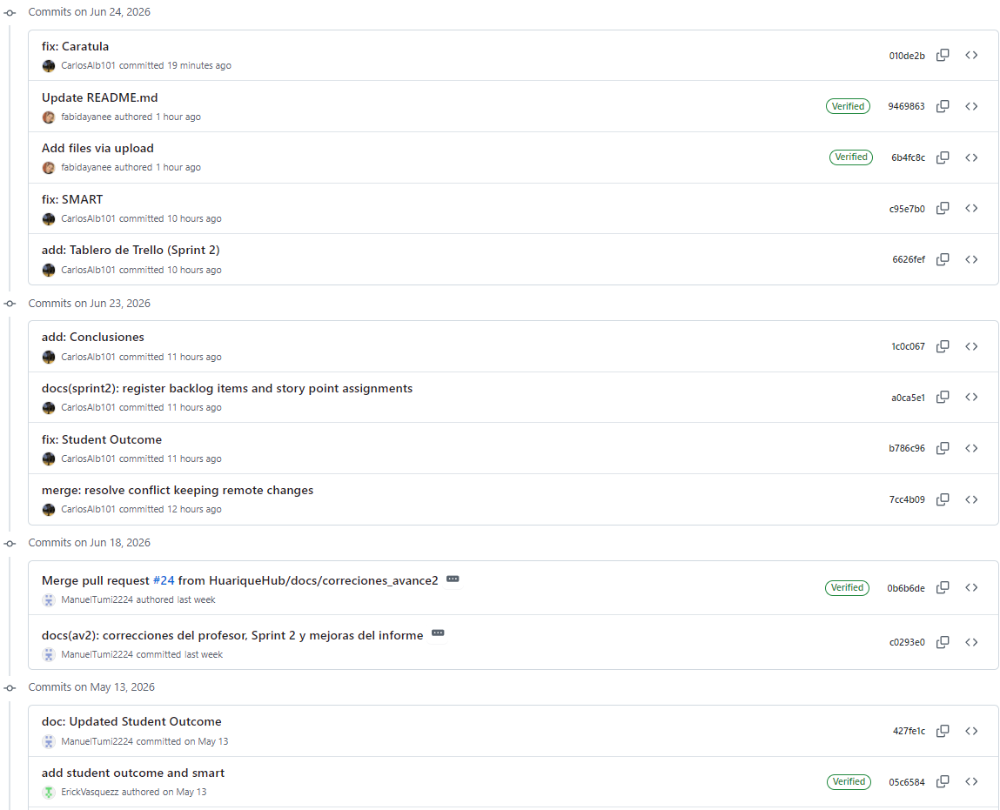

- Captura de contributors/insights de GitHub:

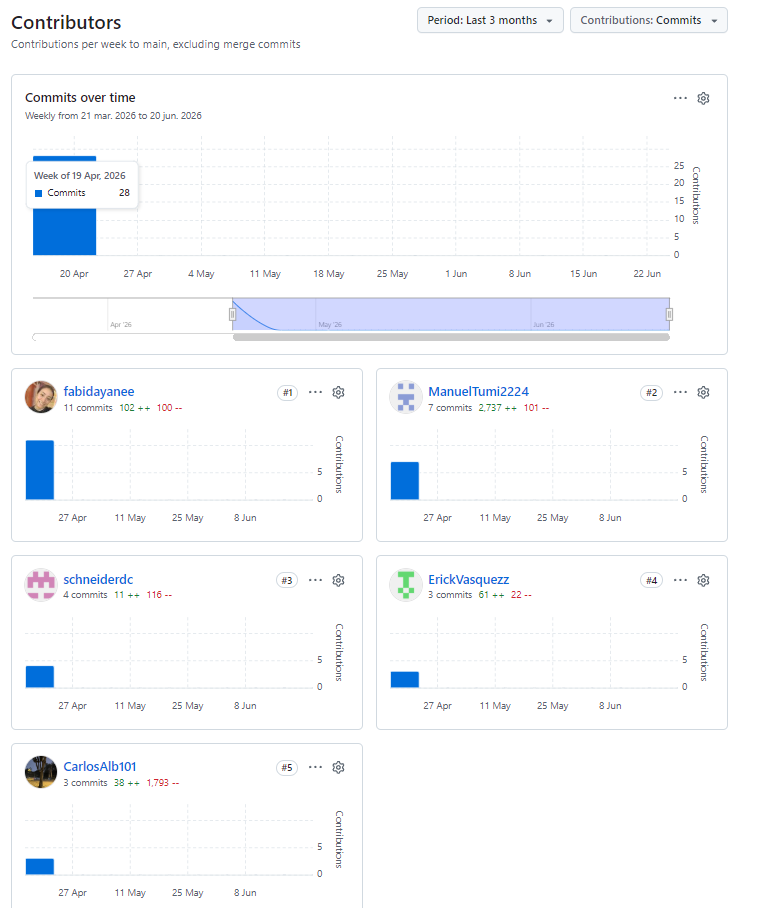

- Resumen de participación por integrante:

| Integrante | Participación |
|---|---|
| Delgado Carrasco, Schneider | Verificó los contratos de la API y consolidó las evidencias de servicios correspondientes al Sprint 3, validando la documentación del backend mediante Swagger. |
| Lopez Goitia, Carlos Alberto | Actualizó la estructura final del informe para la entrega TB2, incorporando el desarrollo del Sprint 3 y las evidencias de implementación de las funcionalidades finales. |
| Tumi Oliden, Manuel Ignacio | Documentó la integración y funcionamiento de las funcionalidades finales de la aplicación móvil, incluyendo la validación de flujos principales y persistencia de sesión. |
| Becerra Llempen, Fabiola Dayane | Documentó las evidencias de ejecución y validación de la aplicación, incluyendo capturas de pantallas finales, pruebas de uso y revisión de la experiencia del usuario. |
| Vasquez Goicochea, Erick Alessander | Documentó el Sprint Planning 3, Sprint Backlog 3, evidencias de despliegue, colaboración del equipo y actualización final de anexos del informe. |

<div style="page-break-after: always;"></div>

# Contenido

## Tabla de contenidos

- [Registro de Versiones del Informe](#registro-de-versiones-del-informe)
- [Project Report Collaboration Insights](#project-report-collaboration-insights)
- [Contenido](#contenido)
- [Student Outcome](#student-outcome)
- [Objetivos SMART](#objetivos-smart)
- [Capítulo I: Presentación](#capítulo-i-presentación)
  - [1.1. Startup Profile](#11-startup-profile)
    - [1.1.1. Descripción de la Startup](#111-descripción-de-la-startup)
    - [1.1.2. Perfiles de integrantes del equipo](#112-perfiles-de-integrantes-del-equipo)
  - [1.2. Solution Profile](#12-solution-profile)
    - [1.2.1. Antecedentes y problemática](#121-antecedentes-y-problemática)
    - [1.2.2. Lean UX Process](#122-lean-ux-process)
      - [1.2.2.1. Lean UX Problem Statements](#1221-lean-ux-problem-statements)
      - [1.2.2.2. Lean UX Assumptions](#1222-lean-ux-assumptions)
      - [1.2.2.3. Lean UX Hypothesis Statements](#1223-lean-ux-hypothesis-statements)
      - [1.2.2.4. Lean UX Canvas](#1224-lean-ux-canvas)
  - [1.3. Segmentos objetivo](#13-segmentos-objetivo)
- [Capítulo II: Requirements Development and Software Solution Design](#capítulo-ii-requirements-development-and-software-solution-design)
  - [2.1. Competidores](#21-competidores)
    - [2.1.1. Análisis competitivo](#211-análisis-competitivo)
    - [2.1.2. Estrategias y tácticas frente a competidores](#212-estrategias-y-tácticas-frente-a-competidores)
  - [2.2. Entrevistas](#22-entrevistas)
    - [2.2.1. Diseño de entrevistas](#221-diseño-de-entrevistas)
    - [2.2.2. Registro de entrevistas](#222-registro-de-entrevistas)
    - [2.2.3. Análisis de entrevistas](#223-análisis-de-entrevistas)
  - [2.3. Needfinding](#23-needfinding)
    - [2.3.1. User Personas](#231-user-personas)
    - [2.3.2. User Task Matrix](#232-user-task-matrix)
    - [2.3.3. User Journey Mapping](#233-user-journey-mapping)
    - [2.3.4. Empathy Mapping](#234-empathy-mapping)
    - [2.3.5. Big Picture EventStorming](#235-big-picture-eventstorming)
    - [2.3.6. Ubiquitous Language](#236-ubiquitous-language)
  - [2.4. Requirements specification](#24-requirements-specification)
    - [2.4.1. User Stories](#241-user-stories)
    - [2.4.2. Impact Mapping](#242-impact-mapping)
    - [2.4.3. Product Backlog](#243-product-backlog)
  - [2.5. Strategic-Level Domain-Driven Design](#25-strategic-level-domain-driven-design)
    - [2.5.1. EventStorming](#251-eventstorming)
      - [2.5.1.1. Candidate Context Discovery](#2511-candidate-context-discovery)
      - [2.5.1.2. Domain Message Flows Modeling](#2512-domain-message-flows-modeling)
      - [2.5.1.3. Bounded Context Canvases](#2513-bounded-context-canvases)
    - [2.5.2. Context Mapping](#252-context-mapping)
    - [2.5.3. Software Architecture](#253-software-architecture)
      - [2.5.3.1. Software Architecture Context Level Diagrams](#2531-software-architecture-context-level-diagrams)
      - [2.5.3.2. Software Architecture Container Level Diagrams](#2532-software-architecture-container-level-diagrams)
      - [2.5.3.3. Software Architecture Deployment Diagrams](#2533-software-architecture-deployment-diagrams)
  - [2.6. Tactical-Level Domain-Driven Design](#26-tactical-level-domain-driven-design)
- [Capítulo III: Solution UI/UX Design](#capítulo-iii-solution-uiux-design)
  - [3.1. Product design](#31-product-design)
    - [3.1.1. Style Guidelines](#311-style-guidelines)
      - [3.1.1.1. General Style Guidelines](#3111-general-style-guidelines)
    - [3.1.2. Information Architecture](#312-information-architecture)
      - [3.1.2.1. Organization Systems](#3121-organization-systems)
      - [3.1.2.2. Labelling Systems](#3122-labelling-systems)
      - [3.1.2.3. SEO Tags and Meta Tags](#3123-seo-tags-and-meta-tags)
      - [3.1.2.4. Searching Systems](#3124-searching-systems)
      - [3.1.2.5. Navigation Systems](#3125-navigation-systems)
    - [3.1.3. Landing Page UI Design](#313-landing-page-ui-design)
      - [3.1.3.1. Landing Page Wireframe](#3131-landing-page-wireframe)
      - [3.1.3.2. Landing Page Mock-up](#3132-landing-page-mock-up)
    - [3.1.4. Mobile Applications UX/UI Design](#314-mobile-applications-uxui-design)
      - [3.1.4.1. Mobile Applications Wireframes](#3141-mobile-applications-wireframes)
      - [3.1.4.2. Mobile Applications Wireflow Diagrams](#3142-mobile-applications-wireflow-diagrams)
      - [3.1.4.3. Mobile Applications Mock-ups](#3143-mobile-applications-mock-ups)
      - [3.1.4.4. Mobile Applications User Flow Diagrams](#3144-mobile-applications-user-flow-diagrams)
      - [3.1.4.5. Mobile Applications Prototyping](#3145-mobile-applications-prototyping)
- [Capítulo IV: Product Implementation & Validation](#capítulo-iv-product-implementation--validation)
  - [4. Product Implementation & Validation](#4-product-implementation--validation)
  - [4.1. Software Configuration Management](#41-software-configuration-management)
    - [4.1.1. Software Development Environment Configuration](#411-software-development-environment-configuration)
    - [4.1.2. Source Code Management](#412-source-code-management)
    - [4.1.3. Source Code Style Guide & Conventions](#413-source-code-style-guide--conventions)
    - [4.1.4. Software Deployment Configuration](#414-software-deployment-configuration)
  - [4.2. Landing Page & Mobile Application Implementation](#42-landing-page--mobile-application-implementation)
    - [4.2.1. Sprint 1](#421-sprint-1)
      - [4.2.1.1. Sprint Planning 1](#4211-sprint-planning-1)
      - [4.2.1.2. Sprint Backlog 1](#4212-sprint-backlog-1)
      - [4.2.1.3. Development Evidence for Sprint Review](#4213-development-evidence-for-sprint-review)
      - [4.2.1.4. Testing Suite Evidence for Sprint Review](#4214-testing-suite-evidence-for-sprint-review)
      - [4.2.1.5. Execution Evidence for Sprint Review](#4215-execution-evidence-for-sprint-review)
      - [4.2.1.6. Services Documentation Evidence for Sprint Review](#4216-services-documentation-evidence-for-sprint-review)
      - [4.2.1.7. Software Deployment Evidence for Sprint Review](#4217-software-deployment-evidence-for-sprint-review)
      - [4.2.1.8. Team Collaboration Insights during Sprint](#4218-team-collaboration-insights-during-sprint)
    - [4.2.2. Sprint 2](#422-sprint-2)
      - [4.2.2.1. Sprint Planning 2](#4221-sprint-planning-2)
      - [4.2.2.2. Sprint Backlog 2](#4222-sprint-backlog-2)
      - [4.2.2.3. Development Evidence for Sprint Review](#4223-development-evidence-for-sprint-review)
      - [4.2.2.4. Testing Suite Evidence for Sprint Review](#4224-testing-suite-evidence-for-sprint-review)
      - [4.2.2.5. Execution Evidence for Sprint Review](#4225-execution-evidence-for-sprint-review)
      - [4.2.2.6. Services Documentation Evidence for Sprint Review](#4226-services-documentation-evidence-for-sprint-review)
      - [4.2.2.7. Software Deployment Evidence for Sprint Review](#4227-software-deployment-evidence-for-sprint-review)
      - [4.2.2.8. Team Collaboration Insights during Sprint](#4228-team-collaboration-insights-during-sprint)
    - [4.2.3. Sprint 3](#423-sprint-3)
      - [4.2.3.1. Sprint Planning 3](#4231-sprint-planning-3)
      - [4.2.3.2. Sprint Backlog 3](#4232-sprint-backlog-3)
      - [4.2.3.3. Development Evidence for Sprint Review](#4233-development-evidence-for-sprint-review)
      - [4.2.3.4. Testing Suite Evidence for Sprint Review](#4234-testing-suite-evidence-for-sprint-review)
      - [4.2.3.5. Execution Evidence for Sprint Review](#4235-execution-evidence-for-sprint-review)
      - [4.2.3.6. Services Documentation Evidence for Sprint Review](#4236-services-documentation-evidence-for-sprint-review)
      - [4.2.3.7. Software Deployment Evidence for Sprint Review](#4237-software-deployment-evidence-for-sprint-review)
      - [4.2.3.8. Team Collaboration Insights during Sprint](#4238-team-collaboration-insights-during-sprint)
  - [4.3. Validation Interviews](#43-validation-interviews)
    - [4.3.1. Diseño de Entrevistas](#431-diseño-de-entrevistas)
    - [4.3.2. Registro de Entrevistas](#432-registro-de-entrevistas)
    - [4.3.3. Evaluaciones según heurísticas](#433-evaluaciones-según-heurísticas)
- [Conclusiones](#conclusiones)
  - [Conclusiones y recomendaciones.](#conclusiones-y-recomendaciones)
- [Video App Validation](#video-app-validation)
- [Video About the product](#video-about-the-product)
- [Video About the team](#video-about-the-team)
- [Glosario](#glosario)
- [Bibliografía](#bibliografía)
- [Anexos](#anexos)

<div style="page-break-after: always;"></div>

# Student Outcome

ABET - EAC - Student Outcome 7 Criterio: La capacidad de adquirir y aplicar nuevos conocimientos según sea necesario, utilizando estrategias de aprendizaje apropiadas.

<div>
<table>
<thead>
<tr>
<th>Criterio específico</th>
<th>Nombre</th>
<th>Acciones realizadas</th>
<th>Conclusiones</th>
</tr>
</thead>
<tbody>
<tr>
<td rowspan="5">Actualiza conceptos y conocimientos necesarios para su desarrollo profesional y en especial para su proyecto en soluciones de software.</td>
<td>Delgado Carrasco, Schneider</td>
<td>
<strong>AV1:</strong><br>
Investigué y apliqué técnicas de Lean UX para identificar la problemática central del proyecto, adquiriendo conocimientos sobre análisis de segmentos objetivo y diseño orientado al usuario que no habían sido abordados previamente en el curso.<br>
<strong>TB1:</strong><br>
Aprendí a utilizar Figma para elaborar wireframes, mock-ups y prototipos interactivos de la aplicación móvil, aplicando principios de diseño inclusivo y arquitectura de información adquiridos de manera autónoma para sustentar las decisiones visuales del producto.<br>
<strong>AV2:</strong><br>
Profundicé en el uso de Retrofit para la integración de la aplicación móvil con el backend, verificando contratos de la API y aplicando conocimientos sobre manejo de errores HTTP adquiridos mediante la documentación oficial de Android y las guías de Jetpack Compose.<br>
<strong>TB2:</strong><br>
Actualicé mis conocimientos sobre validación final de servicios backend y documentación técnica, revisando contratos de la API mediante Swagger y consolidando evidencias del Sprint 3 para demostrar el funcionamiento de los endpoints desplegados públicamente.
</td>
<td rowspan="5">
<strong>AV1:</strong> El equipo demostró capacidad para adquirir de forma autónoma conocimientos sobre metodologías de investigación de usuarios y análisis de mercado, aplicándolos directamente en la definición del problema y la propuesta de solución del proyecto.<br><br>
<strong>TB1:</strong> Durante el TB1, cada integrante incorporó nuevos conocimientos técnicos y de diseño según las necesidades de su área de responsabilidad, evidenciando estrategias de aprendizaje autónomo mediante el uso de documentación oficial, tutoriales especializados y recursos académicos para implementar las funcionalidades asignadas.<br><br>
<strong>AV2:</strong> En el AV2, el equipo consolidó su capacidad de aprendizaje aplicado al integrar la aplicación móvil con el backend desplegado en producción, adquiriendo conocimientos sobre integración de APIs REST, manejo de tokens JWT y despliegue en Railway, aplicando estrategias de aprendizaje como documentación oficial, pruebas iterativas y revisión de código entre pares.<br><br>
<strong>TB2:</strong> En la entrega TB2, el equipo consolidó la versión final del producto aplicando nuevos conocimientos relacionados con validación de funcionalidades, documentación de servicios, despliegue de software y preparación de evidencias para el Release Review. Esto permitió demostrar que los aprendizajes adquiridos durante el ciclo fueron aplicados en la implementación final de PuntoSabor.<br><br>
<strong>TF:</strong> En la entrega del TF,entendiendo lo importante que es mantenerse al día con las tecnologías, metodologías y herramientas que se emplean para desarrollar soluciones de software. La integración de la aplicación con los servicios de backend, la implementación de la solución, la validación funcional y la documentación técnica nos hicieron reforzar habilidades esenciales para nuestro crecimiento profesional, teniendo en cuenta que el aprendizaje constante es vital para adecuarnos al avance tecnológico y crear productos de software de alta calidad que satisfagan necesidades auténticas.
</td>
</tr>
<tr>
<td>Lopez Goitia, Carlos Alberto</td>
<td>
<strong>AV1:</strong><br>
Aprendí y apliqué el enfoque de Domain-Driven Design (DDD) para definir la arquitectura del sistema, elaborando diagramas de contexto, contenedores y componentes bajo el modelo C4, conocimientos adquiridos de manera autónoma a partir de la bibliografía especializada del curso.<br>
<strong>TB1:</strong><br>
Actualicé mis conocimientos sobre especificación de requisitos con criterios de aceptación en formato Gherkin y refiné las User Stories del Product Backlog aplicando buenas prácticas de Scrum, complementando lo visto en clase con recursos externos sobre escritura efectiva de historias de usuario.<br>
<strong>AV2:</strong><br>
Adquirí conocimientos sobre integración de servicios REST en Flutter utilizando el paquete http y manejo de estado con Provider, aplicándolos en la implementación de la pantalla de preferencias del usuario conectada al backend desplegado en Railway.<br>
<strong>TB2:</strong><br>
Fortalecí mis conocimientos sobre organización de entregables finales y documentación de implementación, actualizando la estructura del informe para incluir el Sprint 3, las evidencias de despliegue y la consolidación de las funcionalidades finales de la aplicación móvil.
</td>
</tr>
<tr>
<td>Tumi Oliden, Manuel Ignacio</td>
<td>
<strong>AV1:</strong><br>
Investigué y apliqué la técnica de las 5W's y 2H's para el análisis de antecedentes y problemática, así como el proceso de Lean UX para la formulación de Problem Statements, Assumptions e Hypothesis Statements, conocimientos incorporados de manera autónoma a partir de recursos académicos y guías especializadas.<br>
<strong>TB1:</strong><br>
Aprendí a definir sistemas de búsqueda y navegación para aplicaciones móviles aplicando principios de arquitectura de información, consultando recursos sobre UX móvil y patrones de navegación en Jetpack Compose para fundamentar las decisiones documentadas en el informe.<br>
<strong>AV2:</strong><br>
Incorporé conocimientos sobre autenticación con JWT en aplicaciones Android, implementando el almacenamiento seguro del token de sesión mediante SharedPreferences y su uso en las peticiones al backend, siguiendo la documentación oficial de Android y guías de seguridad móvil.<br>
<strong>TB2:</strong><br>
Actualicé mis conocimientos sobre validación de flujos principales de una aplicación móvil, revisando el funcionamiento de la autenticación, la persistencia de sesión y la interacción entre las pantallas finales y los servicios desplegados.
</td>
</tr>
<tr>
<td>Becerra Llempen, Fabiola Dayane</td>
<td>
<strong>AV1:</strong><br>
Aprendí a elaborar User Personas, User Task Matrix y User Journey Maps aplicando metodologías de needfinding, utilizando UXPressia como herramienta especializada que no había usado anteriormente, adquiriendo de manera autónoma el manejo de la plataforma para representar los arquetipos del proyecto.<br>
<strong>TB1:</strong><br>
Profundicé en el diseño de Wireflows y User Flows para aplicaciones móviles, incorporando conocimientos sobre representación de interacciones y flujos de usuario en LucidChart, aplicando estos aprendizajes en la documentación de las pantallas core de PuntoSabor.<br>
<strong>AV2:</strong><br>
Adquirí conocimientos sobre integración de módulos de reseñas y notificaciones en Flutter, aprendiendo el manejo de listas dinámicas con ListView.builder y la actualización de estado reactivo, aplicándolos en las pantallas de reseñas y notificaciones conectadas al backend.<br>
<strong>TB2:</strong><br>
Reforcé mis conocimientos sobre validación de experiencia de usuario y revisión heurística, documentando evidencias de uso de la aplicación final, capturas de pantallas implementadas y observaciones relacionadas con la navegación y facilidad de uso de PuntoSabor.<br>
<strong>TF:</strong><br>
Consolidé lo aprendido a lo largo de todo el ciclo al incorporar los módulos desarrollados en una aplicación web que funciona perfectamente. Me capacité en la integración de servicios backend, Flutter, pruebas funcionales y optimización de la experiencia del usuario, al documentar y mostrar el resultado final de PuntoSabor con un enfoque en calidad, operatividad integral y facilidad de uso.
</td>
</tr>
<tr>
<td>Vasquez Goicochea, Erick Alessander</td>
<td>
<strong>AV1:</strong><br>
Actualicé mis conocimientos sobre análisis competitivo y redacción técnica de documentos de ingeniería de software, aprendiendo a estructurar información de forma coherente para audiencias tanto técnicas como no especializadas, aplicando estas habilidades en la revisión y mejora del Capítulo II.<br>
<strong>TB1:</strong><br>
Aprendí a documentar evidencias de Sprint Review siguiendo estándares de Scrum, incorporando conocimientos sobre gestión de tableros en Trello y registro de commits con Conventional Commits en GitHub, aplicados en la organización del Sprint 1 del proyecto.<br>
<strong>AV2:</strong><br>
Incorporé conocimientos sobre gestión de huariques y promociones en aplicaciones Android con Jetpack Compose, aprendiendo el patrón MVVM con ViewModel y StateFlow para el manejo de estado, aplicándolos en la implementación de las pantallas de creación y edición de huariques y promociones.<br>
<strong>TB2:</strong><br>
Actualicé mis conocimientos sobre gestión de entregas finales bajo Scrum, documentando el Sprint Planning 3, Sprint Backlog 3, evidencias de colaboración, despliegue y validación del producto para sustentar el cierre del proyecto en la etapa de Release Review.
</td>
</tr>
<tr>
<td rowspan="5">Reconoce la necesidad del aprendizaje permanente para el desempeño profesional y el desarrollo de proyectos en soluciones de software.</td>
<td>Delgado Carrasco, Schneider</td>
<td>
<strong>AV1:</strong><br>
Reconocí la importancia de investigar metodologías de diseño centrado en el usuario como Lean UX para complementar los conocimientos técnicos de desarrollo, identificando que la comprensión del problema es tan importante como la implementación de la solución.<br>
<strong>TB1:</strong><br>
Identifiqué la necesidad de aprender herramientas de prototipado como Figma para comunicar ideas de diseño de forma efectiva, reconociendo que el aprendizaje continuo de herramientas especializadas es esencial para el trabajo colaborativo en equipos de desarrollo de software.<br>
<strong>AV2:</strong><br>
Reconocí la importancia de mantener actualizados los conocimientos sobre integración de APIs y manejo de errores en aplicaciones móviles, identificando que las incompatibilidades de contrato entre frontend y backend son desafíos frecuentes que requieren aprendizaje continuo y resolución proactiva de problemas.<br>
<strong>TB2:</strong><br>
Reconocí que la etapa final de un proyecto requiere seguir aprendiendo sobre validación, documentación y despliegue, ya que no basta con implementar funcionalidades, sino que también es necesario demostrar su correcto funcionamiento mediante evidencias claras y verificables.
</td>
<td rowspan="5">
<strong>AV1:</strong> El equipo identificó que el desarrollo de productos digitales requiere la actualización constante de conocimientos en áreas como investigación de usuarios, análisis competitivo y metodologías ágiles, reconociendo el aprendizaje permanente como una necesidad inherente al ejercicio profesional de la ingeniería de software.<br><br>
<strong>TB1:</strong> Durante el TB1, el equipo evidenció la necesidad del aprendizaje permanente al enfrentarse a nuevas herramientas y técnicas para el diseño UX/UI móvil, la implementación con Jetpack Compose y la documentación de sprints bajo estándares Scrum, reconociendo que la capacidad de aprender de forma autónoma es una competencia fundamental para el desempeño profesional en proyectos de software.<br><br>
<strong>AV2:</strong> En el AV2, el equipo reafirmó la necesidad del aprendizaje permanente al integrar tecnologías de despliegue en la nube (Railway), autenticación con JWT y desarrollo cross-platform con Flutter, reconociendo que el ecosistema de desarrollo móvil evoluciona constantemente y que la actualización continua de conocimientos es indispensable para entregar productos de software de calidad.<br><br>
<strong>TB2:</strong> En la TB2, el equipo reconoció que el aprendizaje permanente es fundamental para cerrar correctamente un producto de software, ya que fue necesario adaptar conocimientos sobre validación final, evidencias de sprint, despliegue, documentación técnica y presentación del producto. Esta experiencia permitió reforzar la importancia de aprender de manera continua para responder a los requerimientos de una entrega profesional.<br><br>
<strong>TF:</strong> En el TF, nos dimos cuenta de que el aprendizaje continuo es un componente esencial para nuestro rendimiento profesional y para la creación de proyectos de soluciones informáticas. Durante esta fase, consolidamos nuestros conocimientos en desarrollo, integración de tecnologías, pruebas, implementación y documentación del producto. Reconocimos la importancia de mantenernos al día ante el constante cambio del entorno tecnológico. De igual modo, entendimos que la perfección constante de nuestras capacidades nos posibilita enfrentar nuevos retos, adecuarnos a diversas herramientas y métodos, y colaborar en el desarrollo de soluciones informáticas eficaces, escalables y enfocadas en lo que los usuarios requieren.
</td>
</tr>
<tr>
<td>Lopez Goitia, Carlos Alberto</td>
<td>
<strong>AV1:</strong><br>
Reconocí la necesidad de profundizar en Domain-Driven Design como enfoque arquitectónico, identificando que el diseño de software orientado al dominio del negocio requiere un aprendizaje continuo que va más allá de los contenidos básicos del curso.<br>
<strong>TB1:</strong><br>
Identifiqué que la especificación precisa de requisitos con criterios de aceptación verificables es una habilidad que requiere práctica constante, reconociendo la importancia de mantenerme actualizado en técnicas de ingeniería de requisitos para mejorar la calidad de los productos que desarrolle en mi vida profesional.<br>
<strong>AV2:</strong><br>
Reconocí la necesidad de aprender sobre arquitecturas de integración entre aplicaciones móviles y servicios REST, identificando que el manejo de estado en aplicaciones Flutter y la gestión de sesiones de usuario son áreas de conocimiento en constante evolución que requieren actualización permanente.<br>
<strong>TB2:</strong><br>
Reconocí la importancia de aprender a organizar y presentar una entrega final de software, identificando que la documentación, las evidencias de implementación y la trazabilidad de los sprints son aspectos necesarios para demostrar el avance real de un proyecto.
</td>
</tr>
<tr>
<td>Tumi Oliden, Manuel Ignacio</td>
<td>
<strong>AV1:</strong><br>
Reconocí que la aplicación de técnicas de análisis de problemas como las 5W's y 2H's y el proceso Lean UX requieren práctica continua para lograr formulaciones precisas y útiles, identificando la necesidad de seguir desarrollando habilidades de pensamiento crítico y análisis en el ámbito del desarrollo de software.<br>
<strong>TB1:</strong><br>
Identifiqué la importancia de aprender sobre arquitectura de información y sistemas de navegación móvil como parte del perfil profesional de un ingeniero de software, reconociendo que la experiencia del usuario es un área de conocimiento complementaria e indispensable para el desarrollo de aplicaciones de calidad.<br>
<strong>AV2:</strong><br>
Reconocí la necesidad de mantenerme actualizado en prácticas de seguridad para aplicaciones móviles, identificando que la autenticación con JWT y el almacenamiento seguro de credenciales son conocimientos esenciales para el desarrollo profesional de aplicaciones que manejan datos sensibles de usuarios.<br>
<strong>TB2:</strong><br>
Reconocí que la validación de flujos finales exige aprendizaje constante, debido a que una aplicación puede funcionar por partes, pero necesita ser revisada de extremo a extremo para asegurar una experiencia estable antes de su presentación final.
</td>
</tr>
<tr>
<td>Becerra Llempen, Fabiola Dayane</td>
<td>
<strong>AV1:</strong><br>
Reconocí que el needfinding y la construcción de arquetipos de usuario son habilidades que requieren aprendizaje continuo, identificando que la comprensión profunda de los segmentos objetivo es fundamental para tomar decisiones de diseño informadas en cualquier proyecto de software.<br>
<strong>TB1:</strong><br>
Identifiqué la necesidad de aprender sobre representación de flujos de usuario y diagramas de interacción como parte del conjunto de habilidades de un ingeniero de software moderno, reconociendo que el diseño UX/UI es un área de conocimiento en constante evolución que impacta directamente en la calidad del producto final.<br>
<strong>AV2:</strong><br>
Reconocí la necesidad de actualizar mis conocimientos sobre desarrollo cross-platform con Flutter, identificando que el ecosistema de herramientas para desarrollo móvil evoluciona rápidamente y que mantenerse al día con las mejores prácticas de integración de servicios es indispensable para el desarrollo profesional.<br>
<strong>TB2:</strong><br>
Reconocí que la evaluación de la experiencia del usuario no termina con el diseño inicial, sino que debe continuar durante la implementación final, revisando pantallas, navegación y posibles problemas de uso para mejorar la calidad del producto.<br>
<strong>TF:</strong><br>
Identifiqué que para integrar tecnologías recientes, optimizar el rendimiento y hacer que la experiencia de los usuarios sea mejor, es necesario aprender constantemente en el desarrollo de aplicaciones web y móviles. Igualmente, entendí la relevancia de mantenerme al día en metodologías de desarrollo, herramientas y buenas prácticas. Reconocí que para encarar proyectos de software cada vez más complicados y proporcionar soluciones de calidad superior, es esencial mejorar mis capacidades continuamente.
</td>
</tr>
<tr>
<td>Vasquez Goicochea, Erick Alessander</td>
<td>
<strong>AV1:</strong><br>
Reconocí la importancia de desarrollar habilidades de comunicación técnica para la documentación de proyectos de software, identificando que la capacidad de redactar informes claros y coherentes es una competencia profesional que requiere práctica y actualización constante.<br>
<strong>TB1:</strong><br>
Identifiqué la necesidad de aprender sobre gestión de proyectos ágiles y uso de herramientas de control de versiones como GitHub con GitFlow, reconociendo que el dominio de estas prácticas es esencial para el desempeño profesional en equipos de desarrollo de software.<br>
<strong>AV2:</strong><br>
Reconocí la necesidad de actualizar mis conocimientos sobre el patrón MVVM y el desarrollo con Jetpack Compose para Android, identificando que las arquitecturas modernas de aplicaciones móviles requieren aprendizaje continuo y que la capacidad de adaptarse a nuevos patrones de desarrollo es una competencia clave para mi crecimiento profesional.<br>
<strong>TB2:</strong><br>
Reconocí que la gestión de una entrega final requiere aprendizaje permanente en organización, control de versiones, evidencias y comunicación técnica, ya que estos elementos permiten sustentar el trabajo realizado por el equipo y facilitar la revisión del proyecto.
</td>
</tr>
</tbody>
</table>
</div>

<div style="page-break-after: always;"></div>

## Objetivos SMART

| Integrante | Objetivo SMART | Componentes SMART |
|---|---|---|
| **Becerra Llempen, Fabiola Dayane** | Con el objetivo de conseguir un mínimo de dos certificaciones vinculadas a la experiencia del usuario y al desarrollo móvil antes de que termine 2027, es necesario adquirir habilidades profesionales en diseño UX/UI y desarrollo de aplicaciones móviles a través de cursos especializados y participación en proyectos tecnológicos. | **Specific:** Mejorar habilidades en UX/UI y desarrollo móvil.<br> **Measurable:** Obtener dos certificaciones especializadas.<br> **Achievable:** A través de cursos y proyectos prácticos.<br> **Relevant:** Relacionado con Ingeniería de Software y desarrollo profesional.<br> **Time-bound:** Antes de finalizar el año 2027. |
| **Becerra Llempen, Fabiola Dayane** | Mi objetivo es obtener experiencia laboral en el ámbito de la gestión de productos digitales y el desarrollo de software, a través de participar en proyectos tecnológicos y prácticas profesionales. En los dos años posteriores a mi graduación, buscaré incorporarme a una compañía del sector tecnológico o reforzar mi negocio digital. | **Specific:** Obtener experiencia en desarrollo de software y productos digitales.<br> **Measurable:** Participar en proyectos y prácticas profesionales.<br> **Achievable:** Mediante experiencia académica y laboral.<br> **Relevant:** Alineado a objetivos profesionales y tecnológicos.<br> **Time-bound:** Dentro de los próximos dos años después de graduarme. |
| **Lopez Goitia, Carlos Alberto** | Con el objetivo de fortalecer mi perfil profesional como desarrollador de software, en un plazo de 6 meses después de egresar desarrollaré un proyecto funcional que integre frontend, backend y base de datos, utilizando tecnologías como Node.js, PHP, Apache, MySQL y Azure. El resultado será evidenciado mediante la publicación del proyecto en GitHub con documentación técnica. | **Specific:** Desarrollar un proyecto funcional con frontend, backend y base de datos.<br> **Measurable:** Publicar el proyecto en GitHub con documentación técnica.<br> **Achievable:** Mediante práctica constante y uso de Node.js, PHP, Apache, MySQL, Azure y GitHub.<br> **Relevant:** Relacionado con Ingeniería de Software y desarrollo profesional.<br> **Time-bound:** En un plazo de 6 meses después de egresar. |
| **Lopez Goitia, Carlos Alberto** | Mi objetivo es iniciar mi inserción profesional en el sector tecnológico mediante la postulación a oportunidades laborales o prácticas relacionadas con desarrollo móvil, backend, frontend, UX/UI, cloud, QA o ciberseguridad. En un plazo de 3 meses después de egresar, postularé como mínimo a 10 ofertas y mejoraré mi CV, portafolio y repositorios en GitHub. | **Specific:** Postular a oportunidades laborales o prácticas en áreas tecnológicas.<br> **Measurable:** Postular como mínimo a 10 ofertas.<br> **Achievable:** Mediante la actualización de mi CV, portafolio y proyectos en GitHub.<br> **Relevant:** Alineado con mi desarrollo profesional en Ingeniería de Software.<br> **Time-bound:** En un plazo de 3 meses después de egresar. |
| **Delgado Carrasco, Schneider Carlos Alberto** | Mi objetivo es desarrollar competencias avanzadas en programación y arquitectura de software para crear aplicaciones móviles eficientes y funcionales. Para ello, dedicaré tiempo semanal al aprendizaje de nuevas tecnologías, desarrollaré aplicaciones propias y fortaleceré mi portafolio profesional durante mi etapa universitaria y el inicio de mi vida laboral.| **Specific:** Fortalecer habilidades en programación y arquitectura de software. <br>**Measurable:** Crear aplicaciones propias y ampliar el portafolio profesional. <br>**Achievable:** Mediante aprendizaje continuo y práctica constante. <br>**Relevant:** Relacionado con Ingeniería de Software y el desarrollo profesional. <br>**Time-bound:** Durante la etapa universitaria y los primeros años de experiencia laboral. |
| **Delgado Carrasco, Schneider Carlos Alberto** | Mi meta es integrarme al sector tecnológico como desarrollador de software, participando en entornos de trabajo colaborativos y proyectos relacionados con aplicaciones móviles y sistemas digitales. Busco adquirir experiencia profesional que me permita asumir mayores responsabilidades técnicas y mejorar mis capacidades de resolución de problemas en un periodo máximo de dos años después de culminar la carrera.| **Specific:** Incorporarse al sector tecnológico como desarrollador de software. <br>**Measurable:** Participar en proyectos tecnológicos y asumir responsabilidades técnicas. <br>**Achievable:** Gracias a la formación académica y experiencia obtenida en proyectos. <br>**Relevant:** Vinculado al crecimiento profesional en Ingeniería de Software. <br>**Time-bound:** En un periodo máximo de dos años después de finalizar la carrera.|
| **Tumi Oliden, Manuel Ignacio** | Con el objetivo de fortalecer mi perfil profesional como desarrollador de aplicaciones móviles, en un plazo de 6 meses después de egresar culminaré un curso especializado en Kotlin, Flutter o React Native y desarrollaré una aplicación móvil funcional como evidencia de aprendizaje. | **Specific:** Fortalecer habilidades en desarrollo de aplicaciones móviles.<br> **Measurable:** Culminar un curso especializado y desarrollar una app funcional.<br> **Achievable:** Mediante cursos online, práctica constante y proyectos personales.<br> **Relevant:** Relacionado con Ingeniería de Software y desarrollo móvil.<br> **Time-bound:** En un plazo de 6 meses después de egresar. |
| **Tumi Oliden, Manuel Ignacio** | Mi objetivo es construir un portafolio profesional orientado al desarrollo de software, documentando al menos dos proyectos en GitHub que incluyan buenas prácticas de programación, control de versiones y documentación técnica. Este objetivo será alcanzado durante el primer año posterior a mi egreso. | **Specific:** Construir un portafolio profesional con proyectos de software.<br> **Measurable:** Documentar al menos dos proyectos en GitHub.<br> **Achievable:** Mediante proyectos académicos, personales o colaborativos.<br> **Relevant:** Alineado con mi crecimiento profesional en Ingeniería de Software.<br> **Time-bound:** Durante el primer año posterior a mi egreso. |
| **Vasquez Goicochea Erick Alessander** | Mi objetivo es seguir mejorando mis conocimientos en desarrollo de aplicaciones móviles y en la documentación de proyectos de software, participando en trabajos académicos y proyectos personales. Además, quiero aprender a utilizar mejor herramientas como GitHub y Android Studio mientras desarrollo una aplicación funcional antes de terminar este ciclo. | **Specific:** Mejorar conocimientos en desarrollo móvil y documentación de software.<br> **Measurable:** Desarrollar una aplicación funcional y participar en proyectos colaborativos.<br> **Achievable:** Mediante práctica constante y participación en proyectos académicos.<br> **Relevant:** Relacionado con Ingeniería de Software y crecimiento profesional.<br> **Time-bound:** Antes de finalizar este ciclo. |
| **Vasquez Goicochea Erick Alessander** | Mi meta es ir construyendo un portafolio personal relacionado con desarrollo de software y aplicaciones móviles, subiendo proyectos a GitHub y organizando mejor la documentación y evidencias de cada trabajo realizado. Espero avanzar en este objetivo durante los próximos años de la carrera. | **Specific:** Construir un portafolio personal de proyectos de software.<br> **Measurable:** Publicar proyectos y documentación en GitHub.<br> **Achievable:** A través de proyectos académicos y personales.<br> **Relevant:** Vinculado al desarrollo profesional en Ingeniería de Software.<br> **Time-bound:** Durante los próximos años de formación universitaria. |

# Capítulo I: Presentación

## 1.1. Startup Profile

### 1.1.1. Descripción de la Startup

HuariqueHub es una startup dedicada a la creación de soluciones tecnológicas diseñadas para impulsar la competitividad y el crecimiento de pequeños comercios locales, con un énfasis particular en el rubro gastronómico. Su propuesta central, PuntoSabor, consiste en una plataforma móvil que vincula a los comensales con "huariques", establecimientos de cocina tradicional que destacan por su autenticidad y calidad, pero que suelen carecer de exposición en el entorno digital.

El proyecto surge para resolver la brecha de visibilidad que enfrentan estos negocios frente a las grandes cadenas en las aplicaciones convencionales. 

Mediante una interfaz intuitiva, la herramienta permite a la comunidad descubrir y recomendar estos locales, validando un modelo de negocio sostenible basado en planes de visibilidad y membresías que fortalecen el ecosistema emprendedor local.

### 1.1.2. Perfiles de integrantes del equipo

|                             Miembro                             |                                                                                                                                                                                   .
|:---------------------------------------------------------------:|:-------------------------------------------------------------------------------------------------------------------------------------------------------------------------------------------------------------------------------------------------------------------------------------------------------------------------------------------------------------------------------:|
|  || 
|                                                                 || 
|                                                                 || 
|                                                                 || 
|                                                                  ||

## 1.2. Solution Profile

### 1.2.1. Antecedentes y problemática

#### Las 5W's y 2H's

#### What? (¿Qué?)
El problema central radica en que los huariques, negocios gastronómicos pequeños y poco conocidos que ofrecen comida tradicional, tienen una presencia casi nula en el entorno digital, lo que impide que los consumidores puedan acceder fácilmente a alternativas de comida auténtica y a precios razonables más allá de los restaurantes con mayor popularidad.

#### Why? (¿Por qué?)
Los grandes establecimientos y cadenas dominan las plataformas de comida digitales gracias a su mayor capacidad de inversión y volumen de operaciones, desplazando a los huariques que no disponen de los recursos para competir en ese terreno. Esto crea un vacío importante: los usuarios no logran encontrar estos lugares con facilidad, y los huariques pierden potenciales oportunidades de crecimiento.

#### Where? (¿Dónde?)
El fenómeno ocurre principalmente en zonas urbanas y comunidades donde los huariques tienen presencia física, pero carecen de representación digital. Se hace especialmente evidente en mercados hispanohablantes, donde la gastronomía local es culturalmente rica, pero aún escasamente digitalizada.

#### When? (Cuándo?)
Se trata de una problemática persistente, cuya gravedad ha aumentado con la acelerada transformación digital del mercado gastronómico en los últimos años.

#### Who? (¿Quién?)
Existen dos grupos directamente perjudicados:

1. Los propietarios de huariques, quienes enfrentan dificultades para captar clientes y sostenerse frente a la competencia de restaurantes y cadenas con mayor presencia en medios digitales.

2. Los usuarios que buscan experiencias gastronómicas locales, económicas y genuinas, pero no cuentan con herramientas digitales adecuadas para encontrarlas.

#### How? (¿Cómo?)
El problema se expresa en la escasa o inexistente promoción digital de estos negocios, su ausencia en aplicaciones y mapas de referencia, la poca interacción con posibles clientes y la carencia de una comunidad que los recomiende y divulgue.

#### How much? (¿Cuánto?)
Esta brecha representa no solo una oportunidad económica sin aprovechar para los dueños de huariques, sino también una pérdida del patrimonio gastronómico cultural. A escala de mercado, miles de negocios pequeños y millones de usuarios permanecen al margen del ecosistema digital gastronómico.

### 1.2.2. Lean UX Process

#### 1.2.2.1. Lean UX Problem Statements

Cada enunciado sigue la estructura estandarizada de Lean UX: **situación actual → problema observado → consecuencia para el segmento → reencuadre como oportunidad**. De esta forma el problema queda delimitado, asociado a un segmento concreto y verificable, en lugar de presentarse como una necesidad general.

**Problem Statement 1 — Explorador gastronómico**

Las plataformas gastronómicas actuales (Google Maps, delivery, redes sociales) fueron diseñadas para conectar a las personas con lugares para comer. Sin embargo, hemos observado que estas plataformas priorizan restaurantes y cadenas con mayor inversión publicitaria, por lo que los huariques auténticos, cercanos y económicos quedan poco visibles o con información incompleta y desactualizada. Esto provoca que el explorador gastronómico invierta tiempo y no confíe en lo que encuentra al momento de elegir dónde comer. **¿Cómo podríamos ayudar a los exploradores gastronómicos a descubrir huariques auténticos y cercanos, con información confiable que respalde su decisión?**

**Problem Statement 2 — Dueño o administrador de huarique**

Las herramientas de promoción digital existentes fueron pensadas para negocios con presupuesto y experiencia técnica. Hemos observado que la mayoría de los dueños de huariques cuenta con recursos limitados y poca familiaridad con estas herramientas, por lo que no logran mantener su negocio visible ni actualizado en el entorno digital. Esto provoca que pierdan oportunidades de captar nuevos clientes frente a competidores con mayor presencia. **¿Cómo podríamos permitir que los dueños de huariques publiquen y gestionen su negocio de forma sencilla, sin procesos técnicos complejos, para aumentar su visibilidad?**

**Problem Statement 3 — Plataforma PuntoSabor (negocio)**

El mercado de aplicaciones gastronómicas está dominado por propuestas generalistas centradas en restaurantes y cadenas conocidas. Hemos observado que ningún actor relevante se especializa en huariques ni construye comunidad alrededor de la comida local auténtica, por lo que existe un segmento desatendido tanto de usuarios como de pequeños negocios. Esto representa una oportunidad de diferenciación y de generación de ingresos recurrentes que hoy nadie está capturando. **¿Cómo podríamos posicionar a PuntoSabor como la plataforma de referencia para descubrir huariques, mediante comunidad, visibilidad local y un modelo de membresías accesible?**

#### 1.2.2.2. Lean UX Assumptions
#### Business Assumptions
- Se estima que PuntoSabor logrará convocar a un número considerable de dueños de huariques que buscan mayor visibilidad digital a través de membresías o planes publicitarios.

- Se prevé que la implementación de planes de membresía o publicidad genere ingresos recurrentes y estables para la startup.

- Se considera que el mercado gastronómico local está preparado para adoptar soluciones digitales accesibles que impulsen a los pequeños negocios y mejoren la experiencia de descubrimiento para los usuarios.

- Se parte del supuesto de que una comunidad activa de usuarios y propietarios de huariques favorecerá el crecimiento orgánico y la fidelización dentro de la plataforma.

#### User Assumptions
- Se estima que los usuarios priorizan hallar opciones de comida local genuina, económica y diferente a las que ofrecen las grandes aplicaciones.

- Se espera que los usuarios no solo exploren huariques a través de la app, sino que también contribuyan con calificaciones y reseñas que orienten a otros.

- Se considera que una interfaz sencilla, combinada con acceso a fotografías, especialidades del lugar, rangos de precios y mapas integrados, motivará un uso frecuente de la plataforma.

- Se supone que funciones como guardar favoritos y consultar rankings impulsarán a los usuarios a volver y recomendar PuntoSabor en su entorno cercano.

- Se asume que los propietarios o administradores de huariques valorarán y encontrarán sencillo el proceso de registrar y gestionar su negocio dentro de la app, con miras a aumentar su visibilidad.

- Se espera que estos usuarios proporcionen información completa y actualizada-fotos, especialidades, precios-para enriquecer la experiencia de quienes los visiten.

- Se estima que beneficios como la membresía y la dinámica comunitaria fomentarán que los propietarios mantengan su perfil activo y atractivo.

#### 1.2.2.3. Lean UX Hypothesis Statements

- Creemos que ofrecer una plataforma fácil e intuitiva para descubrir huariques auténticos y económicos aumentará la cantidad de usuarios que visitan estos negocios. Sabremos que esto es cierto cuando al menos el 60% de los usuarios activos reporten haber visitado un huarique recomendado en la plataforma durante el primer mes de uso.

- Creemos que permitir a los dueños de huariques registrar y gestionar su negocio con fotos, especialidades y precios incentivará su participación activa y mejorará la calidad del contenido disponible. Sabremos que esto es cierto cuando al menos el 50% de los huariques registrados actualicen su información o respondan a reseñas dentro de los primeros tres meses tras su registro.

- Creemos que la integración de mapas y funciones de geolocalización facilitará a los usuarios encontrar huariques cercanos, aumentando la interacción y el uso recurrente de la app. Sabremos que esto es cierto cuando al menos el 70% de las búsquedas y accesos diarios incluyan el uso del mapa durante el primer mes de lanzamiento.

- Creemos que un sistema confiable de reseñas y calificaciones incentivará la confianza en los usuarios y motivará a más personas a utilizar PuntoSabor como su app de referencia para descubrir huariques. Sabremos que esto es cierto cuando el 80% de los huariques tengan al menos cinco reseñas activas y una valoración promedio superior a 4 estrellas en los primeros tres meses.

- Creemos que la oferta de planes de membresía y publicidad atraerá a suficientes dueños de huariques para generar ingresos recurrentes sostenibles. Sabremos que esto es cierto cuando el 30% de los huariques registrados contraten al menos un plan pago durante los primeros seis meses.

#### 1.2.2.4. Lean UX Canvas


## 1.3. Segmentos objetivo
### Exploradores Gastronómicos

- Edad: 18 a 40 años.

- Estilo de vida: Activos, curiosos, buscan descubrir comida auténtica y económica.

- Uso de tecnología: Frecuente, usuarios habituales de apps móviles y web para buscar lugares para comer.

- Necesidad principal: Encontrar huariques poco conocidos con buena sazón y precios accesibles.

- Beneficios buscados: Acceso a recomendaciones confiables, mapas con ubicación cercana, y sistema de reseñas para tomar decisiones informadas.

### Dueños y Administradores de Huariques

- Perfil: Emprendedores y pequeños negocios de comida tradicional o casera.

- Necesidad principal: Promocionar su negocio, aumentar la visibilidad y atraer nuevos clientes de manera sencilla, accesible y rentable.

- Beneficios buscados: Herramienta accesible para gestionar su información en la plataforma, recibir retroalimentación valiosa y utilizar planes de membresía o publicidad para crecer.

# Capítulo II: Requirements Development and Software Solution Design

## 2.1. Competidores
### 2.1.1. Análisis competitivo

Actualmente existen varias plataformas que permiten a los usuarios buscar lugares para comer, como Google Maps, Uber Eats, Yelp o Rappi. Estas aplicaciones ofrecen una gran variedad de opciones, pero en la mayoría de casos dan mayor visibilidad a restaurantes conocidos o cadenas, dejando de lado a negocios más pequeños como los huariques.

En ese sentido, muchos de estos locales no logran aparecer fácilmente en los resultados o no cuentan con suficiente información para generar confianza en los usuarios. Esto hace que las personas tengan dificultades para descubrir nuevas opciones fuera de lo común.

Frente a esta situación, PuntoSabor propone un enfoque diferente, ya que se centra únicamente en huariques. Esto permite ofrecer una experiencia más específica y enfocada en comida local auténtica, algo que las plataformas tradicionales no priorizan.

Además, al incluir funciones pensadas para este tipo de negocios, como la gestión directa del perfil y un sistema de reseñas más enfocado, se genera una mejor conexión entre usuarios y dueños. Por eso, se puede ver que existe una oportunidad clara para diferenciarse en el mercado.


PuntoSabor se distingue por su enfoque exclusivo en huariques, brindando un lugar especializado para pequeños establecimientos de comida tradicional que normalmente no son resaltados en otras plataformas. Asimismo, incluye funciones concretas como la administración directa de huariques por sus propietarios, un sistema de reseñas y evaluaciones enfocado en estos establecimientos y un modelo de membresía para aumentar la visibilidad.

### 2.1.2. Estrategias y tácticas frente a competidores.  

Con el fin de diferenciar a PuntoSabor de otras plataformas más grandes y posicionarse dentro del mercado de huariques, se plantean las siguientes estrategias y tácticas:

Estrategias:

- Enfocar la plataforma en huariques y pequeños negocios de comida local poco conocidos, permitiendo ofrecer una experiencia más auténtica que no suele encontrarse en aplicaciones tradicionales.

- Incentivar la participación de usuarios y propietarios mediante reseñas, recomendaciones y contenido real, con el objetivo de generar mayor confianza dentro de la plataforma.

- Implementar un modelo de ingresos basado en membresías y publicidad accesible, pensado para que los dueños de huariques puedan promocionarse sin necesidad de realizar grandes inversiones.

Tácticas:

- Utilizar publicidad en redes sociales y buscadores, enfocada en zonas urbanas donde existe presencia de huariques, para atraer tanto usuarios como propietarios.

- Establecer alianzas con ferias, eventos y organizaciones gastronómicas para dar mayor visibilidad a la plataforma e incorporar nuevos huariques.

- Asegurar que la aplicación sea fácil de usar, rápida y accesible, incluyendo herramientas simples para registrar y actualizar información, así como un sistema de mapas intuitivo.

- Promover la participación mediante incentivos como descuentos, beneficios o reconocimientos para usuarios y dueños que interactúan activamente.

- Implementar un sistema de retroalimentación que permita recoger sugerencias y mejorar la plataforma de manera continua.

## 2.2. Entrevistas
### 2.2.1. Diseño de entrevistas

Segmento 1: Exploradores Gastronómicos (Usuarios de la app móvil)

Objetivo: Entender sus motivaciones, comportamientos y expectativas al usar una app móvil para descubrir comida local auténtica.

Preguntas Segmento 1:
- ¿Con qué frecuencia usas aplicaciones móvil para buscar lugares para comer fuera de lo común?
- ¿Cómo sueles descubrir huariques o lugares de comida poco conocidos en la móvil?
- ¿Qué aspectos valoras más al elegir un lugar para comer usando una app móvil (precio, ubicación, reseñas, fotos, etc.)?
- ¿Qué dificultades has tenido al usar apps móvil para buscar lugares de comida local?
- ¿Qué te motivaría a usar una app móvil dedicada exclusivamente a huariques?
- ¿Qué funcionalidades en la app móvil considerarías imprescindibles para usarla con regularidad?
- ¿Qué preocupaciones o barreras tendrías al usar una app móvil para descubrir huariques?

Segmento 2: Dueños y Administradores de Huariques (Usuarios que usan la app móvil para gestionar su huarique).

Objetivo: Entender lo que necesita y espera al utilizar la aplicación móvil para gestionar y publicitar sus huariques.

Preguntas Segmento 2:
- ¿Actualmente usas alguna plataforma móvil o digital para promocionar tu huarique? ¿Cuál?
- ¿Qué retos has enfrentado al tratar de gestionar tu negocio a través de plataformas digitales?
- ¿Qué tan cómodo te sientes usando aplicaciones móvil para actualizar la información de tu negocio?
- ¿Qué características te harían decidirte a usar una app móvil especializada para huariques?
- ¿Qué tipo de soporte o facilidades esperarías al usar esta app móvil para gestionar tu perfil o negocio?
- ¿Qué modelo de tarifas o membresías considerarías justo para usar esta plataforma?
- ¿Qué resultados te gustaría ver después de usar esta aplicación móvil para promocionar tu huarique?

### 2.2.2. Registro de entrevistas
**Segmento #1: Exploradores Gastronómicos (Usuarios de la app móvil)**
| Número de entrevista | Datos del entrevistado                                                                 | Evidencia de entrevista |
|-----------------------|-----------------------------------------------------------------------------------------|--------------------------|
| 1                     | **Nombre:**  Vitaly Baca  <br> **Edad:** 20  <br> **Distrito:** Lurin <br><br> **Resumen:** Vitaly Baca, un estudiante de 20 años que está estudiando Ingeniería de Software en la UPC, emplea estas aplicaciones durante casi todos los fines de semana, ya que le gusta salir a conocer lugares nuevos con su pareja o amigos. Encuentra la mayoría de los huariques en Instagram y TikTok siguiendo a foodies, además de buscar en Google Maps. Lo que primero aprecia es el precio, puesto que como estudiante posee un presupuesto limitado, y después las fotos y los comentarios de confianza para no terminar en un lugar inapropiado. Señala entre los obstáculos que ha tenido que afrontar que, a veces, llega a lugares que parecen abiertos pero están cerrados, y también que muchas huariques pequeñas no aparecen en las aplicaciones. Siempre que contenga críticas honestas de usuarios semejantes a él, se sentiría motivado para utilizar una aplicación exclusiva de huariques. Considera esenciales recomendaciones personalizadas, filtros según tipo de comida y precio, así como un mapa rápido e intuitivo. Sus inquietudes más importantes serían que la aplicación esté saturada de anuncios, contenga información poco confiable o incluya escasos sitios en su ciudad, lo que haría que pierda su valor. |  <br> [📂 Ver entrevista](https://drive.google.com/file/d/1NSQkOkLNAq3A-IIhc4_lm2q3UwWDaylk/view?usp=sharing) 00:00 - 05:37|


| Número de entrevista | Datos del entrevistado                                                                 | Evidencia de entrevista |
|-----------------------|-----------------------------------------------------------------------------------------|--------------------------|
| 2                     | **Nombre:** Sebastian del Rio  <br> **Edad:** 20  <br> **Distrito:** Chorrillos <br><br> **Resumen:** Sebastián del Río, un estudiante de 20 años que estudia Ingeniería de Software en la UTP, no tiene el hábito de emplear con regularidad aplicaciones móvil para encontrar huariques; lo hace solamente una o dos veces al mes cuando desea salir con sus amigos o experimentar algo diferente. Con frecuencia, encuentra la mayoría de los lugares a través de Google Maps, pero principalmente por sugerencias en Instagram y TikTok. Para él, lo fundamental al seleccionar un lugar es la proximidad, el precio y las imágenes y comentarios auténticos de otros clientes. Indica como mayor obstáculo el hecho de que los huariques no suelen aparecer en las aplicaciones, y que son más frecuentes los restaurantes conocidos. También menciona que la información está frecuentemente incompleta o carece de buenas imágenes. Lo incentivaría a utilizar una aplicación que sea simple y que muestre sitios verdaderos y seguros. Ten en cuenta elementos indispensables como fotografías auténticas, reseñas sinceras, un mapa con la ubicación, filtros de precio y la posibilidad de guardar favoritos. Lo que más le inquietaría es que la información no fuera confiable, que la aplicación lo dirija a lugares cerrados o de baja calidad, o que sea lenta y compleja. |  <br> [📂 Ver entrevista](https://drive.google.com/file/d/1NSQkOkLNAq3A-IIhc4_lm2q3UwWDaylk/view?usp=sharing) 05:37 - 09:56|


| Número de entrevista | Datos del entrevistado                                                                 | Evidencia de entrevista |
|-----------------------|-----------------------------------------------------------------------------------------|--------------------------|
| 3                     | **Nombre:** Luis Fernandez  <br> **Edad:** 20  <br> **Distrito:** Pueblo Libre <br><br> **Resumen:** Luis Fernández, un estudiante de 20 años que se encuentra cursando la carrera de Ingeniería de Sistemas en la UTP, explora sitios nuevos cada semana, especialmente los fines de semana cuando está con su pareja. Se orienta por cuentas de amantes de la comida en Instagram y TikTok, guarda videos para ver más tarde y revisa críticas en Google Maps o grupos de Facebook. Para él, el precio es crucial, pero también le da importancia a la experiencia total: comentarios sobre la calidad de los alimentos y el servicio, así como imágenes de los platos. Ha enfrentado dificultades con horarios obsoletos en aplicaciones, al llegar a sitios que estaban cerrados y con la escasa visibilidad de huariques menos famosos. Lo motivaría una aplicación fiable que se centre en huariques y tenga opiniones de personas del lugar. Un mapa interactivo, sugerencias personalizadas y filtros por tipo de comida, ubicación y costo son elementos que consideras esenciales. Sus inquietudes son que la aplicación tenga demasiada publicidad, información falsa o que no ofrezca suficientes alternativas locales. |  <br> [📂 Ver entrevista](https://drive.google.com/file/d/1P5WpXLAtHH9lsgnF7tXXyMJiK7xsN05h/view?usp=sharing) 09:56 - 13:01|

**Segmento #2: Dueños y Administradores de Huariques (Usuarios que usan la app móvil para gestionar su huarique)**
| Número de entrevista | Datos del entrevistado                                                                 | Evidencia de entrevista |
|-----------------------|-----------------------------------------------------------------------------------------|--------------------------|
| 1                     | **Nombre:** Wildor Villalobos  <br> **Edad:** 28  <br> **Distrito:** Santiago de Surco <br><br> **Resumen:** Dueño de un establecimiento que vende pan con chicharrón. Utiliza Instagram y TikTok (principalmente IG Reels); las publicaciones son útiles para promociones, pero los reels generan más movimiento. Obstáculos: competencia y algoritmo, es necesario pagar para llegar a más personas. Desea que la aplicación le deje destacar su negocio y observar métricas claras (cuántas personas lo encuentran, qué tan eficaz es para atraer clientes), a través de gráficos directos y un panel sencillo. Estaría dispuesto a pagar S/ 20-50/mes si rinde igual o mejor que IG/TikTok. Objetivo: aumentar ventas. |  <br> [📂 Ver entrevista](https://drive.google.com/file/d/1P5WpXLAtHH9lsgnF7tXXyMJiK7xsN05h/view?usp=sharing) 00:00 - 03:15|


| Número de entrevista | Datos del entrevistado                                                                 | Evidencia de entrevista |
|-----------------------|-----------------------------------------------------------------------------------------|--------------------------|
| 2                     | **Nombre:** Piero Tapia  <br> **Edad:** 26  <br> **Distrito:** Jesús María <br><br> **Resumen:** Dueño de un establecimiento de venta de sándwiches. Hoy en día, la falta de presupuesto y experiencia limitada en redes y pagos en línea hacen que dependa de la afluencia local; no le parece intuitiva la afiliación a aplicaciones. Es importante que la aplicación sea sencilla de aprender y utilizar, así como que tenga comisiones bajas (que no encarezcan sus productos). Solicita orientación y soporte para aprender a utilizar la herramienta y optimizar el negocio, además de visibilidad. Sugiere planes de forma escalonada (principiante, intermedio y avanzado). Éxito esperado: un mayor número de personas que consuman en el local (no solo lo visiten). |  <br> [📂 Ver entrevista](https://drive.google.com/file/d/1P5WpXLAtHH9lsgnF7tXXyMJiK7xsN05h/view?usp=sharing) 03:15 - 08:14|


| Número de entrevista | Datos del entrevistado                                                                 | Evidencia de entrevista |
|-----------------------|-----------------------------------------------------------------------------------------|--------------------------|
| 3                     | **Nombre:** Gabriela Vasquez  <br> **Edad:** 23  <br> **Distrito:** Pueblo libre <br><br> **Resumen:** Dueña de un establecimiento de jugos artesanales. Hasta el momento, está principalmente condicionado por los clientes que pasan por la zona, debido a que su presupuesto es reducido y no tiene mucha experiencia con las plataformas digitales de venta o las redes sociales. Se queja de que le parece un poco confuso afiliarse a aplicaciones de pago o de entrega. Encuentra una aplicación que sea fácil de usar, que tenga comisiones bajas y que le permita hacer publicidad de sus productos sin dificultades. Asimismo, le gustaría tener a su disposición tutoriales o asesoramiento que la asistan en el aprendizaje del empleo de la herramienta y en el fomento de su negocio. Sugiere tener niveles de uso progresivos para avanzar gradualmente. Su objetivo es aumentar la cantidad de clientes que visitan su juguería, no solo establecer una presencia en línea. |  <br> [📂 Ver entrevista](https://drive.google.com/file/d/15Qma_86tWBnnfWBWlx28-MLKOQJRCrI2/view?usp=drive_link) |


### 2.2.3. Análisis de entrevistas
**Segmento #1: Exploradores Gastronómicos (Usuarios de la app móvil)**
---
**Hallazgos:**
**👨 Vitaly Baca**

Le gusta salir con su pareja o sus amigos para conocer sitios nuevos, por lo que usa aplicaciones móvil casi todos los fines de semana. Utiliza Google Maps y sigue a foodies en Instagram y TikTok para descubrir la mayoría de huariques. Aprecia el precio por ser estudiante, pero también la fiabilidad de las fotos y los comentarios. Además de que numerosas tiendas pequeñas no aparecen en las aplicaciones, ha habido inconvenientes con locales que se muestran abiertos pero estaban cerrados.Si cuenta con críticas honestas de usuarios parecidos, se incentivaría el uso de una aplicación enfocada únicamente en huariques. Piensa que son imprescindibles los filtros de tipo de comida y precio, un mapa rápido e intuitivo y sugerencias personalizadas. Sus inquietudes son que la aplicación contenga escasa información en su ciudad, que esté llena de publicidad o que tenga datos poco fiables.
**Puntos clave:**
- Usa apps de búsqueda gastronómica con frecuencia (fines de semana).  
- Descubre lugares principalmente en **TikTok, Instagram y Google Maps**.  
- Valora sobre todo el **precio**, seguido de **fotos y reseñas confiables**.  
- Ha tenido problemas con **información desactualizada** y huariques que no aparecen.  
- Se motiva por una app exclusiva con reseñas sinceras.  
- Considera imprescindibles **filtros, mapa interactivo y recomendaciones personalizadas**.  
- Le preocupa la **publicidad excesiva** y la **poca cobertura local**.  


**👨 Sebastián del Río**

No utiliza con mucha regularidad aplicaciones para buscar huariques, solamente una o dos veces al mes cuando tiene ganas de salir con amigos o hacer algo diferente. Conoce los lugares, sobre todo en Instagram y TikTok, y de vez en cuando en Google Maps. Cuando se trata de escoger un lugar, considera principalmente las reseñas y fotos verdaderas, además del precio y la proximidad. Ha presentado como problema el que los huariques escasean en las aplicaciones, ya que se imponen los restaurantes conocidos y la información es frecuentemente incompleta o carece de fotos de calidad. Siempre que sea fácil de usar, se sentiría motivado a emplear una aplicación que realmente exhiba lugares auténticos y fiables. Para él, son indispensables fotografías auténticas, calificaciones sinceras, un mapa interactivo con la localización y filtros de precio, así como la oportunidad de guardar elementos favoritos. Su inquietud es que la información no sea fiable, que lo envíen a sitios de mala calidad o cerrados y que la aplicación sea lenta o complicada.

**Puntos clave:**
- Usa apps **esporádicamente** (1-2 veces al mes).  
- Descubre huariques en **redes sociales** y a veces en Google Maps.  
- Valora **fotos, reseñas reales, precio y cercanía**.  
- Problemas: **huariques invisibles, info incompleta y fotos deficientes**.  
- Se motiva por una app **auténtica y confiable**.  
- Imprescindibles: **fotos reales, reseñas honestas, mapa interactivo, filtros y favoritos**.  
- Preocupaciones: **información falsa, lugares cerrados, app lenta o complicada**.  

**👨 Luis Fernández**

Cada semana busca sitios nuevos, especialmente los fines de semana con su pareja. Se orienta por las cuentas de amantes de la comida en TikTok e Instagram, guarda videos para consultarlos después y examina opiniones en Facebook y Google Maps. Valora mucho el precio, aunque también le da relevancia a la experiencia total: comentarios sobre la atención, calidad de los alimentos y fotografías de los platos. Entre los obstáculos que menciona, se encuentran los horarios de las aplicaciones desactualizados, que lo conducen a locales cerrados, y la escasa visibilidad de huariques menos populares. Se incentivaría el uso de una aplicación fiable que dé prioridad a los huariques que tengan reseñas escritas por personas del lugar. Un mapa interactivo, sugerencias personalizadas y filtros por tipo de comida, ubicación y costo son elementos que consideras esenciales. Sus inquietudes son las siguientes: que la aplicación contenga demasiada publicidad, información engañosa o no ofrezca suficientes alternativas locales.

**Puntos clave:**
- Usa apps **frecuentemente**, casi cada semana.  
- Descubre lugares en **TikTok, Instagram, Google Maps y Facebook**.  
- Valora **precio, experiencia completa, fotos y reseñas sobre atención/comida**.  
- Problemas: **horarios desactualizados, falta de visibilidad de huariques pequeños**.  
- Se motiva por una app **confiable y enfocada en huariques**.  
- Imprescindibles: **filtros por comida, precios y ubicación, mapa interactivo, recomendaciones**.  
- Preocupaciones: **publicidad excesiva, información falsa, pocas opciones locales**.

A partir de los resultados obtenidos en este segmento, se puede ver que existe un patrón claro en el comportamiento de los usuarios. En general, los exploradores gastronómicos buscan constantemente nuevas opciones, pero dependen en gran parte de redes sociales como TikTok e Instagram para descubrir lugares.

Sin embargo, todos coinciden en que las aplicaciones actuales no muestran suficientes huariques o presentan información poco confiable, como horarios desactualizados o falta de reseñas reales. Esto genera una experiencia poco segura al momento de elegir un lugar.

Además, se repite la importancia de contar con filtros, mapas interactivos y recomendaciones personalizadas, lo que indica que los usuarios valoran herramientas que faciliten la búsqueda y reduzcan el riesgo de equivocarse.

Por eso, se puede entender que existe una necesidad clara de una plataforma más confiable, enfocada en huariques y con información actualizada.

---
**Segmento #2: Dueños y Administradores de Huariques**
**👨 Wildor Villalobos (28 años)**

Para difundir su negocio de pan con chicharrón, emplea sobre todo **Instagram y TikTok**, aunque los **reels** son más eficaces que las publicaciones habituales. El principal desafío que afronta es la **competencia**, el obstáculo de **comprender el algoritmo** y la exigencia de destinar dinero a publicidad para obtener más visibilidad.

Se siente **a gusto** al utilizar aplicaciones móvil, siempre que sean **útiles y sencillas de manejar**. Aprecia bastante las **métricas claras** acerca de cuántos clientes lo descubren y cómo llegan a su restaurante. Le agradan las interfaces sencillas, con gráficos directos y comunicación lineal.

En cuanto al **modelo de pago**, ya invierte mensualmente entre **S/ 20 y S/ 50 en Instagram**. Por lo tanto, estaría dispuesto a invertir la misma cantidad en una aplicación especializada, siempre que esta le proporcione un rendimiento igual o superior en términos de atracción de clientes. La principal expectativa que tiene es que la aplicación **eleve sus ventas** de un modo significativo.

**Puntos clave:**  
- Usa **Instagram y TikTok** (prefiere reels).  
- Problemas: **competencia alta, algoritmos complicados, inversión en publicidad**.  
- Cómodo con apps móvil si son **efectivas y simples**.  
- Valora **métricas claras y directas** (clientes alcanzados, interacciones, impacto real).  
- Prefiere **interfaz simple con gráficos directos y comunicación lineal**.  
- Dispuesto a pagar **20-50 soles/mes** si rinde igual o mejor que Instagram/TikTok.  
- Expectativa central: que la app **genere más clientes y ventas**.  
**👨 Piero Tapia (26 años)**

Propietario de un local de sándwiches. Su clientela llega sobre todo por la localización física de su negocio; hoy en día no usa plataformas web para promocionarse. Señala que tiene escaso conocimiento en redes sociales y que no dispone de un presupuesto adecuado para campañas de marketing digital, lo cual le dificulta proyectar una buena imagen online.

La **falta de conocimientos sobre el manejo digital**, la complejidad para atraer al público adecuado y las dificultades para entender procedimientos como **las afiliaciones a aplicaciones de entrega o los pagos online** son algunos de sus principales desafíos. Como cliente ha utilizado aplicaciones de pedidos, pero como empresa no siente que pueda afiliarse porque no le parecen intuitivas. 

Si una aplicación especializada es **fácil de entender y utilizar**, con **comisiones bajas** que no encarecen sus productos, se incentivaría su uso porque eso tiene un impacto negativo en la demanda. Además, espera que la aplicación le proporcione **guía y soporte** para adquirir habilidades en su uso y optimizar su gestión a lo largo del tiempo. Sugiere que el modelo de tarifas/membresías sea **escalonado** (para principiantes, negocios intermedios y avanzados) a fin de no dejar fuera a las empresas que están en sus inicios.

Su principal expectativa es que la aplicación le produzca **un incremento en el número de clientes reales y las ventas**, no solamente visibilidad sin conversión.

**Puntos clave:**  
-En la actualidad, no emplea plataformas en línea; su negocio depende del **tráfico físico** en el local.  
- Problemas: **Dificultades con los pagos online y las afiliaciones, falta de presupuesto, escaso conocimiento digital.**  
- Como cliente, emplea aplicaciones de comida, pero no las utiliza como negocio (no son intuitivas).  
- Evalúa: **la sencillez de uso, las comisiones bajas y la guía o soporte práctico para aprender**.  
- Propone un **sistema de tarifas escalonado** (para principiantes, intermedios y avanzados).  
- Expectativa: **Incrementar las ventas y atraer a más clientes reales**, además de la visibilidad.

**👩‍🦰 Gabriela Vasquez (23 años)**

Propietaria de una **juguería artesanal** situada en un barrio con mucho tráfico. En la actualidad, su negocio se basa en el **boca a boca y el tránsito local**, puesto que no emplea plataformas digitales o redes sociales para hacer publicidad. Dice que no tiene mucha familiaridad con las herramientas en línea y que le parecen **poco intuitivas** las alternativas de suscribirse a aplicaciones de delivery o de pagos online.

Su mayor desafío es **obtener visibilidad sin sacrificar la simplicidad** que distingue a su juguería. Intenta captar nuevos clientes sin la necesidad de invertir sumas elevadas en publicidad o de enredarse con procesos tecnológicos. Ten en cuenta que la aplicación sea **fácil de usar, clara y atractiva**, incluso para aquellos que no tienen un conocimiento previo del marketing digital.

Además, le gustaría que la aplicación proporcionara **soporte y consejos prácticos** para aprender a utilizar la herramienta de manera óptima, lo que incluye sugerencias para sobresalir su empresa frente a otras competidoras. Piensa que es beneficioso un **sistema de planes por niveles** (básico, intermedio, avanzado) que se ajuste al crecimiento de la empresa sin requerir grandes desembolsos iniciales.

Su objetivo fundamental es que la aplicación lo asista para **incrementar el número de clientes en su negocio de jugos**, sobre todo aquellos que buscan alternativas naturales o saludables en las cercanías.

**Puntos clave:**  
- No utiliza aplicaciones ni redes sociales para hacer publicidad; se basa en el **tráfico local y el boca a boca**.  
- Problemas: **poca experiencia en el ámbito digital, dificultades con las suscripciones y los pagos online**.  
- Valora: **Diseño atractivo, facilidad de uso y guía por pasos**.  
- Busca **visibilidad verdadera sin altos costos de publicidad**.  
- Se inclina por un **modelo de membresía escalonado** (básico, intermedio y avanzado).  
- Expectativa: **Consolidar la identidad de su negocio y hacer crecer la clientela que va en persona**.

En el caso de los dueños de huariques, se puede ver que la mayoría enfrenta dificultades relacionadas con el uso de herramientas digitales. Muchos no utilizan plataformas por falta de conocimiento o porque consideran que son complicadas.

También se repite el problema del presupuesto, ya que no pueden invertir grandes cantidades en publicidad como lo hacen los negocios más grandes. A pesar de esto, muestran interés en soluciones que sean simples, accesibles y que realmente les generen resultados.

Otro punto importante es que valoran mucho el acompañamiento, como guías o soporte, lo que indica que no solo necesitan una plataforma, sino también ayuda para aprender a usarla.

Por eso, se puede concluir que la solución debe ser fácil de usar, económica y enfocada en generar resultados como atraer más clientes y aumentar las ventas.

## 2.3. Needfinding
### 2.3.1. User Personas
Se han creado dos perfiles de usuario o personas representativas para entender con mayor precisión las motivaciones, necesidades y conductas de los usuarios principales de PuntoSabor. Estos perfiles resumen los rasgos, metas y desafíos comunes de los segmentos principales, lo que simplifica el desarrollo de la plataforma al diseñarla con enfoque en el usuario y tomar decisiones estratégicas.

- Persona  1: Carla, la Exploradora Gastronómica

   Carla simboliza a los usuarios jóvenes y activos, que buscan probar nuevas opciones de comida, especialmente aquellas que son auténticas y económicas. Este tipo de usuario valora poder encontrar huariques de forma sencilla a través de plataformas digitales, siempre que estas ofrezcan información clara, fotos reales y reseñas confiables.


- Persona 2: Don Luis, dueño de huarique tradicional
Don Luis representa a los dueños de huariques y a los emprendedores pequeños que buscan una forma simple de dar a conocer su negocio. No tiene mucha experiencia con tecnología, por lo que necesita herramientas fáciles de usar y que no impliquen gastos altos.


### 2.3.2. User Task Matrix


Los perfiles de usuario en PuntoSabor presentan diferencias notables en sus tareas habituales, dependiendo de las necesidades y el rol de cada uno. Como exploradora gastronómica, Carla Dípes emplea la aplicación móvil de manera continua y activa para buscar huariques, leer reseñas y utilizar la función de mapas con geolocalización. Para ella, estas actividades son fundamentales para su experiencia. Por otro lado, Don Luis Pérez, propietario de huarique, no suele emplear la aplicación para buscar o ver mapas; su interés principal es actualizar la información de su huarique, tarea que lleva a cabo con frecuencia y considera esencial. Los dos individuos se comunican de vez en cuando utilizando la función de responder reseñas y compartir fotografías u opiniones, aunque Don Luis lo hace con menos frecuencia, pero sigue siendo significativo en términos de importancia.

Coincidencias:
- Ambos utilizan, en menor medida, la función de responder reseñas, considerándola de importancia media.

- Carla tiene una frecuencia más alta que los demás en lo que respecta a compartir fotos y opiniones, aunque todos comparten una actitud media hacia la importancia de hacerlo.

- Para los dos perfiles, las funciones que tienen que ver con la interacción social y la comunidad son de importancia media.
  
Diferencias:
- Carla usa con frecuencia la búsqueda de huariques y el mapa, mientras que Don Luis casi no utiliza estas funciones debido a su enfoque más administrativo.

- La actualización de la información de su huarique es una tarea que Carla no lleva a cabo, pero Don Luis invierte más tiempo y la considera importante.

- Carla presenta un alto nivel de interacción con funciones de exploración, mientras que Don Luis tiene una participación menor en este aspecto.

### 2.3.3. User Journey Mapping
Segmento 1

Con el uso de este artefacto se analizará y entenderá cómo los usuarios del segmento 1 (Exploradores Gastronómicos) llevan a cabo sus tareas con el fin de lograr sus metas desde su punto de vista. Este segmento está constituido por individuos que persiguen vivencias gastronómicas auténticas y asequibles, indagando en huariques menos conocidos y apreciando los datos fidedignos suministrados por medio de imágenes, mapas de localización y reseñas.


Segmento 2

Este artefacto permitirá explicar y entender la manera en que los usuarios del segmento 2 (dueños y administradores de huariques) llevan a cabo sus actividades para lograr sus metas desde su punto de vista. Este segmento está conformado por pequeños empresarios que buscan promover su empresa, incrementar su visibilidad y captar nuevos clientes a través de una plataforma fácil de administrar y accesible, sin requerir conocimientos técnicos sofisticados.


### 2.3.4. Empathy Mapping
Los siguientes mapas de empatía corresponden a los dos perfiles principales de usuarios de PuntoSabor: Carla Dípes, la exploradora de la gastronomía, y Don Luis Pérez, propietario de un huarique tradicional. Estos mapas posibilitan entender a fondo sus sentimientos, pensamientos, necesidades y conductas, lo que contribuye a que el diseño esté orientado hacia el usuario.

- Segmento 1:

La carta de empatía de Carla revela que es una clienta que desea experiencias culinarias locales únicas y autenticidad. Considera que es fácil hallar información fiable y se siente frustrada por la abundancia de opciones genéricas en otras plataformas.


- Segmento 2:

El mapa de empatía de Don Luis muestra a un empresario con restricciones tecnológicas, que requiere una herramienta simple para administrar su huarique y expandir su clientela. Busque apoyo y soluciones asequibles que le permitan tener presencia en línea sin altos costos.


**As-is Scenario Mapping**
Segmento 1

Con este artefacto, se ha desarrollado el As-is Scenario Mapping para la primera franja (Exploradores Gastronómicos). Este panorama muestra la manera en que los usuarios que desean descubrir huariques llevan a cabo sus actividades hoy en día, los obstáculos a los que se enfrentan al buscar alternativas económicas y auténticas, además de las sensaciones y percepciones que sienten en cada fase de su recorrido.


Segmento 2

Con este instrumento se ha realizado el As-is Scenario Mapping para el segundo grupo (los propietarios y administradores de huariques). Esta situación muestra la manera en que los emprendedores de pequeña escala administran hoy en día la promoción y organización de sus negocios, destacando las limitaciones tecnológicas, los procesos manuales y las emociones relacionadas con su necesidad de atraer nuevos clientes y obtener más visibilidad.


### 2.3.5. Big Picture EventStorming

Pasos para el event storming:

Step 1: Unstructured Exploration


Step 2: Timelines


Step 3: Paint Points


Step 4: Pivotal Points


Step 5: commands


Step 6: Policies


Step 7: Read Models


Step 8: External system


Step 9: Aggregates


Step 10: Bounded Contexts


Link del miro: 

https://miro.com/welcomeonboard/N1ZUMVF3dkJEMXY1VTIvR0hhWisyQlFnU1VFYU1UVVFGOFNVKzdGS3FVOFJ1ZWRaNUI3L3NyMGcxNTRqSkN4bUZTZGo1N2VVbVNITTIvc3p2c1V6emNGUEprWThGdVg0SGsvRmtwSWJzTzR3dTVQVG5Hb1ZzWlRuK0tUM2hZSU9nbHpza3F6REdEcmNpNEFOMmJXWXBBPT0hdjE=?share_link_id=673091896888

### 2.3.6. Ubiquitous Language

En esta parte se muestra el glosario de términos fundamentales del ámbito de PuntoSabor, que están escritos en inglés y acompañados de su traducción al español entre paréntesis. Cada definición tiene como objetivo que la comunicación entre todos los miembros del equipo y los interesados sea coherente y clara, así como eliminar ambigüedades y alinear el lenguaje de la empresa.

Glosario:

- Huarique (Huarique): Restaurante peruano tradicional, que normalmente es familiar o local, famoso por su cocina auténtica, accesible y casera. Es el núcleo de la propuesta de PuntoSabor.

- Gastronomic Explorer (Explorador culinario): Persona interesada en descubrir nuevas experiencias gastronómicas, especialmente huariques auténticos, económicos y poco conocidos.

- Huarique Owner (Propietario de Huarique): Persona encargada de administrar un huarique, que incluye la elaboración de los platos, la atención al cliente y la gestión general del negocio.

- Review (reseña): Opinión o valoración escrita por un consumidor acerca de su vivencia en un huarique, que contiene observaciones sobre la calidad de los platos, el servicio y el ambiente.

- Recommendation (Recomendación): Recomendación hecha por un cliente para que otros visitantes tengan la oportunidad de conocer o probar un huarique específico.

- Favorite (Favorito): Huarique es un cliente que recuerda o enfatiza como favorito debido a la calidad de su experiencia, y al que desea volver a visitar o sugerir.

- Culinary Tradition (Tradición Culinaria): Conjunto de hábitos, recetas y prácticas culinarias típicas de los huariques, que enriquecen culturalmente la vivencia gastronómica.

- Community Interaction (Interacción Comunitaria): Interacción entre los clientes y los propietarios de huariques a través del intercambio de experiencias, reseñas, sugerencias y conversaciones que aumentan la confianza y el reconocimiento de sus empresas.
  X
- Membership (Membresía): Plan o suscripción que permite a los propietarios obtener mayor visibilidad y beneficios dentro de la plataforma.

## 2.4. Requirements specification

### 2.4.1. User Stories

En esta sección se presentan los requisitos definidos para PuntoSabor, expresados mediante User Stories y Epics. La tabla sigue la **plantilla oficial del enunciado**, dedicando una fila a cada Epic y a cada User Story, con las columnas **Story ID, Usuario, Prioridad, Epic, Título, Descripción y Criterios de Aceptación**. Cada User Story incluye criterios de aceptación claros y comprobables, redactados en tiempo presente y tercera persona, siguiendo la estructura Gherkin (Given-When-Then). Se consideran User Stories de la aplicación móvil, del sitio web estático (Landing Page, rol *Visitante*) y **Technical Stories** para el RESTful API (rol *Developer*).

La prioridad se expresa como **Alta / Media / Baja** según el valor para el negocio y su contribución al flujo principal, criterio que se mantiene coherente con el orden del Product Backlog (sección [2.4.3](#243-product-backlog)).

**Definición de Epics**

| Story ID | Usuario | Prioridad | Epic | Título | Descripción | Criterios de Aceptación |
|---|---|---|---|---|---|---|
| EP01 | — | Alta | EP01 | Descubrimiento de huariques | Agrupa las funcionalidades que permiten a los usuarios buscar, ubicar y guardar huariques. | N/A (Epic) |
| EP02 | — | Alta | EP02 | Gestión de huariques | Permite a los dueños registrar, actualizar y enriquecer la información de sus huariques. | N/A (Epic) |
| EP03 | — | Alta | EP03 | Reseñas y calificaciones | Reúne la publicación, calificación y moderación de reseñas sobre los huariques. | N/A (Epic) |
| EP04 | — | Alta | EP04 | Landing Page | Sitio web estático que presenta la propuesta de valor y permite el contacto con el equipo. | N/A (Epic) |
| EP05 | — | Baja | EP05 | Notificaciones | Gestión de alertas y preferencias de notificación para usuarios y dueños. | N/A (Epic) |
| EP06 | — | Alta | EP06 | API RESTful (Technical Stories) | Servicios backend que exponen las operaciones para los productos digitales. | N/A (Epic) |
| EP07 | — | Alta | EP07 | Autenticación y gestión de cuenta | Registro, inicio de sesión y recuperación de credenciales de forma segura. | N/A (Epic) |
| EP08 | — | Media | EP08 | Recomendaciones y preferencias | Personalización de la experiencia a partir de preferencias e historial del usuario. | N/A (Epic) |
| EP09 | — | Media | EP09 | Información y estado del huarique | Mantiene actualizada y confiable la información operativa (horarios, estado, reportes). | N/A (Epic) |
| EP10 | — | Media | EP10 | Membresías, pagos y promociones | Modelo de ingresos: planes, pagos, comprobantes y promociones destacadas. | N/A (Epic) |

**User Stories y Technical Stories**

| Story ID | Usuario | Prioridad | Epic | Título | Descripción | Criterios de Aceptación |
|---|---|---|---|---|---|---|
| US01 | Usuario | Alta | EP01 | Filtrar huariques | Como usuario, quiero filtrar huariques por ubicación, tipo de comida y precio para encontrar opciones acordes a mis preferencias. | **Escenario 1:** Dado que el usuario selecciona filtros válidos, Cuando ejecuta la búsqueda, Entonces el sistema muestra solo los huariques que coinciden con los filtros aplicados. <br><br> **Escenario 2:** Dado que no existen huariques que coincidan con los filtros, Cuando el usuario ejecuta la búsqueda, Entonces el sistema muestra un mensaje indicando que no se encontraron resultados. <br><br> **Escenario 3:** Dado que el usuario no selecciona filtros, Cuando ejecuta la búsqueda, Entonces el sistema muestra la lista general de huariques disponibles. |
| US02 | Usuario | Alta | EP01 | Visualizar huariques en mapa | Como usuario, quiero visualizar la ubicación de los huariques en un mapa para identificar fácilmente cómo llegar a ellos. | **Escenario 1:** Dado que el usuario accede a la vista de mapa, Cuando la pantalla termina de cargar, Entonces el sistema muestra los huariques mediante marcadores de ubicación. <br><br> **Escenario 2:** Dado que el usuario selecciona un marcador del mapa, Cuando pulsa sobre este, Entonces el sistema muestra un resumen con nombre, dirección y calificación del huarique. |
| US03 | Usuario | Media | EP01 | Guardar huariques favoritos | Como usuario, quiero guardar huariques como favoritos para consultarlos nuevamente de forma rápida. | **Escenario 1:** Dado que el usuario selecciona la opción de favorito en un huarique, Cuando confirma la acción, Entonces el sistema agrega el huarique a su lista de favoritos. <br><br> **Escenario 2:** Dado que el usuario accede a la sección de favoritos, Cuando la pantalla carga, Entonces el sistema muestra los huariques guardados previamente. |
| US04 | Dueño | Alta | EP02 | Registrar un nuevo huarique | Como dueño, quiero registrar un nuevo huarique con información básica para que aparezca en la plataforma. | **Escenario 1:** Dado que el dueño completa todos los campos obligatorios con datos válidos, Cuando envía el formulario, Entonces el sistema registra el huarique correctamente. <br><br> **Escenario 2:** Dado que el dueño deja campos obligatorios vacíos, Cuando intenta registrar el huarique, Entonces el sistema solicita completar los datos faltantes. |
| US05 | Dueño | Media | EP02 | Actualizar información del huarique | Como dueño, quiero actualizar la información de mi huarique para mantener sus datos correctos y vigentes. | **Escenario 1:** Dado que el dueño modifica datos válidos del huarique, Cuando guarda los cambios, Entonces el sistema actualiza la información correctamente. <br><br> **Escenario 2:** Dado que el dueño ingresa información incompleta o inválida, Cuando intenta guardar los cambios, Entonces el sistema muestra un mensaje de validación. |
| US06 | Dueño | Media | EP02 | Gestionar contenido multimedia | Como dueño, quiero subir fotos y videos de mi huarique para mostrar mejor mi negocio a los usuarios. | **Escenario 1:** Dado que el dueño selecciona un archivo permitido, Cuando lo sube al perfil del huarique, Entonces el sistema almacena y muestra el contenido multimedia. <br><br> **Escenario 2:** Dado que el dueño selecciona un archivo no permitido, Cuando intenta subirlo, Entonces el sistema muestra un mensaje indicando los formatos aceptados. |
| US07 | Usuario | Alta | EP03 | Publicar reseñas | Como usuario, quiero publicar una reseña y calificación sobre un huarique para compartir mi experiencia con otros usuarios. | **Escenario 1:** Dado que el usuario completa la reseña y selecciona una calificación válida, Cuando confirma el envío, Entonces el sistema publica la reseña en el perfil del huarique. <br><br> **Escenario 2:** Dado que el usuario ya publicó una reseña sobre el mismo huarique, Cuando intenta publicar otra, Entonces el sistema impide el registro duplicado. |
| US08 | Sistema | Media | EP03 | Moderar reseñas inapropiadas | Como sistema, quiero detectar reseñas inapropiadas para evitar contenido ofensivo dentro de la plataforma. | **Escenario 1:** Dado que una reseña contiene lenguaje ofensivo, Cuando el usuario intenta publicarla, Entonces el sistema bloquea la publicación o la marca para revisión. |
| US09 | Visitante | Alta | EP04 | Mostrar beneficios en la landing page | Como visitante, quiero ver los beneficios de PuntoSabor en la landing page para comprender el valor de la plataforma. | **Escenario 1:** Dado que el visitante accede a la landing page, Cuando la página termina de cargar, Entonces el sistema muestra los beneficios principales para usuarios y dueños de huariques. |
| US10 | Visitante | Media | EP04 | Enviar consultas desde el formulario de contacto | Como visitante, quiero enviar consultas mediante un formulario de contacto para comunicarme con el equipo de PuntoSabor. | **Escenario 1:** Dado que el visitante completa correctamente todos los campos requeridos, Cuando envía el formulario, Entonces el sistema registra la consulta y muestra una confirmación. <br><br> **Escenario 2:** Dado que el visitante deja campos obligatorios vacíos, Cuando intenta enviar el formulario, Entonces el sistema solicita completar los datos faltantes. |
| US11 | Usuario | Baja | EP05 | Configurar notificaciones | Como usuario, quiero activar o desactivar notificaciones para recibir solo la información que me interesa. | **Escenario 1:** Dado que el usuario modifica sus preferencias de notificación, Cuando guarda los cambios, Entonces el sistema actualiza la configuración seleccionada. |
| US12 | Dueño | Baja | EP05 | Recibir notificaciones de nuevas reseñas | Como dueño, quiero recibir alertas cuando mi huarique reciba nuevas reseñas para responder oportunamente a los usuarios. | **Escenario 1:** Dado que un usuario publica una reseña aprobada, Cuando la reseña queda registrada, Entonces el sistema notifica al dueño del huarique. |
| US13 | Developer | Alta | EP06 | Consultar huariques mediante API | Como developer, quiero consultar huariques mediante filtros en la API para integrar la búsqueda con la aplicación móvil. | **Escenario 1:** Dado que la petición contiene parámetros válidos, Cuando la API procesa la solicitud, Entonces devuelve los huariques que cumplen los criterios enviados. <br><br> **Escenario 2:** Dado que la petición contiene parámetros inválidos, Cuando la API procesa la solicitud, Entonces devuelve un mensaje de error claro. |
| US14 | Developer | Alta | EP06 | Registrar y actualizar huariques mediante API | Como developer, quiero crear y actualizar huariques mediante la API para gestionar la información desde los productos digitales. | **Escenario 1:** Dado que la petición contiene datos válidos, Cuando la API procesa el registro, Entonces crea el huarique y devuelve una respuesta exitosa. <br><br> **Escenario 2:** Dado que la petición contiene datos válidos de actualización, Cuando la API procesa la solicitud, Entonces actualiza la información del huarique. |
| US15 | Usuario | Alta | EP07 | Registrar e iniciar sesión de forma segura | Como usuario, quiero crear una cuenta e iniciar sesión con credenciales seguras para acceder a mi perfil. | **Escenario 1:** Dado que el usuario ingresa datos válidos de registro, Cuando envía el formulario, Entonces el sistema crea la cuenta correctamente. <br><br> **Escenario 2:** Dado que el usuario ingresa credenciales válidas, Cuando inicia sesión, Entonces el sistema le permite acceder a su cuenta. <br><br> **Escenario 3:** Dado que el usuario ingresa credenciales incorrectas, Cuando intenta iniciar sesión, Entonces el sistema muestra un mensaje de error. <br><br> **Escenario 4:** Dado que el usuario deja campos vacíos, Cuando intenta continuar, Entonces el sistema solicita completar los datos requeridos. |
| US16 | Usuario | Media | EP07 | Recuperar contraseña | Como usuario, quiero recuperar mi contraseña para volver a acceder a mi cuenta en caso de olvido. | **Escenario 1:** Dado que el usuario ingresa un correo registrado, Cuando solicita la recuperación, Entonces el sistema envía instrucciones para restablecer la contraseña. <br><br> **Escenario 2:** Dado que el usuario ingresa un correo no registrado, Cuando solicita la recuperación, Entonces el sistema muestra un mensaje informativo. |
| US17 | Usuario | Media | EP08 | Guardar preferencias del usuario | Como usuario, quiero guardar mis preferencias de cocina, presupuesto y ubicación para recibir recomendaciones personalizadas. | **Escenario 1:** Dado que el usuario ingresa preferencias válidas, Cuando confirma la configuración, Entonces el sistema guarda las preferencias en su perfil. <br><br> **Escenario 2:** Dado que el usuario tiene preferencias guardadas, Cuando accede a recomendaciones, Entonces el sistema muestra huariques relacionados con esos criterios. |
| US18 | Usuario | Baja | EP08 | Sugerir huariques automáticamente | Como usuario, quiero recibir sugerencias de huariques basadas en mi historial para descubrir opciones relacionadas con mis intereses. | **Escenario 1:** Dado que el usuario tiene historial de búsquedas o favoritos, Cuando accede a recomendaciones, Entonces el sistema muestra huariques similares. <br><br> **Escenario 2:** Dado que el usuario no tiene historial, Cuando accede a recomendaciones, Entonces el sistema muestra huariques populares de la zona. |
| US19 | Usuario | Media | EP08 | Recomendar huariques cercanos | Como usuario, quiero recibir recomendaciones de huariques cercanos a mi ubicación para encontrar opciones próximas. | **Escenario 1:** Dado que el usuario concede permiso de ubicación, Cuando accede a la sección “Cerca de mí”, Entonces el sistema muestra huariques dentro del radio definido. <br><br> **Escenario 2:** Dado que el usuario no concede permiso de ubicación, Cuando accede a la sección, Entonces el sistema solicita permisos o permite una búsqueda manual. |
| US20 | Usuario | Baja | EP09 | Verificar horarios de huariques | Como usuario, quiero ver si el horario de un huarique fue confirmado recientemente para evitar información desactualizada. | **Escenario 1:** Dado que el dueño actualizó el horario recientemente, Cuando el usuario entra al perfil del huarique, Entonces el sistema muestra la etiqueta “Horario verificado”. <br><br> **Escenario 2:** Dado que no existen actualizaciones recientes, Cuando el usuario entra al perfil, Entonces el sistema muestra la etiqueta “Horario no verificado”. |
| US21 | Usuario | Baja | EP09 | Reportar información incorrecta | Como usuario, quiero reportar datos incorrectos de un huarique para contribuir a mantener actualizada la información. | **Escenario 1:** Dado que el usuario detecta información incorrecta, Cuando envía un reporte, Entonces el sistema registra el reporte para revisión. <br><br> **Escenario 2:** Dado que el reporte fue revisado y corregido, Cuando el usuario consulta el huarique, Entonces el sistema muestra la información actualizada. |
| US22 | Sistema | Media | EP09 | Mostrar estado abierto o cerrado | Como sistema, quiero mostrar si un huarique está abierto o cerrado para orientar mejor la decisión del usuario. | **Escenario 1:** Dado que el sistema cuenta con información reciente del horario, Cuando el usuario accede al perfil, Entonces muestra el estado “Abierto ahora” o “Cerrado”. <br><br> **Escenario 2:** Dado que no hay datos suficientes para validar el estado, Cuando el usuario accede al perfil, Entonces muestra el aviso “Estado no confirmado”. |
| US23 | Dueño | Media | EP10 | Seleccionar planes de membresía | Como dueño, quiero elegir entre planes de membresía con distintos beneficios para aumentar la visibilidad de mi huarique. | **Escenario 1:** Dado que el dueño selecciona un plan disponible, Cuando confirma la elección, Entonces el sistema activa la membresía correspondiente. <br><br> **Escenario 2:** Dado que el dueño solicita cambiar de plan, Cuando confirma la modificación, Entonces el sistema programa el cambio para el siguiente periodo disponible. |
| US24 | Dueño | Media | EP10 | Pagar suscripción | Como dueño, quiero pagar mi membresía mediante tarjeta o billetera digital para mantener activo mi plan. | **Escenario 1:** Dado que el dueño ingresa datos de pago válidos, Cuando confirma la operación, Entonces el sistema registra el pago y activa la suscripción. <br><br> **Escenario 2:** Dado que el dueño ingresa datos de pago inválidos, Cuando confirma la operación, Entonces el sistema muestra un mensaje de error y no activa la suscripción. |
| US25 | Dueño | Baja | EP10 | Descargar comprobantes de pago | Como dueño, quiero descargar comprobantes mensuales de mis pagos para llevar control contable de mi membresía. | **Escenario 1:** Dado que el dueño accede a la sección de facturación, Cuando selecciona un mes con pago registrado, Entonces el sistema permite descargar el comprobante correspondiente. <br><br> **Escenario 2:** Dado que existe un pago pendiente o fallido, Cuando el dueño revisa la facturación, Entonces el sistema muestra un aviso de pago pendiente. |
| US26 | Dueño Pro | Media | EP10 | Publicar promociones destacadas | Como dueño Pro, quiero publicar promociones destacadas para aumentar la visibilidad de mi huarique en los listados. | **Escenario 1:** Dado que el dueño Pro configura una promoción con fechas y cupos válidos, Cuando la publica, Entonces el sistema la muestra como destacada en los listados. <br><br> **Escenario 2:** Dado que la promoción alcanza su fecha de finalización, Cuando el usuario revisa los listados, Entonces el sistema deja de mostrarla como promoción activa. |
| US27 | Usuario | Media | EP07 | Gestionar cuenta y perfil | Como usuario, quiero ver mi perfil, actualizar mi nombre y eliminar mi cuenta para tener control sobre mis datos personales. | **Escenario 1:** Dado que el usuario accede a su perfil, Cuando la pantalla carga, Entonces el sistema muestra su nombre, correo y rol. <br><br> **Escenario 2:** Dado que el usuario edita su nombre con un valor válido, Cuando guarda los cambios, Entonces el sistema actualiza el nombre y lo refleja en la sesión. <br><br> **Escenario 3:** Dado que el usuario confirma la eliminación de su cuenta, Cuando acepta la acción, Entonces el sistema elimina la cuenta y cierra la sesión. |

### 2.4.2. Impact Mapping


### 2.4.3. Product Backlog

El Product Backlog reúne las User Stories de la sección [2.4.1](#241-user-stories) con su estimación en Story Points y su priorización. El orden lo determina el **valor para el negocio** y la contribución al flujo principal de descubrimiento de huariques; por ello, las historias de descubrimiento y presentación del producto (incluida la Landing Page, considerada desde el primer sprint) se ubican antes que las de seguridad o configuración, evitando el error de iniciar el backlog con autenticación.

**Documento del Product Backlog y herramienta de gestión del avance.** El backlog se mantiene de forma viva en **Trello**, herramienta indicada para el control del proyecto, donde cada User Story es una tarjeta con su estimación, prioridad, responsable y estado (To-Do / In-Process / To-Review / Done). La tabla siguiente es la exportación de referencia de ese tablero al informe.

- **Tablero de Trello (Product Backlog y control de sprints):** 
https://trello.com/invite/b/6a3b6709fd34f6edb2cc21af/ATTI7be4b37d5e727ef6f2e8092804bf2c3192D51CB7/puntosabor-app
- **Repositorio del informe (documento del backlog en Markdown):** <https://github.com/HuariqueHub/report>

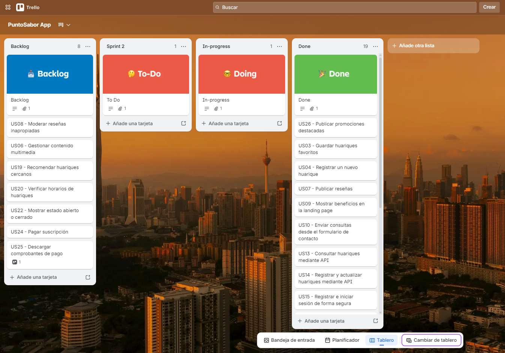

| # Orden | User Story ID | Título | Descripción | Story Points (1 / 2 / 3 / 5 / 8) |
|---------|---------------|--------|-------------|----------------------------------|
| 1 | US01 | Filtrar huariques | Como usuario, quiero filtrar huariques por ubicación, tipo de comida y precio para encontrar opciones acordes a mis preferencias. | 5 |
| 2 | US02 | Visualizar huariques en mapa | Como usuario, quiero visualizar la ubicación de los huariques en un mapa para identificar fácilmente cómo llegar a ellos. | 3 |
| 3 | US03 | Guardar huariques favoritos | Como usuario, quiero guardar huariques como favoritos para consultarlos nuevamente de forma rápida. | 3 |
| 4 | US04 | Registrar un nuevo huarique | Como dueño, quiero registrar un nuevo huarique con información básica para que aparezca en la plataforma. | 5 |
| 5 | US05 | Actualizar información del huarique | Como dueño, quiero actualizar la información de mi huarique para mantener sus datos correctos y vigentes. | 3 |
| 6 | US06 | Gestionar contenido multimedia | Como dueño, quiero subir fotos y videos de mi huarique para mostrar mejor mi negocio a los usuarios. | 3 |
| 7 | US07 | Publicar reseñas | Como usuario, quiero publicar una reseña y calificación sobre un huarique para compartir mi experiencia con otros usuarios. | 3 |
| 8 | US08 | Moderar reseñas inapropiadas | Como sistema, quiero detectar reseñas inapropiadas para evitar contenido ofensivo dentro de la plataforma. | 5 |
| 9 | US09 | Mostrar beneficios en la landing page | Como visitante, quiero ver los beneficios de PuntoSabor en la landing page para comprender el valor de la plataforma. | 2 |
| 10 | US10 | Enviar consultas desde el formulario de contacto | Como visitante, quiero enviar consultas mediante un formulario de contacto para comunicarme con el equipo de PuntoSabor. | 2 |
| 11 | US11 | Configurar notificaciones | Como usuario, quiero activar o desactivar notificaciones para recibir solo la información que me interesa. | 2 |
| 12 | US12 | Recibir notificaciones de nuevas reseñas | Como dueño, quiero recibir alertas cuando mi huarique reciba nuevas reseñas para responder oportunamente a los usuarios. | 2 |
| 13 | US13 | Consultar huariques mediante API | Como developer, quiero consultar huariques mediante filtros en la API para integrar la búsqueda con la aplicación móvil. | 5 |
| 14 | US14 | Registrar y actualizar huariques mediante API | Como developer, quiero crear y actualizar huariques mediante la API para gestionar la información desde los productos digitales. | 5 |
| 15 | US15 | Registrar e iniciar sesión de forma segura | Como usuario, quiero crear una cuenta e iniciar sesión con credenciales seguras para acceder a mi perfil. | 5 |
| 16 | US16 | Recuperar contraseña | Como usuario, quiero recuperar mi contraseña para volver a acceder a mi cuenta en caso de olvido. | 2 |
| 17 | US17 | Guardar preferencias del usuario | Como usuario, quiero guardar mis preferencias de cocina, presupuesto y ubicación para recibir recomendaciones personalizadas. | 3 |
| 18 | US18 | Sugerir huariques automáticamente | Como usuario, quiero recibir sugerencias de huariques basadas en mi historial para descubrir opciones relacionadas con mis intereses. | 5 |
| 19 | US19 | Recomendar huariques cercanos | Como usuario, quiero recibir recomendaciones de huariques cercanos a mi ubicación para encontrar opciones próximas. | 3 |
| 20 | US20 | Verificar horarios de huariques | Como usuario, quiero ver si el horario de un huarique fue confirmado recientemente para evitar información desactualizada. | 3 |
| 21 | US21 | Reportar información incorrecta | Como usuario, quiero reportar datos incorrectos de un huarique para contribuir a mantener actualizada la información. | 2 |
| 22 | US22 | Mostrar estado abierto o cerrado | Como sistema, quiero mostrar si un huarique está abierto o cerrado para orientar mejor la decisión del usuario. | 5 |
| 23 | US23 | Seleccionar planes de membresía | Como dueño, quiero elegir entre planes de membresía con distintos beneficios para aumentar la visibilidad de mi huarique. | 3 |
| 24 | US24 | Pagar suscripción | Como dueño, quiero pagar mi membresía mediante tarjeta o billetera digital para mantener activo mi plan. | 5 |
| 25 | US25 | Descargar comprobantes de pago | Como dueño, quiero descargar comprobantes mensuales de mis pagos para llevar control contable de mi membresía. | 3 |
| 26 | US26 | Publicar promociones destacadas | Como dueño Pro, quiero publicar promociones destacadas para aumentar la visibilidad de mi huarique en los listados. | 3 |
| 27 | US27 | Gestionar cuenta y perfil | Como usuario, quiero ver mi perfil, actualizar mi nombre y eliminar mi cuenta para tener control sobre mis datos personales. | 3 |

**Suma total estimada del backlog:** 92 Story Points.

#### Roadmap de Sprints hasta la entrega del Trabajo Final

El desarrollo se organiza en tres sprints alineados con los hitos del curso, hasta la entrega del Trabajo Final (TB2, semana 15). Cada sprint toma del Product Backlog las User Stories de mayor prioridad y valor para el negocio, manteniendo la Landing Page presente desde el primer sprint. La gestión y el seguimiento del avance de cada sprint se realiza en el mismo tablero de Trello indicado arriba.

| Sprint | Entrega asociada | Periodo (semanas) | Objetivo (Sprint Goal) | User Stories planificadas |
|---|---|---|---|---|
| **Sprint 1** | TB1 (Semana 7) | Sem. 5 – 7 | Construir la base inicial de la Landing Page y de la aplicación móvil (presentación del producto, descubrimiento y primeras interacciones). | US09, US10, US01, US02, US03, US04, US07, US15 |
| **Sprint 2** | AV2 (Semana 12) | Sem. 8 – 12 | Completar el flujo principal de la app conectado al backend desplegado (autenticación real, gestión de huariques por el dueño, reseñas y servicios de la API). | US13, US14, US05, US06, US16, US17, US19, US23 |
| **Sprint 3** | TB2 (Semana 15) | Sem. 13 – 15 | Cerrar el producto con monetización y funcionalidades de soporte a la decisión (membresías y pagos, promociones, estado/horarios y notificaciones). | US24, US25, US26, US20, US21, US22, US11, US12, US18 |

> Nota: la distribución de User Stories por sprint es la planificación vigente y puede ajustarse en cada Sprint Planning según el velocity real del equipo. El detalle de ejecución de cada sprint se documenta en el [Capítulo IV](#capítulo-iv-product-implementation--validation).

## 2.5. Strategic-Level Domain-Driven Design

### 2.5.1. EventStorming

A partir del Big Picture EventStorming realizado en la sección 2.3.5, se elaboró el Design-Level EventStorming de PuntoSabor, definiendo para cada bounded context sus Aggregates, Commands, Domain Events, Policies, Invariantes y Read Models.

#### 2.5.1.1. Candidate Context Discovery

Del proceso de EventStorming se identificaron los siguientes bounded contexts candidatos:

| Bounded Context | Aggregate principal | Responsabilidad |
|---|---|---|
| Explorer Discovery | `SearchSession` | Búsqueda y descubrimiento de huariques |
| User Preferences | `UserPreferences` | Preferencias y consentimiento del usuario |
| Business Listing | `BusinessListing` | Registro y publicación de huariques |
| Subscription & Billing | `BusinessSubscription` | Planes de membresía y facturación |
| Promotion | `Promotion` | Creación y publicación de promociones |
| Contact & Support | `SupportRequest` | Contacto, direcciones y soporte |

#### 2.5.1.2. Domain Message Flows Modeling

**Flujo: Publicar un Huarique**

1. `CreateListing` → `ListingCreated`
2. `UpdateListingFields` → `ListingFieldsUpdated`
3. `GeocodeAddress` → `AddressGeocoded` → (policy) `RunListingValidations` → `ListingValidationsPassed`
4. `PublishListing` → `ListingPublished` → actualiza `PublicListingView`

**Flujo: Crear y Publicar una Promoción**

1. `CreatePromotion` → `PromotionCreated`
2. `SetPromotionTargeting` → `PromotionTargetingSet`
3. `SetPromotionSchedule` → `PromotionScheduleSet` → (policy) `SchedulePublish/Unpublish`
4. `PublishPromotion` → `PromotionPublished` → (policy) `IndexPromotionForDiscovery` → actualiza `ZonePromotionsView`

**Invariantes transversales**

- Un huarique solo puede publicarse si cumple validaciones y tiene geolocalización.
- Una promoción solo puede publicarse si existe un plan activo y el huarique está publicado.
- Los resultados de búsqueda nunca incluyen huariques inactivos o no publicados.
- Los comandos deben ser idempotentes para evitar duplicación de eventos.

#### 2.5.1.3. Bounded Context Canvases

**Explorer Discovery**

| Elemento | Detalle |
|---|---|
| Aggregate | `SearchSession` |
| Commands | `StartSearchSession`, `ApplySearchFilter`, `OpenMap`, `SelectHuarique`, `ViewHuariqueDetail` |
| Domain Events | `SearchSessionStarted`, `SearchPerformed`, `MapDisplayed`, `HuariqueSelected`, `HuariqueDetailViewed` |
| Policies | `AutoSearch`, `RankingPolicy` |
| Read Models | `SearchResultsView`, `HuariqueMiniCard` |
| Invariantes | Solo se listan huariques con estado `PUBLISHED` y `ACTIVE`. |

**Business Listing**

| Elemento | Detalle |
|---|---|
| Aggregate | `BusinessListing` |
| Commands | `CreateListing`, `UploadListingImage`, `UpdateListingFields`, `GeocodeAddress`, `PublishListing` |
| Domain Events | `ListingCreated`, `ListingImageUploaded`, `ListingFieldsUpdated`, `AddressGeocoded`, `ListingPublished` |
| Policies | `RunListingValidations` |
| Read Models | `OwnerListingDashboard`, `PublicListingView` |
| Invariantes | No se publica un huarique sin nombre, dirección, geolocalización y dueño asignado. |

**Subscription & Billing**

| Elemento | Detalle |
|---|---|
| Aggregate | `BusinessSubscription` |
| Commands | `SelectPlan`, `AcceptPlanTerms`, `ValidateBusinessEligibility`, `ActivatePlan`, `ChangePlan` |
| Domain Events | `PlanSelected`, `PlanTermsAccepted`, `BusinessEligibilityValidated`, `PlanActivated`, `PlanChanged` |
| Policies | `EnablePromotionCapabilities`, `DisablePromotionCapabilities` |
| Read Models | `BillingHistory`, `PlanStatusView` |
| Invariantes | Solo un `PlanActivated` habilita la creación de promociones. |

**Promotion**

| Elemento | Detalle |
|---|---|
| Aggregate | `Promotion` |
| Commands | `CreatePromotion`, `SetPromotionTargeting`, `SetPromotionSchedule`, `PublishPromotion`, `UnpublishPromotion` |
| Domain Events | `PromotionCreated`, `PromotionTargetingSet`, `PromotionScheduleSet`, `PromotionPublished`, `PromotionUnpublished` |
| Policies | `IndexPromotionForDiscovery`, `SchedulePublish/Unpublish` |
| Read Models | `ZonePromotionsView`, `OwnerPromotionsDashboard` |
| Invariantes | Solo se publican promociones si el huarique tiene `ListingPublished` y `PlanActivated`. |

**User Preferences**

| Elemento | Detalle |
|---|---|
| Aggregate | `UserPreferences` |
| Commands | `SetPreferredLanguage`, `SetDiscoveryPreferences`, `SavePrivacyConsent` |
| Domain Events | `PreferredLanguageChanged`, `DiscoveryPreferencesSaved`, `PrivacyConsentRecorded` |
| Read Models | `UserPrefView` |

**Contact & Support**

| Elemento | Detalle |
|---|---|
| Aggregate | `SupportRequest` |
| Commands | `SubmitContactForm`, `OpenDirections`, `AcceptPrivacyConsent` |
| Domain Events | `ContactFormSubmitted`, `DirectionsOpened`, `PrivacyConsentRecorded` |
| Read Models | `SupportInboxView`, `ConsentLedger` |

### 2.5.2. Context Mapping

El Context Mapping define las relaciones entre los Bounded Contexts del sistema. Se utilizan los patrones DDD estándar: **U** (Upstream), **D** (Downstream), **ACL** (Anti-Corruption Layer), **OHS** (Open Host Service).

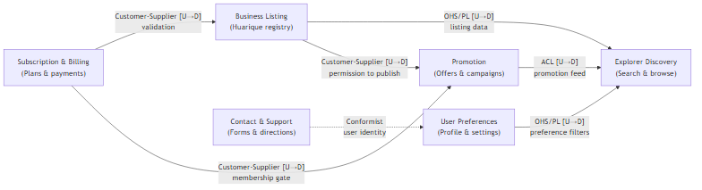

| Relación | Patrón | Descripción |
|---|---|---|
| Business Listing → Explorer Discovery | OHS / Published Language | Discovery consume el catálogo de huariques publicado por Listing vía API REST. |
| Subscription & Billing → Business Listing | Customer-Supplier | Listing (downstream) valida con Billing si el dueño tiene suscripción activa antes de publicar. |
| Subscription & Billing → Promotion | Customer-Supplier | Promotion solo puede publicar si Billing confirma membresía vigente. |
| Business Listing → Promotion | Customer-Supplier | Promotion necesita que el huarique esté registrado y activo en Listing. |
| User Preferences → Explorer Discovery | OHS / Published Language | Discovery aplica los filtros (zona, tipo de comida, precio) expuestos por Preferences. |
| Promotion → Explorer Discovery | ACL | Discovery traduce el modelo de promociones al formato de su feed interno mediante una capa anticorrupción. |
| Contact & Support → User Preferences | Conformist | Support reutiliza la identidad del usuario definida en Preferences sin transformarla. |

### 2.5.3. Software Architecture

#### 2.5.3.1. Software Architecture Context Level Diagrams

El diagrama de contexto muestra a PuntoSabor como sistema central interactuando con sus dos tipos de usuarios principales:

- **PuntoSabor:** sistema principal que conecta a exploradores y dueños de huariques.
- **Explorador gastronómico:** usuario que busca y descubre huariques auténticos.
- **Dueño de restaurante:** usuario que publica su huarique y gestiona su membresía.


#### 2.5.3.2. Software Architecture Container Level Diagrams

El diagrama de contenedores muestra los componentes internos del sistema PuntoSabor:

- **Aplicación Móvil (Android/Kotlin):** interfaz principal del usuario, construida con Jetpack Compose.
- **Landing Page (HTML/CSS/JS):** sitio estático desplegado en GitHub Pages.
- **Backend API (C#/.NET 8):** servidor de aplicaciones que expone endpoints REST y gestiona la lógica de negocio.
- **Base de datos (MySQL):** almacena usuarios, huariques, reseñas, planes y suscripciones.


#### 2.5.3.3. Software Architecture Deployment Diagrams

El diagrama de despliegue muestra los nodos de infraestructura donde se ejecutan los componentes del sistema HuariqueHub y cómo se comunican entre sí.

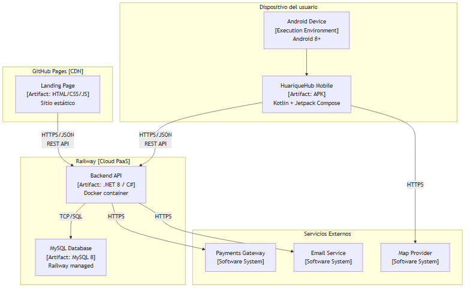

| Nodo | Tecnología | Descripción |
|---|---|---|
| Android Device | Android 8+ | Dispositivo físico o emulador donde se instala la app móvil. |
| HuariqueHub Mobile (APK) | Kotlin + Jetpack Compose | Aplicación Android distribuida directamente (APK). |
| Landing Page | HTML / CSS / JS | Sitio estático desplegado en GitHub Pages (CDN gratuito). |
| Backend API | .NET 8 / C# (Docker) | API REST desplegada en Railway como contenedor Docker. |
| MySQL Database | MySQL 8 | Base de datos relacional gestionada por Railway. |
| Payments Gateway | Externo (ej. Stripe/Culqi) | Procesamiento de pagos de membresías vía webhooks. |
| Map Provider | Externo (ej. Google Maps) | Tiles de mapa y geocodificación para localizar huariques. |
| Email Service | Externo (ej. SendGrid) | Envío de correos de confirmación para formularios de soporte. |

## 2.6. Tactical-Level Domain-Driven Design

### 2.6.1. Bounded Context: Explorer Discovery

#### 2.6.1.1. Domain Layer

| Elemento | Clase |
|---|---|
| Aggregate root | `Huarique` |
| Entidades | `Review`, `Category` |
| Value Objects | `Description`, `Address`, `Coordinates`, `Rating`, `OpeningStatus` |
| Servicio de dominio | `SearchService` (búsqueda por filtros) |

#### 2.6.1.2. Interface Layer

Endpoints REST expuestos:

| Método | Endpoint | Descripción |
|---|---|---|
| GET | `/huariques` | Listar/buscar huariques con filtros |
| GET | `/huariques/{id}` | Obtener detalle de un huarique |
| GET | `/categories` | Listar categorías disponibles |

Pantallas móviles: HomeScreen, HuariqueDetailScreen.

#### 2.6.1.3. Application Layer

| Clase | Método |
|---|---|
| `HuariquesApplicationService` | `getHuarique(id)`, `searchHuariques(filters)` |

#### 2.6.1.4. Infrastructure Layer

| Clase | Rol |
|---|---|
| `HuariqueRepositorySQL` | Implementa `IHuariqueRepository` con consultas SQL/EF Core |
| `CategoryRepositorySQL` | Implementa `ICategoryRepository` |

#### 2.6.1.5. Bounded Context Software Architecture Component Level Diagrams


#### 2.6.1.6. Bounded Context Software Architecture Code Level Diagrams

##### 2.6.1.6.1. Bounded Context Domain Layer Class Diagrams


| Clase | Definición |
|-------|-----------|
| `Huarique` | Aggregate root: local gastronómico con nombre, descripción, dirección, coordenadas, calificación promedio y estado de apertura. |
| `Category` | Entidad que clasifica a los huariques por tipo/estilo. |
| `Review` | Entidad que modela una reseña con calificación (1..5), comentario y fecha. |
| `Description` | Value Object que encapsula la descripción validada del huarique. |
| `Address` | Value Object con línea, distrito y ciudad. |
| `Coordinates` | Value Object con latitud/longitud válidas para geolocalización. |
| `Rating` | Value Object entero (1..5) que garantiza calificaciones válidas. |
| `OpeningStatus` | Enumeración del estado operativo del local. |
| `IHuariqueRepository` | Puerto para la persistencia de `Huarique`. |
| `IReviewRepository` | Puerto para la persistencia de `Review`. |
| `HuariqueRepositorySQL` | Adaptador que implementa `IHuariqueRepository` usando SQL. |
| `ReviewService` | Servicio de dominio para publicar/moderar reseñas. |
| `HuariquesApplicationService` | Servicio de aplicación que orquesta los casos de uso. |

##### 2.6.1.6.2. Bounded Context Database Design Diagram

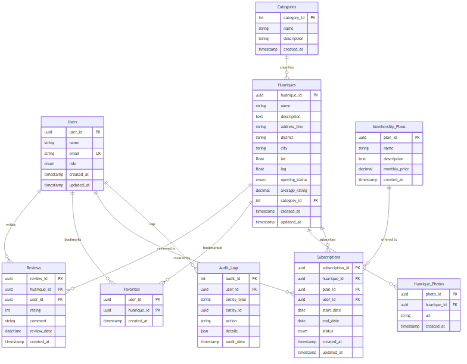

---

### 2.6.2. Bounded Context: Business Listing

#### 2.6.2.1. Domain Layer

| Elemento | Clase |
|---|---|
| Aggregate root | `Huarique` (rol de listing) |
| Value Objects | `Address`, `Coordinates`, `Description` |
| Servicio de dominio | `ListingValidationService` |

#### 2.6.2.2. Interface Layer

| Método | Endpoint | Descripción |
|---|---|---|
| POST | `/huariques` | Registrar nuevo huarique |
| PATCH | `/huariques/{id}` | Actualizar datos del huarique |

#### 2.6.2.3. Application Layer

| Clase | Método |
|---|---|
| `ListingApplicationService` | `createListing(ownerId, info)`, `updateListing(id, fields)`, `publishListing(id)` |

#### 2.6.2.4. Infrastructure Layer

| Clase | Rol |
|---|---|
| `HuariqueRepositorySQL` | Persistencia del listing en MySQL vía EF Core |
| `GeocodingAdapter` | Llama a API externa para convertir dirección en coordenadas |
| `ImageStorageAdapter` | Gestiona subida de fotos al storage en la nube |

#### 2.6.2.5. Bounded Context Software Architecture Component Level Diagrams


#### 2.6.2.6. Bounded Context Software Architecture Code Level Diagrams

##### 2.6.2.6.1. Bounded Context Domain Layer Class Diagrams

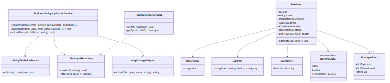

| Clase | Definición |
|---|---|
| `Huarique` | Aggregate root: listing del local gastronómico con nombre, descripción, dirección, coordenadas, estado y fotos. |
| `HuariquePhoto` | Entidad que representa una foto asociada al huarique. |
| `Description` | Value Object con el texto descriptivo validado. |
| `Address` | Value Object con línea, distrito y ciudad. |
| `Coordinates` | Value Object con latitud/longitud válidas. |
| `OpeningStatus` | Enumeración del estado operativo del local. |
| `ListingValidationService` | Servicio de dominio que valida invariantes antes de guardar el listing. |
| `IHuariqueRepository` | Puerto de persistencia para `Huarique`. |
| `HuariqueRepositorySQL` | Adaptador que implementa `IHuariqueRepository` con SQL/EF Core. |
| `ImageStorageAdapter` | Puerto de infraestructura para subida de fotos. |
| `BusinessListingApplicationService` | Orquesta los casos de uso de registro y edición de listings. |

##### 2.6.2.6.2. Bounded Context Database Design Diagram

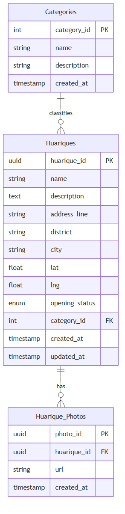

---

### 2.6.3. Bounded Context: Subscription & Billing

#### 2.6.3.1. Domain Layer

| Elemento | Clase |
|---|---|
| Aggregate root | `Subscription` |
| Entidades | `MembershipPlan` |
| Value Objects | `SubscriptionStatus` (`ACTIVE`, `CANCELED`, `EXPIRED`) |
| Servicio de dominio | `MembershipService` |

#### 2.6.3.2. Interface Layer

| Método | Endpoint | Descripción |
|---|---|---|
| GET | `/plans` | Listar planes de membresía disponibles |

Pantallas móviles: PlanesScreen, PagoScreen.

#### 2.6.3.3. Application Layer

| Clase | Método |
|---|---|
| `SubscriptionApplicationService` | `selectPlan(huariqueId, planId)`, `activatePlan(id, paymentId)`, `changePlan(id, newPlanId)` |

#### 2.6.3.4. Infrastructure Layer

| Clase | Rol |
|---|---|
| `SubscriptionRepositorySQL` | Persistencia de `Subscription` y `MembershipPlan` en MySQL |
| `PaymentGatewayAdapter` | Integración con pasarela de pago externa |

#### 2.6.3.5. Bounded Context Software Architecture Component Level Diagrams


#### 2.6.3.6. Bounded Context Software Architecture Code Level Diagrams

##### 2.6.3.6.1. Bounded Context Domain Layer Class Diagrams

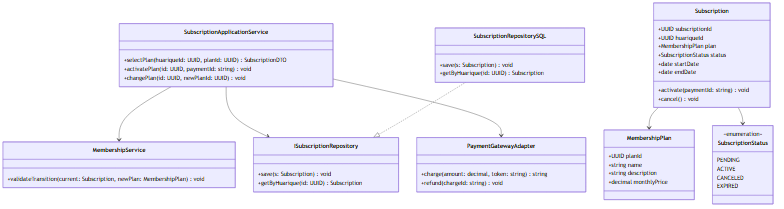

| Clase | Definición |
|---|---|
| `Subscription` | Aggregate root: suscripción de un huarique a un plan de membresía. |
| `MembershipPlan` | Entidad que define un plan (nombre, precio mensual, descripción). |
| `SubscriptionStatus` | Enumeración: `PENDING`, `ACTIVE`, `CANCELED`, `EXPIRED`. |
| `MembershipService` | Servicio de dominio que valida transiciones de estado entre planes. |
| `ISubscriptionRepository` | Puerto de persistencia para `Subscription` y `MembershipPlan`. |
| `SubscriptionRepositorySQL` | Adaptador que implementa `ISubscriptionRepository` con SQL/EF Core. |
| `PaymentGatewayAdapter` | Puerto de infraestructura para cobros y devoluciones. |
| `SubscriptionApplicationService` | Orquesta selección, activación y cambio de plan. |

##### 2.6.3.6.2. Bounded Context Database Design Diagram

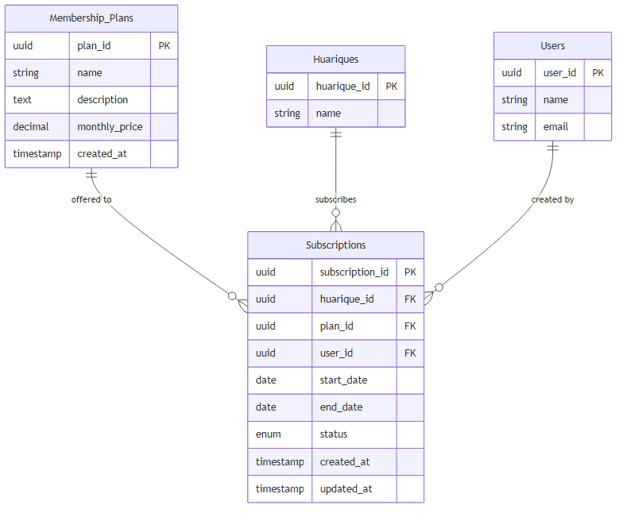

---

### 2.6.4. Bounded Context: Promotion

#### 2.6.4.1. Domain Layer

| Elemento | Clase |
|---|---|
| Aggregate root | `Promotion` |
| Value Objects | `PromotionSchedule` (startAt, endAt), `PromotionTargeting` (zones, tags) |
| Servicio de dominio | `PromotionPublishingService` |

#### 2.6.4.2. Interface Layer

| Método | Endpoint | Descripción |
|---|---|---|
| GET | `/promos` | Listar promociones activas |

Pantallas móviles: PromocionesScreen, CrearPromocionScreen.

#### 2.6.4.3. Application Layer

| Clase | Método |
|---|---|
| `PromotionApplicationService` | `createPromotion(huariqueId, content)`, `publishPromotion(id)`, `unpublishPromotion(id, reason)` |

#### 2.6.4.4. Infrastructure Layer

| Clase | Rol |
|---|---|
| `PromotionRepositorySQL` | Persistencia de `Promotion` en MySQL |
| `SchedulerAdapter` | Ejecuta publicación/despublicación automática según fechas |

#### 2.6.4.5. Bounded Context Software Architecture Component Level Diagrams


#### 2.6.4.6. Bounded Context Software Architecture Code Level Diagrams

##### 2.6.4.6.1. Bounded Context Domain Layer Class Diagrams

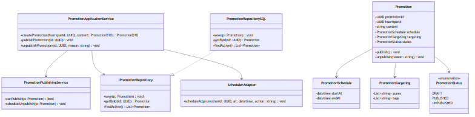

| Clase | Definición |
|---|---|
| `Promotion` | Aggregate root: promoción creada por un dueño de huarique con contenido, ventana temporal y targeting. |
| `PromotionSchedule` | Value Object con `startAt` y `endAt` validados. |
| `PromotionTargeting` | Value Object con zonas y etiquetas de segmentación. |
| `PromotionStatus` | Enumeración: `DRAFT`, `PUBLISHED`, `UNPUBLISHED`. |
| `PromotionPublishingService` | Servicio de dominio que valida reglas de publicación y programa despublicación. |
| `IPromotionRepository` | Puerto de persistencia para `Promotion`. |
| `PromotionRepositorySQL` | Adaptador que implementa `IPromotionRepository` con SQL/EF Core. |
| `SchedulerAdapter` | Puerto de infraestructura para programar tareas de publicación/despublicación. |
| `PromotionApplicationService` | Orquesta creación, publicación y despublicación de promociones. |

##### 2.6.4.6.2. Bounded Context Database Design Diagram

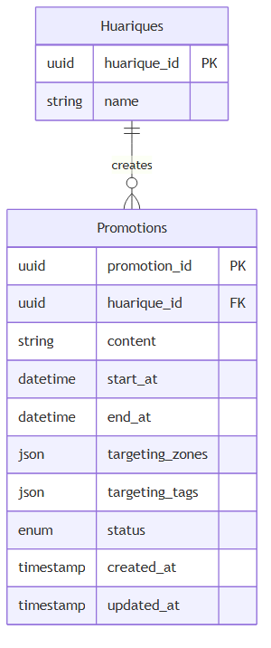

---

### 2.6.5. Bounded Context: User Preferences

#### 2.6.5.1. Domain Layer

| Elemento | Clase |
|---|---|
| Aggregate root | `UserPreferences` |
| Value Objects | `DiscoveryPreferences` (priceRange, foodTypes, zone), `PrivacyConsent` |

#### 2.6.5.2. Interface Layer

Pantallas móviles: PreferenciasScreen (configuración de idioma, tipo de comida, presupuesto, zona).

#### 2.6.5.3. Application Layer

| Clase | Método |
|---|---|
| `PreferencesApplicationService` | `setPreferences(userId, prefs)`, `getPreferences(userId)` |

#### 2.6.5.4. Infrastructure Layer

| Clase | Rol |
|---|---|
| `UserPreferencesRepositorySQL` | Persistencia de preferencias del usuario en MySQL |

#### 2.6.5.5. Bounded Context Software Architecture Component Level Diagrams


#### 2.6.5.6. Bounded Context Software Architecture Code Level Diagrams

##### 2.6.5.6.1. Bounded Context Domain Layer Class Diagrams

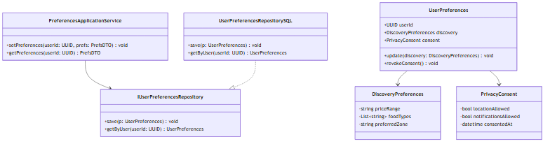

| Clase | Definición |
|---|---|
| `UserPreferences` | Aggregate root: preferencias de descubrimiento y privacidad del usuario. |
| `DiscoveryPreferences` | Value Object con rango de precio, tipos de comida y zona preferida. |
| `PrivacyConsent` | Value Object con consentimiento de ubicación y notificaciones. |
| `IUserPreferencesRepository` | Puerto de persistencia para `UserPreferences`. |
| `UserPreferencesRepositorySQL` | Adaptador que implementa `IUserPreferencesRepository` con SQL/EF Core. |
| `PreferencesApplicationService` | Orquesta lectura y actualización de preferencias del usuario. |

##### 2.6.5.6.2. Bounded Context Database Design Diagram

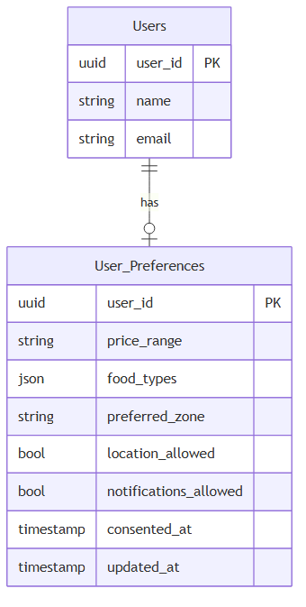

---

### 2.6.6. Bounded Context: Contact & Support

#### 2.6.6.1. Domain Layer

| Elemento | Clase |
|---|---|
| Aggregate root | `SupportRequest` |
| Value Objects | `ContactPayload` (nombre, email, mensaje), `ConsentScopes` |

#### 2.6.6.2. Interface Layer

Landing Page: formulario de contacto HTML estático.  
Pantallas móviles: ContactoScreen, DireccionesScreen.

#### 2.6.6.3. Application Layer

| Clase | Método |
|---|---|
| `SupportApplicationService` | `submitContactForm(payload)`, `openDirections(huariqueId)` |

#### 2.6.6.4. Infrastructure Layer

| Clase | Rol |
|---|---|
| `SupportRequestRepositorySQL` | Persistencia de solicitudes de soporte en MySQL |
| `EmailNotificationAdapter` | Envío de correos de confirmación al usuario |

#### 2.6.6.5. Bounded Context Software Architecture Component Level Diagrams


#### 2.6.6.6. Bounded Context Software Architecture Code Level Diagrams

##### 2.6.6.6.1. Bounded Context Domain Layer Class Diagrams

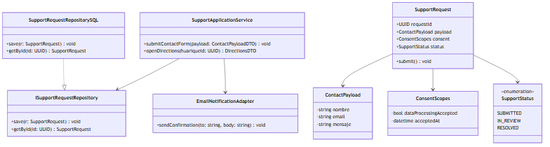

| Clase | Definición |
|---|---|
| `SupportRequest` | Aggregate root: solicitud de soporte o contacto enviada por el usuario. |
| `ContactPayload` | Value Object con nombre, email y mensaje del formulario. |
| `ConsentScopes` | Value Object con aceptación del tratamiento de datos. |
| `SupportStatus` | Enumeración: `SUBMITTED`, `IN_REVIEW`, `RESOLVED`. |
| `ISupportRequestRepository` | Puerto de persistencia para `SupportRequest`. |
| `SupportRequestRepositorySQL` | Adaptador que implementa `ISupportRequestRepository` con SQL/EF Core. |
| `EmailNotificationAdapter` | Puerto de infraestructura para envío de correos de confirmación. |
| `SupportApplicationService` | Orquesta el envío de formularios y la apertura de direcciones. |

##### 2.6.6.6.2. Bounded Context Database Design Diagram

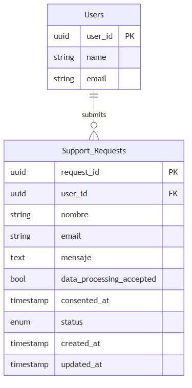

# Capítulo III: Solution UI/UX Design

## 3.1. Product design

El diseño del producto de PuntoSabor busca ofrecer una experiencia clara, accesible y coherente tanto para los usuarios que desean descubrir huariques como para los propietarios que buscan promocionar sus negocios.

Esta sección presenta los lineamientos visuales, la arquitectura de información, el diseño de la Landing Page y la propuesta UX/UI de la aplicación móvil, asegurando una navegación sencilla y alineada con la propuesta de valor del producto.

### 3.1.1. Style Guidelines

Los "Style Guidelines" de la aplicación móvil PuntoSabor definen las directrices visuales y de diseño que permiten mantener una experiencia coherente, clara y fácil de usar en todas las pantallas de la app. Estos lineamientos establecen criterios sobre colores, tipografía, espaciado, componentes visuales e identidad gráfica, asegurando que la aplicación sea intuitiva tanto para los usuarios que buscan huariques como para los propietarios que gestionan sus negocios.

#### 3.1.1.1. General Style Guidelines

##### Branding

Para el desarrollo de la identidad visual de PuntoSabor, se definió un estilo orientado a transmitir cercanía, autenticidad y confianza. La marca busca reflejar el valor de los huariques dentro de la gastronomía local, destacándolos como espacios accesibles, tradicionales y con identidad propia.

El logotipo de PuntoSabor representa la idea de descubrimiento gastronómico mediante elementos asociados a la ubicación y la comida local. Su propuesta visual permite que los usuarios relacionen rápidamente la aplicación con la búsqueda de huariques cercanos, recomendaciones confiables y experiencias culinarias auténticas.

La identidad gráfica utiliza una apariencia cálida, amigable y moderna, pensada para conectar tanto con los exploradores gastronómicos como con los propietarios de huariques. De esta manera, PuntoSabor mantiene una imagen coherente con su propósito: facilitar la visibilidad de pequeños negocios gastronómicos mediante una aplicación móvil sencilla y accesible.

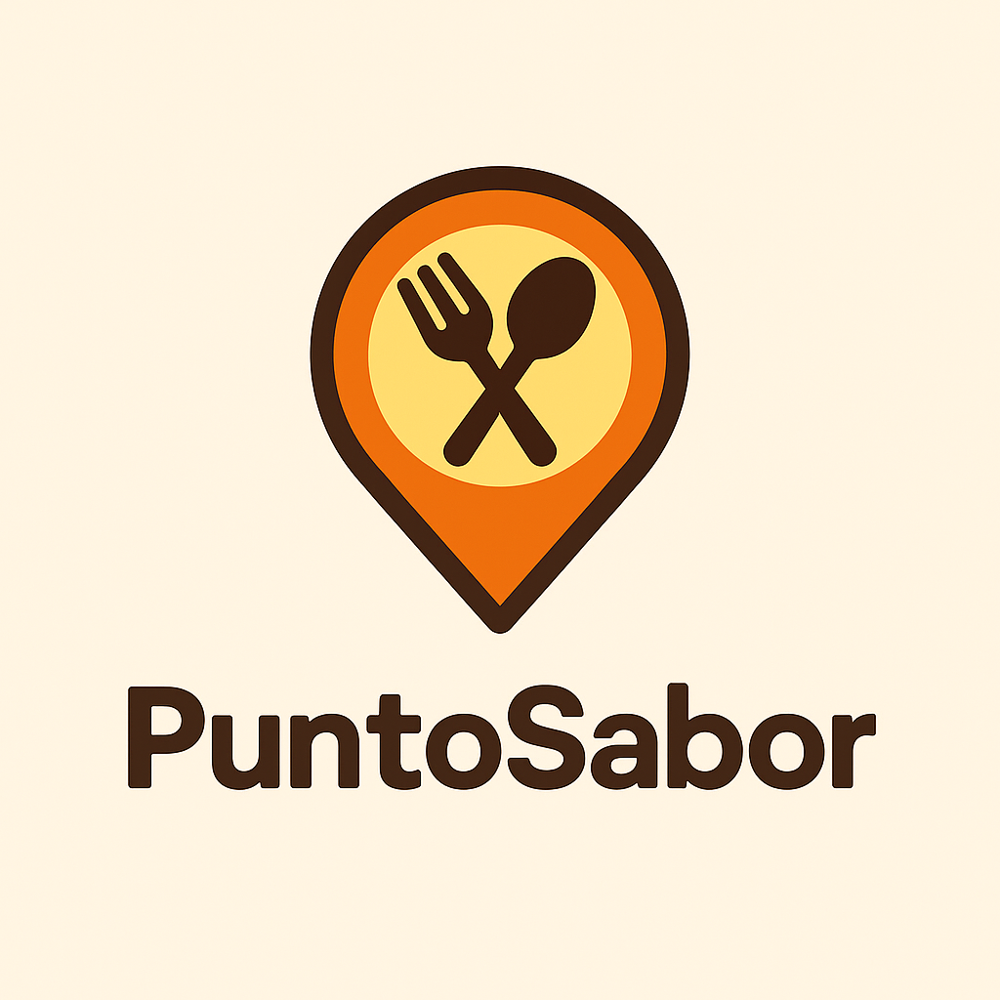

##### Typography

Para la tipografía de PuntoSabor, se seleccionó una combinación que prioriza la legibilidad, la modernidad y la claridad dentro de la aplicación móvil. La tipografía Poppins se utiliza principalmente en títulos y encabezados, ya que aporta un estilo amigable y permite resaltar información importante para el usuario.

Para textos descriptivos, botones, formularios y elementos de la interfaz, se emplea Inter, debido a su buena lectura en pantallas móviles y su apariencia ordenada. Esta combinación permite que la app mantenga una experiencia visual coherente, accesible y fácil de navegar.

A continuación, se detallan las tipografías adoptadas para PuntoSabor considerando color, peso, tamaño, interlineado y alineación:


##### Colors

La paleta de colores de PuntoSabor fue definida para transmitir autenticidad, cercanía y dinamismo dentro de la aplicación móvil. Los tonos principales, asociados al rojo, verde y amarillo, buscan representar el sabor, la frescura y la identidad gastronómica local de los huariques.

Estos colores se aplican de forma estratégica en botones, íconos, estados, fondos y elementos destacados de la interfaz, permitiendo guiar la atención del usuario y mantener una experiencia visual amigable, moderna y coherente en todas las pantallas de la app.


##### Spacing

El sistema de espaciado de PuntoSabor está diseñado para mantener una interfaz móvil limpia, ordenada y fácil de navegar. La separación entre elementos permite mejorar la lectura, evitar la saturación visual y facilitar la interacción táctil del usuario.

Para conservar consistencia en las pantallas de la aplicación, se utiliza una escala modular basada en 8dp, adecuada para interfaces móviles. Esta escala permite definir márgenes, paddings y separaciones entre componentes de manera uniforme.


### 3.1.2. Information Architecture

La arquitectura de información de PuntoSabor se diseñó para que los usuarios puedan encontrar fácilmente las funciones principales de la aplicación móvil, como buscar huariques, revisar información del local, consultar reseñas, guardar favoritos y gestionar un negocio.

La organización del contenido busca reducir la carga cognitiva y facilitar una navegación intuitiva, clara y rápida. De esta manera, la aplicación mantiene una experiencia coherente con su propuesta de valor: conectar a los usuarios con huariques auténticos y ayudar a los propietarios a mejorar su visibilidad digital.

#### 3.1.2.1. Organization Systems

En PuntoSabor se aplican distintos sistemas de organización para que la información dentro de la aplicación móvil sea clara, ordenada y fácil de encontrar.

**Organización jerárquica (Visual Hierarchy):**  
En las pantallas principales de la app se prioriza la información más importante para el usuario, como el buscador de huariques, las recomendaciones destacadas, la ubicación cercana y las reseñas. Esto permite que el usuario identifique rápidamente las acciones principales.

**Organización secuencial (Step-by-step):**  
Procesos como el registro de un huarique, la edición de información del negocio o la publicación de datos del local siguen una secuencia paso a paso. De esta manera, los propietarios pueden completar sus tareas sin dificultad.

**Organización por tópicos:**  
Los huariques se agrupan según criterios como tipo de comida, ubicación, rango de precios, valoraciones y promociones. Esto facilita que los usuarios filtren y encuentren opciones según sus preferencias.

**Organización según audiencia:**  
La aplicación considera dos tipos principales de usuarios: exploradores gastronómicos y dueños de huariques. Por ello, las funciones y contenidos se organizan de acuerdo con sus necesidades: búsqueda y descubrimiento para los comensales, y gestión de negocio para los propietarios.


#### 3.1.2.2. Labelling Systems

El sistema de etiquetado de **PuntoSabor** prioriza la claridad, simplicidad y consistencia dentro de la aplicación móvil. Para ello, se utilizan palabras cortas y directas que permiten al usuario comprender rápidamente cada sección o acción disponible.

En la aplicación móvil se consideran etiquetas principales como:

- Inicio
- Explorar
- Huariques
- Favoritos
- Reseñas
- Promociones
- Perfil

Además, los botones de acción utilizan textos claros con verbos directos, como:

- Buscar huariques
- Ver detalles
- Guardar favorito
- Dejar reseña
- Registrar negocio
- Editar información

Estas etiquetas permiten que tanto los exploradores gastronómicos como los propietarios de huariques interactúen con la aplicación de manera sencilla, manteniendo coherencia con los objetivos de la plataforma.

#### 3.1.2.3. SEO Tags and Meta Tags

Para PuntoSabor se han definido elementos SEO orientados principalmente a la Landing Page, ya que esta será el punto de entrada público para atraer usuarios y propietarios interesados en la plataforma. Estos elementos ayudan a mejorar la visibilidad del producto en motores de búsqueda y mantienen coherencia con la propuesta de valor de la marca.

**SEO Tags para Landing Page:**

- **Title:** PuntoSabor | Descubre huariques auténticos cerca de ti.
- **Meta Description:** PuntoSabor conecta a exploradores gastronómicos con huariques auténticos y económicos, ofreciendo reseñas confiables, mapas interactivos y promociones exclusivas.
- **Meta Keywords:** huariques, comida peruana, gastronomía local, reseñas, recomendaciones, restaurantes pequeños, comida auténtica.
- **Author:** HuariqueHub - Startup PuntoSabor.

**ASO Elements para aplicación móvil:**

- **App Title:** PuntoSabor
- **App Subtitle:** Descubre huariques auténticos cerca de ti.
- **App Keywords:** huariques, comida local, restaurantes, comida peruana, reseñas, promociones, gastronomía.
- **App Description:** PuntoSabor es una aplicación móvil que permite descubrir huariques cercanos, consultar reseñas, guardar favoritos y conocer promociones de pequeños negocios gastronómicos locales.
#### 3.1.2.4. Searching Systems

La aplicación móvil de HuariqueHub ofrece sistemas de búsqueda diseñados para que el usuario encuentre lo que necesita sin esfuerzo:

- **Búsqueda en catálogo:** localización de huariques por nombre, tipo de comida o distrito.  
- **Filtros avanzados:** por rango de precios, valoración de usuarios, ubicación geográfica y promociones activas.  
- **Mapa interactivo:** permite aplicar filtros visuales y seleccionar huariques desde su ubicación exacta.  
- **Búsqueda en reseñas:** posibilidad de filtrar comentarios por calificación (positivas/negativas) o por temas (precio, atención, sabor).  
De esta manera se evita que el usuario se sienta perdido entre la cantidad de opciones disponibles y se mejora la eficiencia en la exploración.

#### 3.1.2.5. Navigation Systems

La navegación de PuntoSabor combina claridad, consistencia y adaptabilidad:

- **Landing Page (Desktop):** menú superior con navegación horizontal que permite acceder rápidamente a las secciones principales. Desplegada en GitHub Pages.  
- **Landing Page (Móvil):** menú tipo hamburguesa con navegación vertical, optimizado para pantallas pequeñas.  
- **Aplicación Móvil (Android/Kotlin):** navegación entre pantallas mediante Jetpack Compose Navigation, con acceso a Login, Registro, Home, Detalle de Huarique y otras pantallas core.  
- **CTAs estratégicos:** botones prominentes en el color primario de la paleta para guiar al usuario a acciones críticas como buscar huariques, registrar un negocio o activar una promoción.  

En conjunto, estos sistemas garantizan que los usuarios puedan recorrer la plataforma de forma intuitiva, cumpliendo sus metas sin obstáculos.


### 3.1.3. Landing Page UI Design
La interfaz de la landing page es clave para el proyecto, pues constituye la primera impresión del producto. Debe ofrecer una experiencia estética y funcional que atraiga de inmediato a los visitantes y los impulse a seguir explorando

#### 3.1.3.1. Landing Page Wireframe
Landing Page para Desktop Web Browser


Landing Page para Mobile Web Browse


#### 3.1.3.2. Landing Page Mock-up

Esta sección presenta y explica los Mock-ups del Landing Page, tanto en su versión para Desktop Web Browser como Mobile Web Browser. En la propuesta y la explicación debe evidenciarse la aplicación de los principios, elementos de diseño, diseño inclusivo y arquitectura de información, así como el Design System establecido para los productos digitales.


### 3.1.4. Mobile Applications UX/UI Design

El diseño de experiencia de usuario (UX) e interfaz de usuario (UI) en aplicaciones móviles se centra en crear una interacción fluida y optimizada para entornos táctiles y dispositivos portátiles. La UX prioriza la usabilidad en movimiento, diseñando arquitecturas de información y flujos de navegación simplificados que responden a los gestos naturales del usuario. Por otro lado, la UI define la identidad visual mediante la creación de componentes adaptables, tipografías legibles y una paleta de colores coherente que garantiza la claridad en pantallas de diversos tamaños. La integración de ambos aspectos permite desarrollar una aplicación intuitiva, estéticamente profesional y capaz de ofrecer una respuesta rápida y eficiente a las necesidades del usuario final.

#### 3.1.4.1. Mobile Applications Wireframes
Representación esquemática de la estructura y flujo de navegación de la aplicación móvil, diseñada para definir la jerarquía de información y la disposición de los elementos antes de su implementación visual.


#### 3.1.4.2. Mobile Applications Wireflow Diagrams

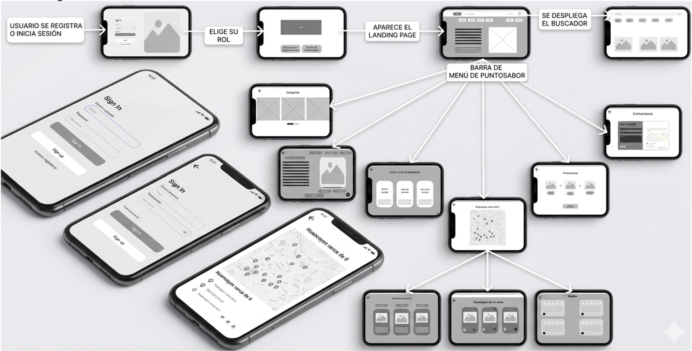

#### 3.1.4.3. Mobile Applications Mock-ups

Representaciones visuales de alta fidelidad que integran la identidad de marca, incluyendo la paleta de colores, tipografía e iconografía final, para simular la apariencia real y estética de la interfaz en dispositivos móviles.


#### 3.1.4.4. Mobile Applications User Flow Diagrams


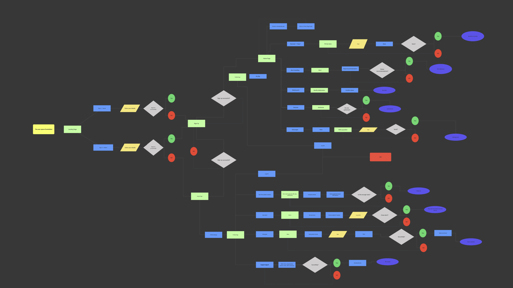
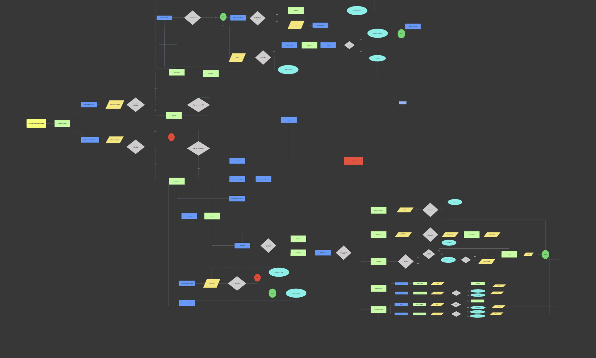

Descubridor Gastronómico
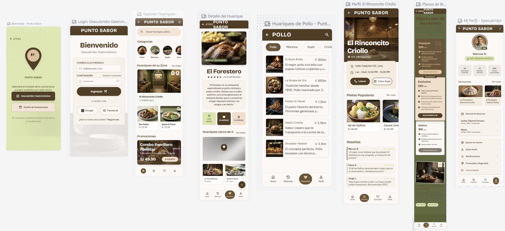

Dueño de restaurante
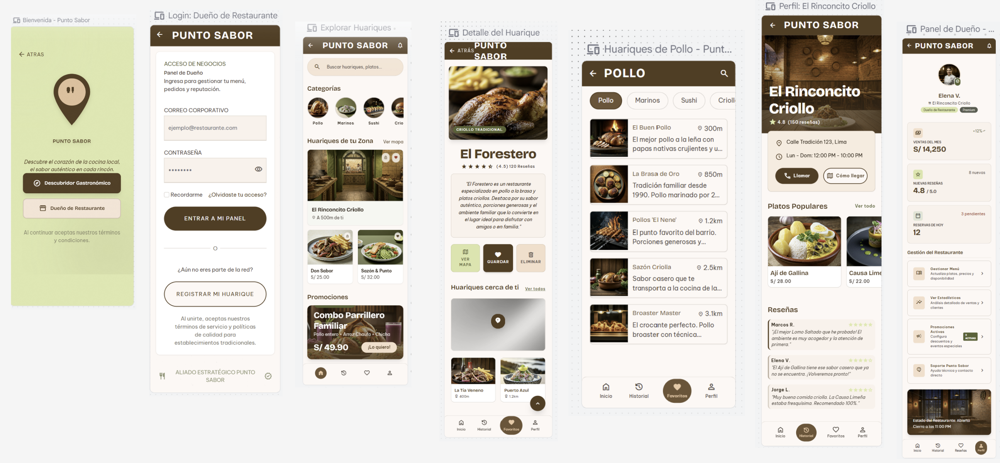

#### 3.1.4.5. Mobile Applications Prototyping

Prototipo de la aplicación móvil PuntoSabor en figma: https://www.figma.com/proto/lT88eEZFP7G86QwYXq59Lc/PuntoSabor?node-id=479-3247&t=ye1K7Dvu4kkj6fuI-1&scaling=scale-down&content-scaling=fixed&page-id=0%3A1&starting-point-node-id=60%3A349&show-proto-sidebar=1

# Capítulo IV: Product Implementation & Validation

## 4. Product Implementation & Validation

## 4.1. Software Configuration Management

En esta sección se detalla cómo se implementa, organiza y publica HuariqueHub, compuesto por tres componentes principales:

1. **Landing Page (HTML/CSS/JS estático):** publicada en GitHub Pages.
2. **Backend (C#/.NET 8):** API REST desplegada en Railway.
3. **Aplicación Móvil (Android/Kotlin con Jetpack Compose):** la interfaz principal del usuario, con las pantallas core de la plataforma.

El objetivo es mantener la consistencia del desarrollo entre los tres componentes y documentar las convenciones de código para futuras iteraciones.

### 4.1.1. Software Development Environment Configuration

**Landing Page (HuariqueHub-Landing)**
- Tecnologías: HTML5, CSS3, JavaScript (vanilla).
- Responsive Web Design: CSS (Flexbox/Grid + media queries).
- Editor: Visual Studio Code.
- Control de versiones: Git + GitHub.
- Plataforma de despliegue: GitHub Pages.

Estructura:
- `index.html` (página principal)
- `css/style.css` (hoja de estilos)
- `img/` (recursos de imágenes)

**Backend (HuariqueHub-Backend)**
- Framework: .NET 8
- Lenguaje: C#
- IDE: Visual Studio 2022 o Visual Studio Code con extensión C#.
- Control de versiones: Git + GitHub.
- Plataforma de despliegue: Railway (contenedor Docker + base de datos MySQL 8).
- **URL pública del backend:** <https://huariquehub-backend.up.railway.app>
- **Documentación de la API (Swagger / OpenAPI):** <https://huariquehub-backend.up.railway.app/swagger>

**Aplicación Móvil (HuariqueHub-App)**
- Lenguaje: Kotlin
- Framework UI: Jetpack Compose
- Nombre del proyecto: `HuariqueHub-Mobile`
- IDE: Android Studio.
- Control de versiones: Git + GitHub.

### 4.1.2. Source Code Management

**Repositorios GitHub (actual)**
- `HuariqueHub-Landing` (Landing Page estática HTML/CSS/JS, desplegada en GitHub Pages).
- `HuariqueHub-Backend` (API REST en C#/.NET 8, desplegada en Railway).
- `HuariqueHub-App` (Aplicación móvil Android/Kotlin con Jetpack Compose).

**Flujo de trabajo (GitFlow ligero)**
- **Ramas principales**
  - `main`: versión estable publicada.
  - `develop`: integración previa a publicación.
- **Ramas de apoyo**
  - `feature/*`: nuevas funcionalidades o mejoras (p. ej., `feature/US01-home-screen`, `feature/auth-login`).
  - `hotfix/*`: correcciones urgentes sobre `main`.

**Versionado Semántico**
- **X (major)**: cambios incompatibles (reestructura global de navegación/archivos).
- **Y (minor)**: nuevas secciones o funcionalidades compatibles.
- **Z (patch)**: correcciones menores (estilos, textos, enlaces).
- Ejemplos: `v1.0`, `v1.1`.

**Conventional Commits**

Formato general:
```
<type>[scope]: <descripción>
```
Ejemplos:
- `feat: agregar pantalla de home con lista de huariques`
- `feat(auth): implementar pantalla de login con Jetpack Compose`
- `fix(api): corregir endpoint de búsqueda por distrito`
- `docs: actualizar pasos de despliegue en README`

### 4.1.3. Source Code Style Guide & Conventions

**Landing Page -HTML**
- Estructura semántica: `<header>`, `<nav>`, `<main>`, `<section>`, `<footer>`.
- Imágenes siempre con `alt`.
- Enlaces relativos y consistentes entre páginas.
- Scripts JS al final del `body` cuando corresponda.

**Landing Page -CSS**
- Uso de variables CSS (`:root { --color... }`) para colores y espaciados.
- Convención de clases en kebab-case (ej.: `.hero-title`, `.card-grid`).
- Layout con Flexbox y/o Grid.
- Media queries para puntos de quiebre (ej.: 960px, 760px, 560px).
- Estados y accesibilidad: `:hover`, `:focus-visible`, contraste adecuado.

**Landing Page -JavaScript**
- `const` / `let` (evitar `var`), funciones pequeñas y claras.
- Separar lógica de interacción del DOM cuando sea posible.
- Uso moderado de `localStorage` solo para preferencias/estado del cliente (si aplica).

**Backend -C# / .NET 8**
- Nombres en PascalCase para clases, métodos y propiedades.
- Estructura de capas: Domain, Application, Infrastructure, Presentation.
- Inyección de dependencias mediante el contenedor DI nativo de .NET.
- Métodos asíncronos con `async/await` (Task/Task<T>) para operaciones I/O.
- Documentación con comentarios XML (`///`) en métodos y clases públicas.

**Aplicación Móvil -Kotlin / Jetpack Compose**
- Variables y funciones en camelCase; clases y Composables en PascalCase.
- Composables pequeños, reutilizables y sin estado cuando sea posible.
- Navegación centralizada mediante `AppNavigation.kt` con Jetpack Compose Navigation.
- Corrutinas de Kotlin para operaciones asíncronas.
- Separación clara entre UI (`ui/screens/`) y datos (`data/model/`).

### 4.1.4. Software Deployment Configuration

Para la configuración del despliegue de PuntoSabor, se consideraron los entornos necesarios para publicar y ejecutar tanto la landing page como la aplicación móvil. El objetivo de esta configuración es permitir que el producto pueda ser probado por los usuarios y revisado por el equipo durante el avance del proyecto.

En esta etapa, la landing page se despliega como un sitio web estático, mientras que la aplicación móvil se ejecuta desde el entorno de desarrollo utilizando Android Studio. Esto permite validar la navegación, las pantallas principales y las funcionalidades implementadas durante el sprint.

#### Entorno de despliegue de la Landing Page

La landing page de PuntoSabor se publica mediante GitHub Pages, ya que esta herramienta permite alojar sitios estáticos de manera sencilla y accesible. Para ello, se utiliza el repositorio del proyecto, donde se almacenan los archivos HTML, CSS, JavaScript e imágenes necesarias para la presentación del producto.

Pasos considerados para el despliegue:

1. Subir los archivos de la landing page al repositorio de GitHub.
2. Verificar que la estructura de archivos sea correcta.
3. Activar GitHub Pages desde la configuración del repositorio.
4. Seleccionar la rama correspondiente para la publicación.
5. Validar que el sitio se visualice correctamente desde el enlace generado.
6. Revisar que las secciones principales sean accesibles desde el navegador.

#### Entorno de ejecución de la Aplicación Móvil

La aplicación móvil se desarrolla utilizando Kotlin y Jetpack Compose dentro de Android Studio. Para su ejecución, se utiliza un emulador Android o un dispositivo físico conectado al equipo de desarrollo.

Pasos considerados para la ejecución:

1. Clonar o descargar el repositorio del proyecto.
2. Abrir el proyecto en Android Studio.
3. Sincronizar las dependencias de Gradle.
4. Seleccionar un emulador o dispositivo Android.
5. Ejecutar la aplicación desde Android Studio.
6. Verificar el funcionamiento de las pantallas implementadas.

#### Consideraciones del despliegue

- La landing page debe mantenerse actualizada con la información principal del producto.
- La aplicación móvil debe ejecutarse correctamente en el entorno de pruebas.
- Los cambios deben registrarse mediante commits en GitHub.
- Las evidencias del despliegue deben incluir capturas de pantalla del sitio publicado y de la aplicación en ejecución.
- En futuras iteraciones, se podrá integrar un backend o servicios externos si el alcance del proyecto lo requiere.

## 4.2. Landing Page & Mobile Application Implementation

### 4.2.1. Sprint 1

#### 4.2.1.1. Sprint Planning 1

En la planificación del Sprint 1 se definieron las tareas principales que el equipo debía desarrollar para avanzar con la implementación inicial del producto. Se tomaron como base las necesidades identificadas en las entrevistas, los user personas y las funcionalidades principales definidas en el backlog.

El objetivo del sprint fue construir una primera versión funcional de la landing page y de la aplicación móvil, priorizando las secciones que permiten presentar el producto y representar el flujo principal de uso.

| Sprint | Sprint 1 |
|---|---|
| Sprint Goal | Implementar la base inicial de la landing page y de la aplicación móvil de PuntoSabor. |
| Fecha de inicio | 03 de mayo de 2026 |
| Fecha de fin | 11 de mayo de 2026 |
| Equipo | HuariqueHub |
| Producto | PuntoSabor |

Durante este sprint se priorizaron tareas relacionadas con la estructura visual, navegación principal, pantallas iniciales y organización del proyecto.

#### 4.2.1.2. Sprint Backlog 1

Para el Sprint 1 se seleccionaron las historias de usuario más importantes para construir una primera versión funcional de PuntoSabor. Se priorizaron historias relacionadas con la presentación del producto, la búsqueda inicial de huariques y las primeras interacciones del usuario dentro de la aplicación móvil.

Las historias seleccionadas permiten mostrar un avance inicial tanto de la landing page como de la aplicación, manteniendo relación directa con los requisitos definidos previamente en la sección de User Stories.


| ID | User Story | Tipo | Epic relacionada | Responsable | Estado |
|---|---|---|---|---|---|
| US09 | Presentación de beneficios | Landing Page | EP04 | Becerra Llempen, Fabiola Dayane | Completado |
| US10 | Formulario de contacto | Landing Page | EP04 | Delgado Carrasco, Schneider | Completado |
| US01 | Búsqueda avanzada | App móvil | EP01 | Tumi Oliden, Manuel Ignacio | Completado |
| US02 | Visualización en mapa | App móvil | EP01 | Lopez Goitia, Carlos Alberto | Completado |
| US03 | Guardar favoritos | App móvil | EP01 | Vasquez Goicochea, Erick Alessander | Completado |
| US04 | Registro de nuevo huarique | App móvil | EP02 | Lopez Goitia, Carlos Alberto | Completado |
| US07 | Envío de reseñas | App móvil | EP03 | Becerra Llempen, Fabiola Dayane | Completado |
| US15 | Registro y login seguro | App móvil | EP07 | Tumi Oliden, Manuel Ignacio | Completado |

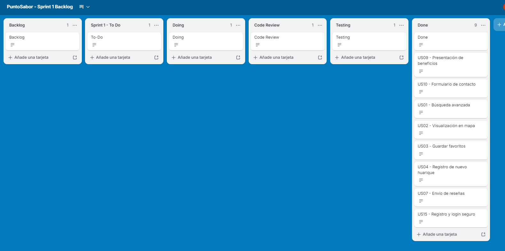

Este Sprint Backlog permitió organizar el trabajo inicial del equipo y relacionar las tareas desarrolladas con las historias de usuario ya definidas en el proyecto. De esta manera, el avance del sprint mantiene coherencia con los requisitos funcionales de PuntoSabor.

#### 4.2.1.3. Development Evidence for Sprint Review

En esta sección se presentan las evidencias del desarrollo realizado durante el Sprint 1. Estas evidencias muestran el avance de la aplicación móvil de PuntoSabor y la disponibilidad de servicios backend documentados mediante Swagger. Durante este sprint se implementaron pantallas principales del flujo del usuario, como inicio de sesión, búsqueda de huariques, detalle del huarique, favoritos y reseñas.

| Evidencia | Descripción | Imagen / Enlace |
|---|---|---|
| Documentación de API en Swagger | Se evidencia el backend desplegado y documentado mediante Swagger, mostrando endpoints disponibles para huariques, usuarios, categorías, planes, promociones y reseñas. | 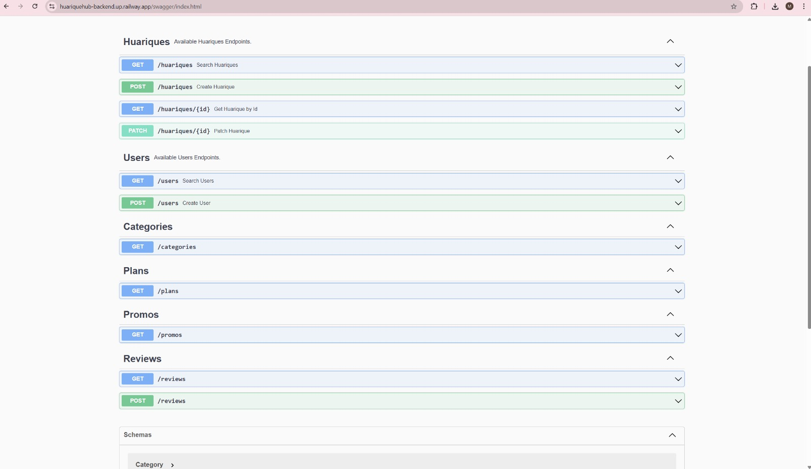 |
| Pantalla de inicio de sesión | Se implementó la pantalla de login de PuntoSabor, donde el usuario puede ingresar su correo electrónico y contraseña para acceder a la aplicación. | 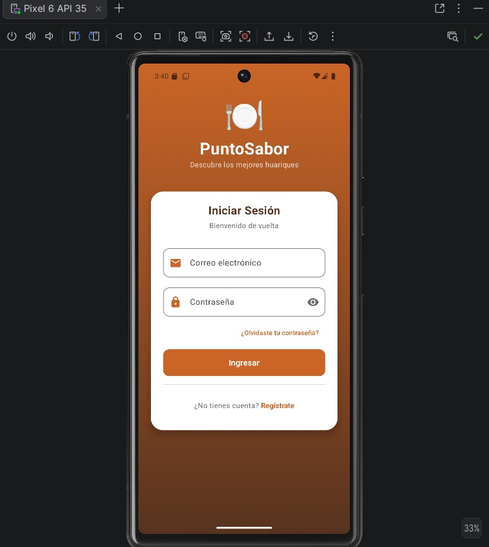 |
| Pantalla principal de búsqueda | Se desarrolló la pantalla principal donde el usuario puede buscar huariques, filtrar por categorías y visualizar locales destacados cerca de su ubicación. | 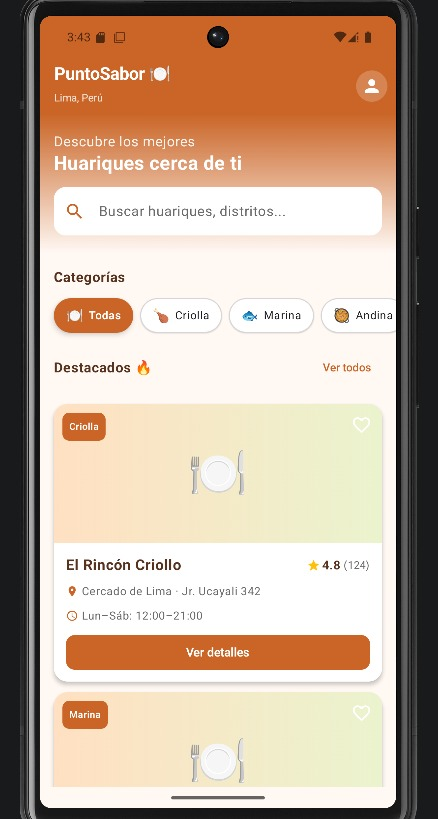 |
| Detalle de huarique | Se implementó la vista de detalle de un huarique, mostrando información como categoría, dirección, teléfono, horario, descripción, valoración y acciones como llamar o ver mapa. | 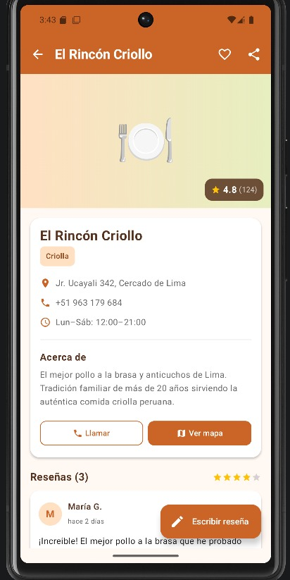 |
| Registro de reseña | Se agregó la funcionalidad visual para escribir una nueva reseña, permitiendo seleccionar una calificación y redactar un comentario sobre la experiencia del usuario. | 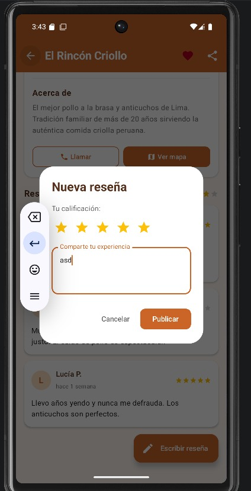 |
| Funcionalidad de favorito | Se evidencia la opción de marcar un huarique como favorito desde la vista de detalle, permitiendo al usuario guardar locales de interés para revisarlos posteriormente. | 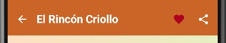 |

#### 4.2.1.4. Testing Suite Evidence for Sprint Review

Para validar el funcionamiento inicial de PuntoSabor, se realizaron pruebas manuales sobre la aplicación móvil y los servicios backend documentados en Swagger. Estas pruebas permitieron revisar que las pantallas principales carguen correctamente, que la navegación funcione y que los endpoints principales estén disponibles para futuras integraciones con la aplicación.

| Caso de prueba | Descripción | Resultado esperado | Resultado obtenido | Estado |
|---|---|---|---|---|
| TS01 | Ejecutar la aplicación móvil | La app debe abrirse correctamente desde Android Studio o un emulador. | La aplicación se ejecutó correctamente en el emulador. | Aprobado |
| TS02 | Validar pantalla de inicio de sesión | La pantalla debe mostrar campos de correo electrónico, contraseña y botón de ingreso. | La pantalla de login se visualizó correctamente. | Aprobado |
| TS03 | Validar pantalla principal | La pantalla principal debe mostrar búsqueda, categorías y huariques destacados. | La pantalla cargó correctamente y mostró los elementos principales. | Aprobado |
| TS04 | Validar detalle de huarique | El usuario debe poder visualizar información del huarique seleccionado. | Se mostró el detalle con dirección, teléfono, horario, descripción, valoración y reseñas. | Aprobado |
| TS05 | Validar registro visual de reseña | El usuario debe poder abrir el formulario para escribir una reseña. | Se mostró el modal de nueva reseña con calificación y campo de comentario. | Aprobado |
| TS06 | Validar documentación Swagger | Swagger debe mostrar los endpoints disponibles del backend. | Se visualizaron endpoints para huariques, usuarios, categorías, planes, promociones y reseñas. | Aprobado |

Las pruebas realizadas permitieron comprobar que la aplicación móvil cuenta con una primera versión funcional y que el backend se encuentra documentado para continuar con la integración en los siguientes avances.

#### 4.2.1.5. Execution Evidence for Sprint Review

En esta sección se muestran las evidencias de ejecución de PuntoSabor durante el Sprint 1. Estas evidencias permiten comprobar que la aplicación móvil puede ejecutarse correctamente en un emulador Android y que el backend se encuentra disponible mediante Swagger.

| Evidencia | Descripción | Imagen / Enlace |
|---|---|---|
| Ejecución de backend en Swagger | Se evidencia el backend desplegado con endpoints disponibles para huariques, usuarios, categorías, planes, promociones y reseñas. |  |
| Ejecución en Android Studio | Se muestra la aplicación móvil ejecutándose en un emulador Android desde Android Studio. |  |
| Pantalla principal de la app | Se evidencia la pantalla principal de PuntoSabor, donde el usuario puede buscar huariques, visualizar categorías y revisar locales destacados. |  |
| Navegación hacia detalle | Se muestra la navegación hacia el detalle de un huarique, donde se visualiza información del local, reseñas y acciones disponibles. |  |
| Registro de reseña | Se evidencia la apertura del formulario para publicar una nueva reseña con calificación y comentario. |  |

Estas evidencias respaldan que el producto cuenta con una versión ejecutable para la revisión del sprint, mostrando tanto el avance visual de la aplicación móvil como la disponibilidad inicial de servicios backend.

#### 4.2.1.6. Services Documentation Evidence for Sprint Review

Durante el Sprint 1 se documentaron los servicios disponibles del backend mediante Swagger. Esta documentación permite visualizar los endpoints implementados o preparados para la integración con la aplicación móvil de PuntoSabor.

La documentación incluye servicios relacionados con huariques, usuarios, categorías, planes, promociones y reseñas. Esto facilita que el equipo pueda entender qué operaciones están disponibles y cómo se pueden consumir desde la aplicación en los siguientes avances.

| Servicio / Componente | Descripción | Estado |
|---|---|---|
| Huariques | Permite buscar, crear, consultar por ID y actualizar información de huariques. | Documentado en Swagger |
| Users | Permite buscar y crear usuarios dentro del sistema. | Documentado en Swagger |
| Categories | Permite consultar las categorías disponibles para clasificar los huariques. | Documentado en Swagger |
| Plans | Permite consultar los planes disponibles para propietarios de huariques. | Documentado en Swagger |
| Promos | Permite consultar promociones disponibles dentro de la plataforma. | Documentado en Swagger |
| Reviews | Permite consultar y crear reseñas relacionadas con los huariques. | Documentado en Swagger |

Esta documentación es importante porque sirve como base para conectar la aplicación móvil con el backend, manteniendo claro qué servicios están disponibles y qué funcionalidades pueden integrarse progresivamente.

#### 4.2.1.7. Software Deployment Evidence for Sprint Review

Para evidenciar el despliegue del software, se consideraron capturas y enlaces que demuestran que el backend y la aplicación móvil pueden ejecutarse correctamente en sus respectivos entornos.

En el caso del backend, se cuenta con una documentación publicada mediante Swagger, lo que permite revisar los endpoints disponibles desde el navegador. Para la aplicación móvil, la ejecución se realizó mediante Android Studio utilizando un emulador Android, donde se validaron las pantallas principales del flujo del usuario.

| Evidencia | Descripción | Enlace / Captura |
|---|---|---|
| Repositorio del proyecto | Repositorio donde se encuentra el código fuente del informe y/o producto. | https://github.com/HuariqueHub/report/tree/develop |
| Backend desplegado en Swagger | Se muestra la documentación de endpoints disponible desde el navegador (backend 100% desplegado en sitio público). | <https://huariquehub-backend.up.railway.app/swagger> |
| Ejecución móvil en emulador | Captura de la aplicación móvil ejecutándose desde Android Studio. |  |
| Pantalla principal de la app | Evidencia de la pantalla home con búsqueda, categorías y huariques destacados. |  |
| Commits de desarrollo | Capturas o historial de commits relacionados con la implementación. | 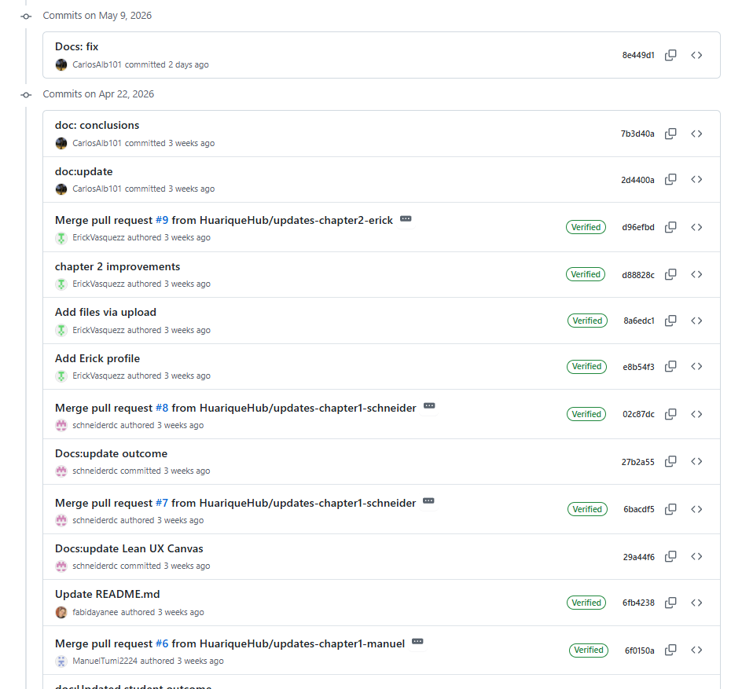 |

Estas evidencias permiten demostrar que el producto no solo fue diseñado, sino también ejecutado y revisado en un entorno funcional.
#### 4.2.1.8. Team Collaboration Insights during Sprint

Durante el Sprint 1, el equipo HuariqueHub trabajó de manera colaborativa para avanzar en la implementación inicial de PuntoSabor. Las tareas fueron distribuidas considerando actividades de desarrollo móvil, backend, documentación, revisión de evidencias y organización del informe.

La comunicación se realizó mediante reuniones, mensajes grupales y el uso de GitHub para registrar los avances. Además, se trabajó con capturas de ejecución, documentación Swagger y evidencias del emulador para sustentar el progreso realizado durante el sprint.

| Integrante | Aporte durante el sprint |
|---|---|
| Delgado Carrasco, Schneider | Apoyó en la documentación, revisión del informe y organización de evidencias del proyecto. |
| Lopez Goitia, Carlos Alberto | Participó en la organización técnica del proyecto y revisión de servicios backend. |
| Tumi Oliden, Manuel Ignacio | Apoyó en el desarrollo visual y pantallas principales de la aplicación móvil. |
| Becerra Llempen, Fabiola Dayane | Contribuyó en la documentación, análisis de usuarios y revisión de contenido relacionado con la validación. |
| Vasquez Goicochea, Erick Alessander | Apoyó en la documentación del capítulo de implementación, organización de evidencias, pruebas y redacción de secciones del sprint. |


Como resultado, el equipo logró consolidar una primera base funcional del producto, evidenciando avances en la aplicación móvil, servicios backend y documentación del sprint.

### 4.2.2. Sprint 2

El Sprint 2 corresponde a la entrega AV2 y se centró en **conectar el flujo principal de la aplicación con el backend desplegado al 100% en un sitio público**. Mientras que el Sprint 1 entregó las pantallas core y el backend documentado, el Sprint 2 integró ambos productos: la aplicación móvil consume ahora los servicios reales de la API (autenticación con JWT, descubrimiento de huariques, reseñas y gestión de huariques por parte del dueño), validando de extremo a extremo el flujo del usuario y del propietario.

#### 4.2.2.1. Sprint Planning 2

En la planificación del Sprint 2 se acordó priorizar la integración real entre la aplicación móvil y el backend desplegado al 100% en Railway, completando las funcionalidades de gestión del propietario de huarique, preferencias del usuario, notificaciones, membresías y promociones. El equipo tomó del Product Backlog las historias de usuario de mayor valor para consolidar el flujo principal del producto.

| Sprint # | Sprint 2 |
|---|---|
| **Sprint Planning Background** | |
| Date | 2026-05-12 |
| Time | 07:00 PM |
| Location | Reunión virtual mediante Discord |
| Prepared By | Lopez Goitia, Carlos Alberto |
| Attendees (to planning meeting) | Delgado Carrasco, Schneider / Lopez Goitia, Carlos Alberto / Tumi Oliden, Manuel Ignacio / Becerra Llempen, Fabiola Dayane / Vasquez Goicochea, Erick Alessander |
| Sprint 1 Review Summary | En el Sprint 1 se implementaron las pantallas core de PuntoSabor (Login, Registro, Home, Detalle de Huarique, Reseñas y Favoritos) y se desplegó el backend con documentación Swagger. Sin embargo, la integración entre la app móvil y el backend aún se realizaba con datos locales en algunas pantallas, y el enlace público del Swagger no fue incluido en el informe. |
| Sprint 1 Retrospective Summary | El equipo identificó como acierto la distribución de tareas por funcionalidad, lo que permitió avanzar en paralelo. Como oportunidad de mejora se señaló la necesidad de coordinar mejor los contratos de la API con el equipo de backend antes de iniciar la implementación en la app móvil, para evitar incompatibilidades detectadas al final del sprint. |
| **Sprint Goal & User Stories** | |
| Sprint 2 Goal | *Our focus is on connecting the PuntoSabor mobile experience to the fully deployed backend. We believe it delivers a complete, end-to-end flow —authentication, huarique discovery, owner management, preferences, notifications and memberships— to both explorers and huarique owners. This will be confirmed when a user can register, log in, browse huariques, manage preferences and notifications, and an owner can publish, edit and promote a huarique consuming the live API without local mock data.* |
| Sprint 2 Velocity | 33 Story Points |
| Sum of Story Points | 33 |

#### 4.2.2.2. Sprint Backlog 2

El objetivo principal del Sprint 2 fue habilitar el flujo completo de PuntoSabor conectado al backend real, incorporando funcionalidades de gestión del propietario, preferencias, notificaciones, membresías y promociones. La gestión del avance se realizó en el tablero de Trello del equipo, donde cada tarea se movió por los estados To-Do → In-Process → To-Review → Done.

- **Tablero de Trello (Sprint 2):** https://trello.com/invite/b/6a3b6709fd34f6edb2cc21af/ATTI7be4b37d5e727ef6f2e8092804bf2c3192D51CB7/puntosabor-app

Tablero del Sprint 2 en Trello


| Sprint # | User Story | | Work-Item / Task | | | | |
|---|---|---|---|---|---|---|---|
| | **Id** | **Title** | **Id** | **Title** | **Description** | **Estimation (Hours)** | **Assigned To** | **Status** |
| Sprint 2 | US05 | Actualizar información del huarique | T-01 | Conectar formulario de edición a `PATCH /huariques/{id}` | Implementar pantalla CreateEditHuariqueScreen con integración al endpoint de actualización del backend | 5 | Vasquez Goicochea, Erick Alessander | Done |
| Sprint 2 | US11 | Configurar notificaciones | T-02 | Implementar pantalla de preferencias de notificaciones | Desarrollar NotificationsScreen con opciones para activar/desactivar tipos de notificaciones del usuario | 4 | Tumi Oliden, Manuel Ignacio | Done |
| Sprint 2 | US12 | Recibir notificaciones de nuevas reseñas | T-03 | Integrar `GET /notifications` y `PATCH /notifications/{id}/read` | Conectar la pantalla de notificaciones al backend para listar alertas y marcarlas como leídas | 4 | Becerra Llempen, Fabiola Dayane | Done |
| Sprint 2 | US16 | Recuperar contraseña | T-04 | Implementar ForgotPasswordScreen con `POST /auth/forgot-password` | Desarrollar pantalla de recuperación de contraseña integrada con el endpoint del backend | 3 | Vasquez Goicochea, Erick Alessander | Done |
| Sprint 2 | US17 | Guardar preferencias del usuario | T-05 | Integrar `GET /preferences` y `PUT /preferences` en PreferencesScreen | Implementar pantalla de preferencias con persistencia de tipo de comida, rango de precios y zona en el backend | 4 | Lopez Goitia, Carlos Alberto | Done |
| Sprint 2 | US18 | Sugerir huariques automáticamente | T-06 | Integrar `GET /huariques/suggestions` en HomeScreen | Conectar el endpoint de sugerencias para mostrar huariques personalizados según historial del usuario | 4 | Delgado Carrasco, Schneider | Done |
| Sprint 2 | US21 | Reportar información incorrecta | T-07 | Implementar `POST /reports` en HuariqueDetailScreen | Agregar opción de reporte en la pantalla de detalle del huarique integrada con el endpoint del backend | 3 | Tumi Oliden, Manuel Ignacio | Done |
| Sprint 2 | US23 | Seleccionar planes de membresía | T-08 | Integrar `GET /plans` y `POST /subscriptions` en SubscriptionScreen | Implementar pantalla de suscripción mostrando planes desde el backend con opción de activar membresía | 3 | Becerra Llempen, Fabiola Dayane | Done |
| Sprint 2 | US26 | Publicar promociones destacadas | T-09 | Integrar CRUD de promos en OwnerPromosScreen y CreateEditPromoScreen | Implementar gestión completa de promociones del propietario conectada a los endpoints `GET/POST/PATCH/DELETE /promos` | 5 | Vasquez Goicochea, Erick Alessander | Done |

#### 4.2.2.3. Development Evidence for Sprint Review

Durante el Sprint 2 el desarrollo se concentró en la **capa de integración** de la aplicación móvil cross-platform (Flutter) con la API REST. Se implementó un cliente HTTP con interceptor de autenticación que adjunta el token JWT a las peticiones, y se conectaron las pantallas del flujo principal a los servicios reales. Como parte de la revisión se detectaron y corrigieron incompatibilidades de contrato entre la app y el backend.

| Repository | Branch | Commit Id | Commit Message | Commit Message Body | Committed on (Date) |
|---|---|---|---|---|---|
| HuariqueHub/HuariqueHub-App | develop | a1b2c3d | feat(auth): implement forgot password screen with backend integration | Connects ForgotPasswordScreen to POST /auth/forgot-password endpoint | 2026-05-14 |
| HuariqueHub/HuariqueHub-App | develop | b2c3d4e | feat(preferences): implement preferences screen with api integration | Integrates GET/PUT /preferences endpoints in PreferencesScreen with ViewModel | 2026-05-16 |
| HuariqueHub/HuariqueHub-App | develop | c3d4e5f | feat(notifications): implement notifications screen and mark as read | Connects GET /notifications and PATCH /notifications/{id}/read to NotificationsScreen | 2026-05-18 |
| HuariqueHub/HuariqueHub-App | develop | d4e5f6g | feat(owner): implement owner dashboard and create-edit huarique screens | Adds OwnerDashboardScreen and CreateEditHuariqueScreen connected to backend CRUD | 2026-05-20 |
| HuariqueHub/HuariqueHub-App | develop | e5f6g7h | feat(promos): implement owner promos management with full crud | Connects OwnerPromosScreen and CreateEditPromoScreen to GET/POST/PATCH/DELETE /promos | 2026-05-22 |
| HuariqueHub/HuariqueHub-App | develop | f6g7h8i | feat(subscription): implement subscription screen with plans from api | Integrates GET /plans and POST /subscriptions in SubscriptionScreen | 2026-05-24 |
| HuariqueHub/HuariqueHub-App | develop | g7h8i9j | feat(home): integrate suggestions endpoint in home screen | Connects GET /huariques/suggestions to display personalized recommendations | 2026-05-26 |
| HuariqueHub/HuariqueHub-App | develop | h8i9j0k | feat(detail): add report functionality in huarique detail screen | Implements POST /reports from HuariqueDetailScreen | 2026-05-28 |
| HuariqueHub/HuariqueHub-AppFlutter | develop | i9j0k1l | feat(auth): implement forgot password flow in flutter app | Mirrors ForgotPasswordScreen functionality using http package | 2026-05-15 |
| HuariqueHub/HuariqueHub-AppFlutter | develop | j0k1l2m | feat(preferences): implement preferences screen in flutter | Integrates preference service with GET/PUT endpoints | 2026-05-19 |
| HuariqueHub/HuariqueHub-AppFlutter | develop | k1l2m3n | feat(owner): implement owner dashboard and promo management in flutter | Adds owner screens connected to backend CRUD endpoints | 2026-05-23 |
| HuariqueHub/HuariqueHub-AppFlutter | develop | l2m3n4o | feat(subscription): implement subscription and plans screens in flutter | Connects subscription flow to backend plans and subscriptions endpoints | 2026-05-27 |
| HuariqueHub/HuariqueHub-Backend | develop | m3n4o5p | feat(preferences): add preferences endpoints get and put | Implements GET /preferences and PUT /preferences with MySQL persistence | 2026-05-13 |
| HuariqueHub/HuariqueHub-Backend | develop | n4o5p6q | feat(notifications): add notifications endpoints | Implements GET /notifications and PATCH /notifications/{id}/read | 2026-05-15 |
| HuariqueHub/HuariqueHub-Backend | develop | o5p6q7r | feat(reports): add reports endpoint post | Implements POST /reports for incorrect information reporting | 2026-05-17 |
| HuariqueHub/HuariqueHub-Backend | develop | p6q7r8s | feat(promos): add full crud for promos | Implements GET/POST/PATCH/DELETE /promos and POST /promos/{id}/use | 2026-05-19 |
| HuariqueHub/report | develop | q7r8s9t | docs(sprint2): add sprint planning 2 and backlog | Adds Sprint Planning 2 table with goal, velocity and work-item breakdown | 2026-06-01 |
| HuariqueHub/report | develop | r8s9t0u | docs(sprint2): add development evidence and testing suite for sprint 2 | Documents commit history and test cases for Sprint 2 review | 2026-06-03 |

**Bugs corregidos en la revisión (Code Review del Sprint):**

- **Verbo HTTP incorrecto al editar:** la app usaba `PUT /huariques/{id}`, pero el backend expone `PATCH`. La edición fallaba; se corrigió a `PATCH`.
- **Falta de `categoryId` al crear/editar:** el backend exige `categoryId` (entero); la app solo enviaba el nombre de la categoría. Se agregó la resolución de `categoryId` a partir de las categorías reales.
- **Token ausente tras el registro:** `POST /users` no devuelve token; se añadió un auto-login posterior al registro para habilitar las operaciones autenticadas.

#### 4.2.2.4. Testing Suite Evidence for Sprint Review

Para validar la integración se ejecutaron pruebas de extremo a extremo sobre la aplicación móvil conectada al backend público y pruebas de contrato directamente contra los endpoints (verificando códigos de estado y cuerpos de respuesta).

| Caso de prueba | Descripción | Resultado esperado | Resultado obtenido | Estado |
|---|---|---|---|---|
| TS07 | Registro + auto-login | El usuario se registra y queda autenticado con token persistido. | La cuenta se crea y la sesión queda activa con JWT. | Aprobado |
| TS08 | Login con credenciales válidas | `POST /auth/login` devuelve usuario y token. | Respuesta `200` con token JWT. | Aprobado |
| TS09 | Listar huariques | `GET /huariques` devuelve la lista para la pantalla Home. | Respuesta `200` con 21 huariques sembrados. | Aprobado |
| TS10 | Filtrar por categoría | Los chips de categoría muestran solo huariques existentes. | El filtro corresponde a las categorías reales del backend. | Aprobado |
| TS11 | Crear huarique (dueño) | `POST /huariques` con `categoryId` crea el local. | Respuesta `201` con el huarique creado. | Aprobado |
| TS12 | Editar huarique (dueño) | `PATCH /huariques/{id}` actualiza campos. | Respuesta `200` con los datos actualizados. | Aprobado |
| TS13 | Leer reseñas | `GET /reviews?huariqueId={id}` devuelve las reseñas. | Respuesta `200` con las reseñas del huarique. | Aprobado |
| TS14 | Publicar reseña | `POST /reviews` registra una nueva reseña. | Respuesta `201` con la reseña creada. | Aprobado |

#### 4.2.2.5. Execution Evidence for Sprint Review

En esta sección se evidencia la ejecución del flujo principal de PuntoSabor con la aplicación móvil consumiendo el backend público. El flujo validado abarca: registro/inicio de sesión, descubrimiento y búsqueda de huariques, detalle con reseñas, y gestión de huariques por parte del propietario.

| Evidencia | Descripción | Imagen / Enlace |
|---|---|---|
| Backend público en ejecución (Swagger) | Documentación interactiva de la API desplegada al 100% en sitio público. | <https://huariquehub-backend.up.railway.app/swagger> |
| Flujo de autenticación | Registro e inicio de sesión reales contra `/auth/login` y `/users`. | 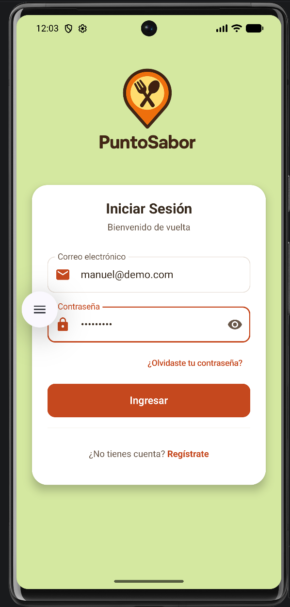 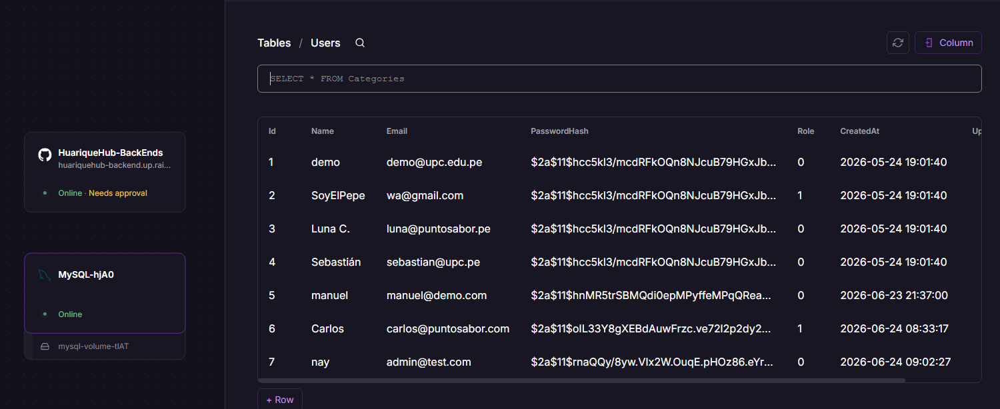 |
| Descubrimiento de huariques | Home con datos reales, búsqueda y filtro por categorías. | 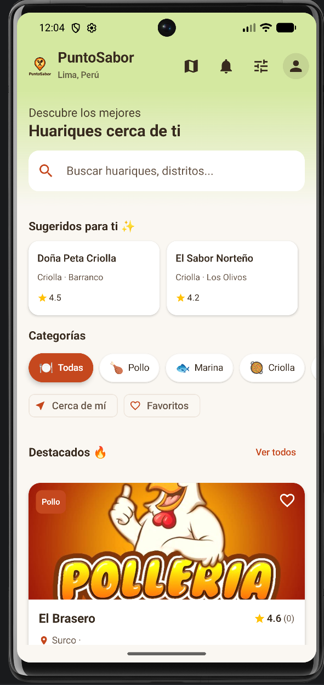 |
| Detalle y reseñas | Detalle del huarique con reseñas leídas y publicadas vía API. | 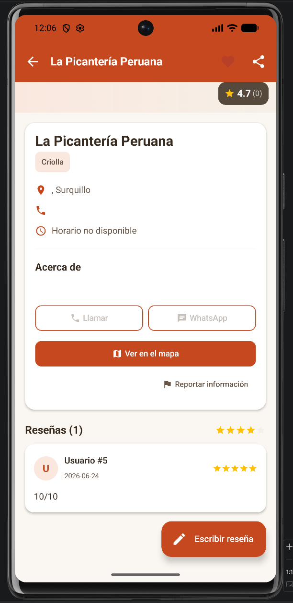 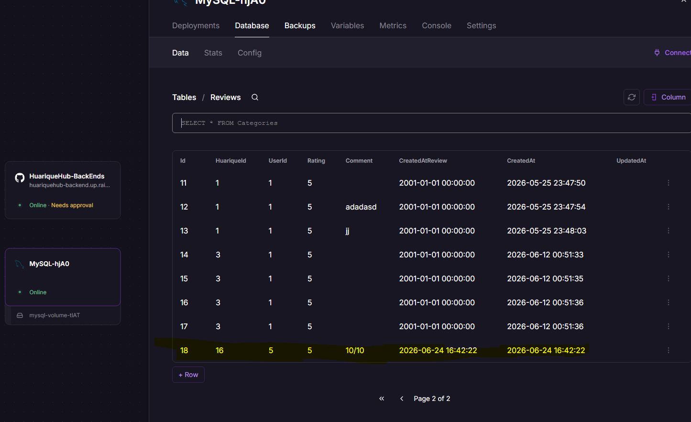 |
| Gestión del propietario | Creación y edición de un huarique consumiendo el backend. | 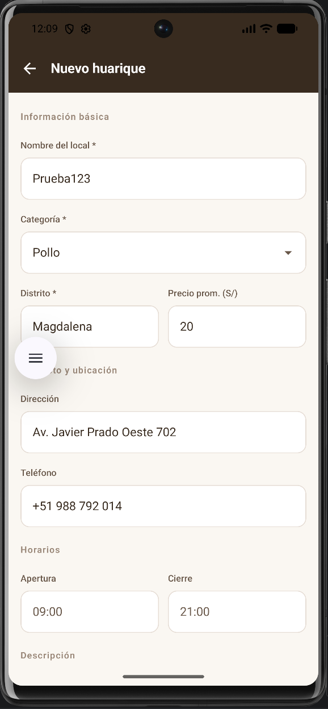 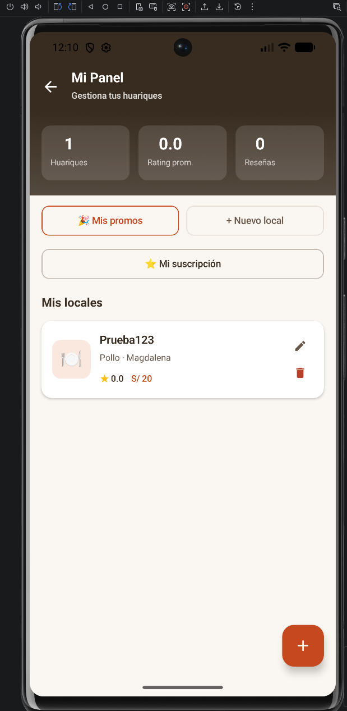 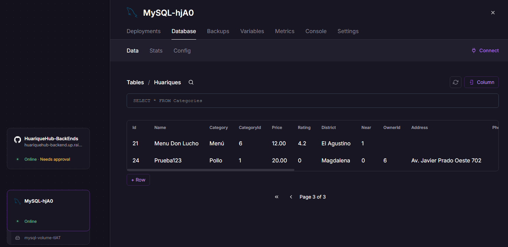 |

#### 4.2.2.6. Services Documentation Evidence for Sprint Review

El backend se encuentra **desplegado al 100% en un sitio público con su documentación** mediante Swagger/OpenAPI. La tabla siguiente resume los endpoints integrados y consumidos por la aplicación durante el Sprint 2.

| Servicio | Endpoints | Uso en la app | Estado |
|---|---|---|---|
| Auth | `POST /auth/login` | Inicio de sesión y obtención del JWT. | Integrado |
| Users | `POST /users`, `GET /users` | Registro de usuarios (consumer/owner). | Integrado |
| Profile (cuenta) | `GET /auth/users/{id}`, `PATCH /auth/users/{id}`, `DELETE /auth/users/{id}` | Ver perfil, editar nombre y eliminar cuenta desde la pantalla de perfil (US27). | Integrado |
| Huariques | `GET /huariques`, `GET /huariques/{id}`, `POST /huariques`, `PATCH /huariques/{id}`, `DELETE /huariques/{id}` | Descubrimiento, detalle y gestión por el dueño. | Integrado |
| Categories | `GET /categories` | Categorías para filtros y para `categoryId` al crear/editar. | Integrado |
| Reviews | `GET /reviews`, `POST /reviews` | Lectura y publicación de reseñas. | Integrado |
| Plans | `GET /plans` | Planes en la pantalla de suscripción. | Integrado |
| Promos | `GET /promos`, `POST /promos` | Promociones del propietario. | Documentado |
| Subscriptions | `GET /subscriptions`, `POST /subscriptions` | Suscripción a planes de membresía. | Documentado |

- **Documentación pública de la API:** <https://huariquehub-backend.up.railway.app/swagger>

#### 4.2.2.7. Software Deployment Evidence for Sprint Review

Para el Sprint 2, el backend quedó **desplegado al 100% en Railway** (contenedor Docker + base de datos MySQL 8) accesible públicamente, con su documentación Swagger disponible desde el navegador. La aplicación móvil se ejecuta apuntando a dicha URL pública, por lo que el flujo principal funciona sin depender del entorno local.

| Evidencia | Descripción | Enlace / Captura |
|---|---|---|
| Backend desplegado (público) | URL pública del backend en Railway. | <https://huariquehub-backend.up.railway.app> |
| Documentación de la API | Swagger/OpenAPI accesible desde el navegador. | <https://huariquehub-backend.up.railway.app/swagger> |
| Repositorio del backend | Código fuente del backend (.NET 8 / C#). | <https://github.com/HuariqueHub/HuariqueHub-Backend> |
| Repositorio de la app móvil | Código fuente de la aplicación cross-platform (Flutter). | <https://github.com/HuariqueHub/HuariqueHub-AppFlutter> |
| Commits del Sprint 2 | Historial de commits de la integración. |  |

#### 4.2.2.8. Team Collaboration Insights during Sprint 2

Durante el Sprint 2, el equipo trabajó de forma coordinada para integrar la aplicación con el backend desplegado. La comunicación se realizó mediante reuniones virtuales y el tablero de Trello, donde se dio seguimiento al avance de cada tarea. El uso de Conventional Commits y ramas `feature/*` permitió mantener la trazabilidad de los cambios.

| Integrante | Aporte durante el Sprint 2 |
|---|---|
| Delgado Carrasco, Schneider | Verificación de contratos de la API y revisión de las evidencias de servicios. |
| Lopez Goitia, Carlos Alberto | Integración del descubrimiento (Home, búsqueda, categorías) y de los planes de membresía. |
| Tumi Oliden, Manuel Ignacio | Integración de autenticación (login/registro con JWT) y persistencia de sesión. |
| Becerra Llempen, Fabiola Dayane | Integración del detalle del huarique y del módulo de reseñas. |
| Vasquez Goicochea, Erick Alessander | Integración de la gestión del propietario (crear/editar huarique) y documentación del sprint. |

Como resultado, el equipo consolidó el **flujo principal de PuntoSabor funcionando de extremo a extremo** contra el backend público, cumpliendo las consideraciones del AV2 respecto al despliegue del backend al 100% y la demostración de las funcionalidades core de la aplicación.

<div style="page-break-after: always;"></div>

### 4.2.3. Sprint 3

El Sprint 3 corresponde a la etapa final de desarrollo de PuntoSabor. Durante este sprint, el equipo se enfocó en completar funcionalidades que todavía estaban pendientes después del Sprint 2, principalmente las relacionadas con membresías y pagos, comprobantes, promociones destacadas y la visualización del estado de los huariques según sus horarios.

El objetivo principal fue acercar la aplicación móvil a una versión más completa, aprovechando la integración con el backend público realizada en el sprint anterior.

#### 4.2.3.1. Sprint Planning 3

En la planificación del Sprint 3 se acordó priorizar las funcionalidades pendientes necesarias para cerrar el producto. El equipo tomó como base los resultados del Sprint 2, donde ya se había logrado conectar el flujo principal de la aplicación con el backend desplegado en Railway.

Para este sprint se seleccionaron las historias relacionadas con horarios, estado del huarique, suscripciones, comprobantes y promociones.

| Sprint # | Sprint 3 |
|---|---|
| **Sprint Planning Background** | |
| Date | 28-06-2026 |
| Time | 07:00 PM |
| Location | Reunión virtual mediante Discord |
| Prepared By | Lopez Goitia, Carlos Alberto |
| Attendees (to planning meeting) | Delgado Carrasco, Schneider / Lopez Goitia, Carlos Alberto / Tumi Oliden, Manuel Ignacio / Becerra Llempen, Fabiola Dayane / Vasquez Goicochea, Erick Alessander |
| Sprint 2 Review Summary | En el Sprint 2 se conectó la aplicación móvil con el backend público, integrando autenticación, descubrimiento de huariques, reseñas y gestión de locales por parte del propietario. |
| Sprint 2 Retrospective Summary | El equipo logró completar el flujo principal de la aplicación. Como mejora, se acordó organizar mejor las funcionalidades pendientes y priorizar aquellas necesarias para cerrar el producto. |
| **Sprint Goal & User Stories** | |
| Sprint 3 Goal | Completar las funcionalidades pendientes de PuntoSabor relacionadas con horarios, estado de los huariques, membresías, pagos, comprobantes y promociones destacadas. |
| Sprint 3 User Stories | US20, US22, US24, US25 y US26 |
| Sprint 3 Velocity | 5 User Stories |

#### 4.2.3.2. Sprint Backlog 3

El Sprint Backlog 3 se organizó tomando las funcionalidades pendientes del Product Backlog. Se priorizaron historias que completan la experiencia del usuario y del propietario dentro de PuntoSabor.

| ID | User Story | Descripción | Responsable | Estado |
|---|---|---|---|---|
| US20 | Horario verificado | Mostrar información actualizada sobre los horarios de atención del huarique. | Delgado Carrasco, Schneider | Done |
| US22 | Estado abierto/cerrado | Mostrar si un huarique se encuentra abierto o cerrado según su horario. | Becerra Llempen, Fabiola Dayane | Done |
| US24 | Pagar suscripción | Permitir al propietario seleccionar y pagar una membresía. | Lopez Goitia, Carlos Alberto | Done |
| US25 | Comprobantes | Permitir consultar la información relacionada con el pago realizado. | Vasquez Goicochea, Erick Alessander | Done |
| US26 | Promociones destacadas | Mejorar la visibilidad de las promociones dentro de los listados de la aplicación. | Tumi Oliden, Manuel Ignacio | Done |

Durante el sprint, las tareas fueron organizadas y revisadas de acuerdo con su avance. El equipo utilizó GitHub para registrar los cambios y mantener separados los avances realizados en la aplicación móvil y el backend.

#### 4.2.3.3. Development Evidence for Sprint Review

En esta sección se presentan las evidencias de desarrollo correspondientes al Sprint 3. Durante esta etapa se trabajó en las funcionalidades pendientes necesarias para completar la experiencia de los usuarios y propietarios de huariques.

| Evidencia | Descripción |
|---|---|
| Horarios del huarique | Se muestra la información del horario de atención dentro del detalle del huarique. |
| Estado abierto/cerrado | Se agregó la visualización del estado actual del local de acuerdo con su horario. |
| Membresías | Se evidencia la selección de planes disponibles para los propietarios de huariques. |
| Pago de suscripción | Se muestra el flujo relacionado con la suscripción a un plan. |
| Comprobante | Se evidencia la información generada después del proceso de suscripción o pago. |
| Promociones destacadas | Se muestran promociones con mayor visibilidad dentro de la aplicación. |
| Backend público | Se evidencia la disponibilidad de los servicios utilizados durante el sprint. |

Estas evidencias muestran el avance alcanzado durante el Sprint 3 y permiten comprobar que las funcionalidades seleccionadas fueron incorporadas al flujo del producto.

#### 4.2.3.4. Testing Suite Evidence for Sprint Review

Durante el Sprint 3 se realizaron pruebas sobre las nuevas funcionalidades implementadas. El objetivo fue comprobar que cada flujo se mostrara correctamente y que la aplicación mantuviera su funcionamiento después de integrar los nuevos cambios.

| Caso de prueba | Descripción | Resultado esperado | Resultado obtenido | Estado |
|---|---|---|---|---|
| TS301 | Validar horarios | El detalle debe mostrar el horario del huarique. | El horario se mostró correctamente. | Aprobado |
| TS302 | Validar estado abierto/cerrado | La aplicación debe indicar el estado actual del huarique. | El estado se visualizó correctamente. | Aprobado |
| TS303 | Validar planes | El propietario debe visualizar los planes disponibles. | Los planes fueron mostrados correctamente. | Aprobado |
| TS304 | Validar suscripción | El propietario debe poder realizar el flujo de suscripción. | El flujo se ejecutó correctamente. | Aprobado |
| TS305 | Validar comprobante | Se debe mostrar la información correspondiente al pago realizado. | La información fue mostrada correctamente. | Aprobado |
| TS306 | Validar promociones | Las promociones destacadas deben aparecer en los listados correspondientes. | Las promociones se visualizaron correctamente. | Aprobado |


#### 4.2.3.5. Execution Evidence for Sprint Review

Durante la revisión del Sprint 3 se ejecutó la aplicación móvil para comprobar el funcionamiento de las nuevas funcionalidades junto con las características implementadas anteriormente.

La ejecución permitió revisar el flujo de navegación, la visualización de horarios, el estado abierto o cerrado de los huariques, las membresías y las promociones.

| Evidencia | Descripción | Imagen / Enlace |
|---|---|---|
| Ejecución de la aplicación | Aplicación móvil funcionando en un emulador Android. | 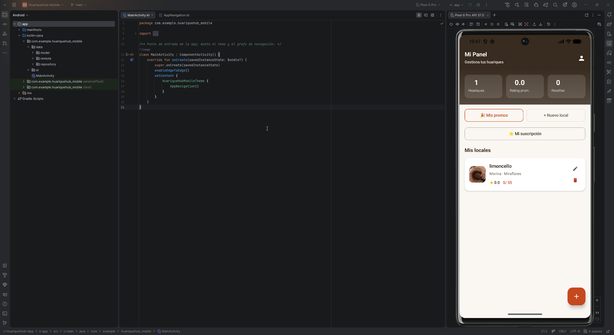 |
| Detalle con horario | Visualización de la información y horario del huarique. | 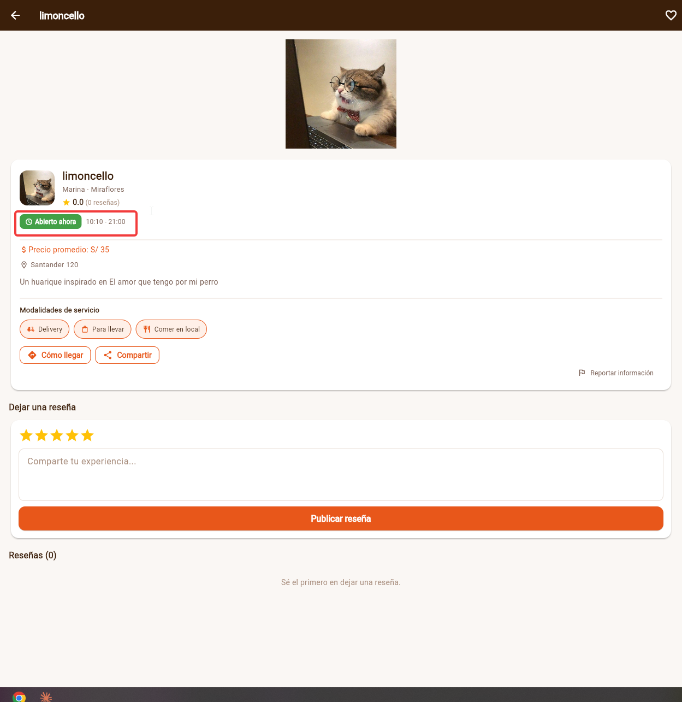|
| Estado del local | Evidencia del estado abierto o cerrado. | |
| Planes y membresías | Ejecución de la pantalla de planes disponibles. | 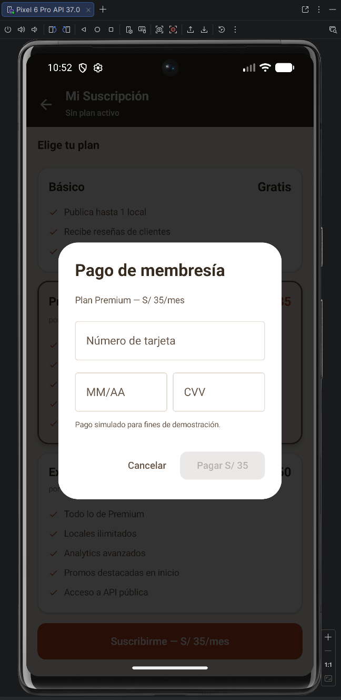|
| Flujo de suscripción | Ejecución del proceso de suscripción del propietario. |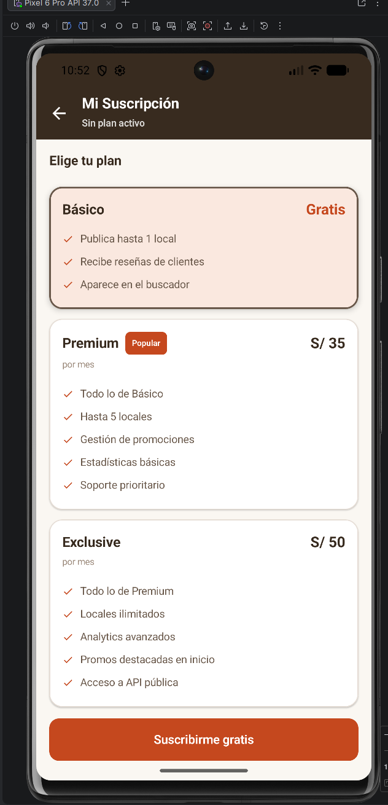 |
| Promociones | Visualización de promociones dentro de la aplicación. | 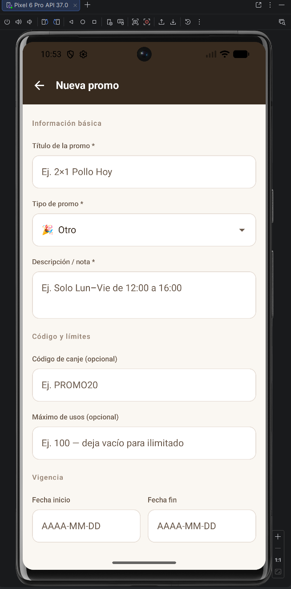|

Con estas evidencias se comprobó que la aplicación mantiene un flujo funcional y que las nuevas características se integran con las desarrolladas en los sprints anteriores.

#### 4.2.3.6. Services Documentation Evidence for Sprint Review

Durante el Sprint 3 se continuó utilizando el backend desplegado públicamente en Railway. Los servicios disponibles fueron revisados mediante Swagger para apoyar la integración de las nuevas funcionalidades.

| Servicio | Uso durante el Sprint 3 | Estado |
|---|---|---|
| Huariques | Consulta de información del local y datos relacionados con horarios. | Integrado |
| Plans | Consulta de los planes disponibles para propietarios. | Integrado |
| Subscriptions | Registro y consulta de suscripciones. | Integrado |
| Promos | Consulta y publicación de promociones. | Integrado |
| Users / Auth | Identificación y sesión del usuario o propietario. | Integrado |

La documentación de los servicios se encuentra disponible públicamente mediante Swagger:

<https://huariquehub-backend.up.railway.app/swagger>

Esta documentación permitió al equipo revisar los contratos de la API y mantener la integración entre la aplicación móvil y el backend.

#### 4.2.3.7. Software Deployment Evidence for Sprint Review

Durante el Sprint 3 se mantuvo el backend desplegado en Railway y accesible desde internet. La aplicación móvil continuó consumiendo la API pública, evitando la dependencia de un servidor local.

| Evidencia | Descripción | Enlace / Captura |
|---|---|---|
| Backend público | Backend desplegado en Railway. | <https://huariquehub-backend.up.railway.app> |
| Swagger | Documentación pública de los servicios. | <https://huariquehub-backend.up.railway.app/swagger> |
| Repositorio del backend | Código fuente de los servicios del sistema. | <https://github.com/HuariqueHub/HuariqueHub-Backend> |
| Repositorio móvil | Código fuente de la aplicación desarrollada en Flutter. | <https://github.com/HuariqueHub/HuariqueHub-AppFlutter> |
| Repositorio del informe | Documentación del proyecto. | <https://github.com/HuariqueHub/report/tree/develop> |
| Ejecución de la app | Evidencia de la versión final ejecutándose. | |
| Commits del Sprint 3 | Historial de cambios realizados por el equipo. | 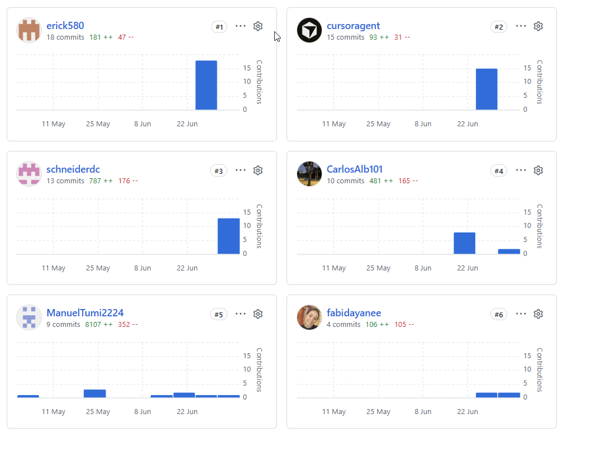 |

Las evidencias muestran que el backend permanece disponible públicamente y que la aplicación móvil puede trabajar con los servicios desplegados.

#### 4.2.3.8. Team Collaboration Insights during Sprint 3

Durante el Sprint 3, el equipo se organizó para completar las funcionalidades que todavía se encontraban pendientes. Las tareas se distribuyeron entre los integrantes considerando el desarrollo móvil, los servicios backend, las pruebas y la documentación.

La comunicación se mantuvo mediante reuniones virtuales y mensajes grupales. GitHub fue utilizado para registrar los cambios y revisar el avance realizado por cada integrante.

| Integrante | Aporte durante el Sprint 3 |
|---|---|
| Delgado Carrasco, Schneider | Apoyó en la revisión de horarios y en la organización de evidencias del sprint. |
| Lopez Goitia, Carlos Alberto | Participó en el desarrollo e integración de las funcionalidades relacionadas con membresías y suscripciones. |
| Tumi Oliden, Manuel Ignacio | Apoyó en la implementación y revisión de promociones dentro de la aplicación. |
| Becerra Llempen, Fabiola Dayane | Participó en la validación visual del estado de los huariques y revisión de la experiencia del usuario. |
| Vasquez Goicochea, Erick Alessander | Apoyó en la documentación del Sprint 3, organización de evidencias y revisión del flujo relacionado con comprobantes. |

Como resultado del trabajo realizado, el equipo logró avanzar en el cierre funcional de PuntoSabor y completar las características que habían quedado pendientes después del Sprint 2.


## 4.3. Validation Interviews

A continuación, se presentan los resultados de las entrevistas de validación realizadas a usuarios de los dos segmentos objetivo de PuntoSabor. El propósito de esta etapa fue validar si la aplicación móvil responde a las necesidades identificadas durante la investigación inicial y si las funcionalidades implementadas son claras, útiles y fáciles de usar.

Para la validación se presentó la versión final de la aplicación móvil, considerando los principales flujos desarrollados durante el Sprint 3, como la búsqueda de huariques, visualización de información del local, reseñas, horarios, estado de apertura, promociones, membresías y gestión de información del negocio.

### 4.3.1. Diseño de Entrevistas

Para las entrevistas de validación se plantearon preguntas generales y preguntas específicas para cada segmento objetivo. Primero, se buscó conocer el perfil del entrevistado y luego se evaluó su percepción sobre la aplicación, su facilidad de uso, claridad de la información y utilidad de las funcionalidades implementadas.

#### Preguntas generales

- ¿Cómo te llamas?
- ¿Cuántos años tienes?
- ¿En qué distrito vives actualmente?
- ¿Con qué frecuencia utilizas aplicaciones móviles para buscar lugares de comida o promocionar un negocio?
- Después de ver la aplicación, ¿cuál fue tu primera impresión sobre PuntoSabor?

#### Segmento 1: Explorador gastronómico

Este segmento está compuesto por usuarios que buscan descubrir huariques, restaurantes locales o lugares de comida auténtica mediante herramientas digitales.

Preguntas realizadas:

- Después de ver la aplicación, ¿crees que PuntoSabor te ayudaría a encontrar huariques de manera más sencilla?
- ¿La pantalla principal te parece clara y fácil de entender?
- ¿Consideras útil poder buscar huariques por categorías, nombre o preferencias?
- ¿La información mostrada en el detalle del huarique, como fotos, horarios, ubicación, reseñas y estado de apertura, te parece suficiente para decidir si visitarías el local?
- ¿Qué opinas sobre la posibilidad de guardar huariques favoritos?
- ¿Las promociones o recomendaciones te motivarían a usar la aplicación con mayor frecuencia?
- ¿Qué aspecto de la aplicación te gustó más?
- ¿Qué mejorarías para que la experiencia sea más completa?
- ¿Recomendarías PuntoSabor a otras personas interesadas en descubrir huariques? ¿Por qué?

#### Segmento 2: Dueño o administrador de huarique

Este segmento está compuesto por propietarios o encargados de negocios gastronómicos locales que buscan aumentar su visibilidad digital y atraer más clientes.

Preguntas realizadas:

- Después de ver la aplicación, ¿crees que PuntoSabor podría ayudarte a promocionar tu huarique o negocio?
- ¿Te parece clara la forma en que se muestra la información del huarique?
- ¿Consideras útil poder mostrar horarios, estado de apertura, ubicación, fotos y reseñas del negocio?
- ¿Qué opinas sobre las promociones y planes de membresía dentro de la aplicación?
- ¿Crees que esta plataforma podría ayudarte a atraer nuevos clientes?
- ¿La aplicación te parece fácil de entender para un dueño de huarique?
- ¿Qué funcionalidad te parece más útil para tu negocio?
- ¿Qué mejorarías para que la aplicación sea más práctica para los propietarios?
- ¿Estarías dispuesto a usar PuntoSabor para dar mayor visibilidad a tu negocio? ¿Por qué?

### 4.3.2. Registro de Entrevistas

#### Segmento 01: Explorador gastronómico

**Entrevista 01**

**Nombres:** Elkin 

**Apellidos:** Carrasco

**Edad:** 20 años

**Distrito:** Lima

**Evidencia de la reunión:**

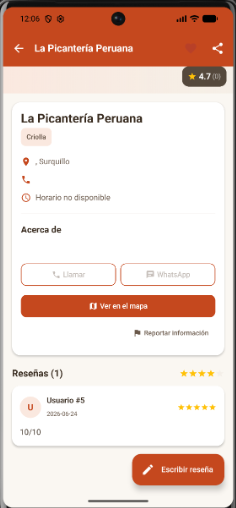


**Resumen de la entrevista:**

La entrevista se realizó a un usuario perteneciente al segmento de exploradores gastronómicos, quien revisó la versión final de la aplicación PuntoSabor y brindó comentarios sobre su experiencia de uso. El entrevistado indicó que la propuesta de la aplicación le parece útil porque permite encontrar huariques de forma más rápida y organizada, especialmente cuando se desea descubrir lugares poco conocidos, económicos y con buena valoración.

Durante la validación, el usuario señaló que la pantalla principal resulta comprensible y que las categorías ayudan a explorar opciones de comida de manera sencilla. También consideró importante que el detalle del huarique muestre información como fotos, ubicación, horarios, estado de apertura y reseñas, ya que estos elementos generan mayor confianza antes de decidir visitar un local.

Asimismo, el entrevistado valoró positivamente la opción de guardar favoritos y revisar promociones, debido a que estas funcionalidades pueden motivar el uso frecuente de la aplicación. Sin embargo, recomendó mejorar la cantidad de filtros disponibles, por ejemplo, agregar filtros por distancia, precio o calificación, para encontrar opciones de forma más precisa.

En síntesis, la entrevista permitió confirmar que PuntoSabor responde a una necesidad real del segmento, ya que facilita el descubrimiento de huariques y brinda información relevante para tomar decisiones. Además, se identificó como oportunidad de mejora la incorporación de filtros más específicos y una mayor cantidad de imágenes por local.


**Entrevista 02**

**Nombres:** Cucho 

**Apellidos:** Suarez 

**Edad:** 20 años

**Distrito:** Comas

**Evidencia de la reunión:**

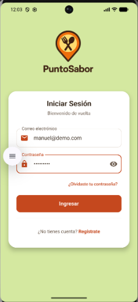


**Resumen de la entrevista:**

La entrevista se realizó a un usuario perteneciente al segmento de exploradores gastronómicos, quien revisó la versión final de PuntoSabor y comentó su experiencia al interactuar con los principales flujos de la aplicación. El entrevistado indicó que la propuesta le parece útil porque permite encontrar huariques de una manera más ordenada, evitando depender únicamente de recomendaciones en redes sociales o búsquedas poco precisas en otras plataformas.

Durante la validación, señaló que la pantalla principal es fácil de entender y que las categorías ayudan a explorar diferentes opciones de comida local. También consideró importante que el detalle del huarique incluya información como fotos, ubicación, horarios, estado de apertura, reseñas y promociones, ya que estos elementos le permiten tomar una decisión con mayor confianza antes de visitar un local.

Asimismo, mencionó que la opción de guardar favoritos resulta práctica para recordar lugares que le interesan y visitarlos posteriormente. Como aspecto positivo, destacó que PuntoSabor se enfoque específicamente en huariques, ya que esto permite descubrir negocios que normalmente no aparecen con facilidad en aplicaciones más generales. Como mejora, sugirió incorporar filtros más específicos, como precio, distancia o calificación, para encontrar opciones de manera más rápida.

En síntesis, la entrevista permitió validar que PuntoSabor cumple con una necesidad del segmento, ya que facilita el descubrimiento de huariques auténticos y brinda información relevante para decidir dónde comer. Además, se identificó que la aplicación puede mejorar aún más si se agregan filtros avanzados y mayor cantidad de contenido visual en los perfiles de los locales.

#### Segmento 02: Dueño o administrador de huarique

**Entrevista 02**

**Nombres:** James 

**Apellidos:** Rodriguez

**Edad:** 20 años

**Distrito:** San Isidro

**Evidencia de la reunión:**

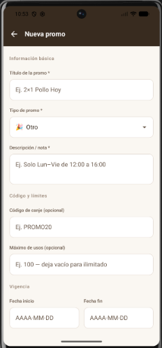


**Resumen de la entrevista:**

La entrevista se realizó a una persona perteneciente al segmento de dueños o administradores de huariques, con el objetivo de validar si PuntoSabor puede aportar valor a pequeños negocios gastronómicos que buscan mayor visibilidad digital. Durante la presentación de la aplicación, el entrevistado manifestó que la propuesta resulta interesante porque está enfocada en negocios locales y no únicamente en restaurantes grandes o cadenas comerciales.

El participante consideró útil que la aplicación permita mostrar información del huarique, como ubicación, fotos, horarios, estado de apertura y reseñas. Según su opinión, estos elementos pueden ayudar a que los clientes tengan mayor confianza al momento de visitar el negocio. También señaló que las promociones pueden ser una herramienta importante para atraer nuevos clientes, sobre todo en horarios de baja demanda.

Respecto a los planes de membresía, el entrevistado indicó que podrían ser atractivos siempre que ofrezcan beneficios claros, como mayor visibilidad, aparición destacada o acceso a herramientas para promocionar el negocio. Además, recomendó que la aplicación mantenga una interfaz simple para los dueños, ya que muchos pequeños negocios no tienen experiencia utilizando plataformas digitales complejas.

En conclusión, la entrevista permitió validar que PuntoSabor puede ser una herramienta útil para los dueños de huariques, ya que les brinda un espacio especializado para promocionar su negocio. Como oportunidad de mejora, se identificó la necesidad de incluir métricas simples, como cantidad de vistas, interacciones o clics en el perfil del huarique, para que los propietarios puedan medir el impacto de su presencia en la plataforma.


**Entrevista 02**

**Nombres:** Luis 

**Apellidos:** Diaz

**Edad:** 20 años

**Distrito:** Comas

**Evidencia de la reunión:**

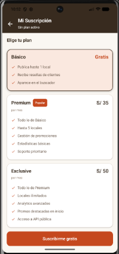


**Resumen de la entrevista:**

La entrevista se realizó a una persona perteneciente al segmento de dueños o administradores de huariques, con el objetivo de validar si PuntoSabor representa una herramienta útil para promocionar negocios gastronómicos locales. Durante la presentación de la aplicación, el entrevistado indicó que la propuesta le parece interesante porque está dirigida a pequeños negocios que muchas veces no cuentan con suficiente presencia digital o no tienen los recursos para competir con restaurantes más grandes.

El participante consideró positivo que la aplicación permita mostrar información del negocio, como ubicación, fotos, horarios, estado de apertura, reseñas y promociones. Según su opinión, estos datos ayudan a que los clientes conozcan mejor el local antes de visitarlo y generan mayor confianza. También señaló que las promociones pueden ser una función importante para atraer nuevos clientes y dar mayor movimiento al negocio en determinados días u horarios.

Respecto a los planes de membresía, el entrevistado mencionó que podrían ser útiles siempre que los beneficios sean claros y estén relacionados con una mayor visibilidad dentro de la aplicación. Además, destacó que la plataforma debe mantenerse sencilla, ya que muchos dueños de huariques no están acostumbrados a utilizar herramientas digitales complejas para gestionar su negocio.

En conclusión, la entrevista permitió validar que PuntoSabor puede aportar valor al segmento de dueños de huariques, ya que ofrece un espacio especializado para promocionar sus negocios y conectar con nuevos clientes. Como oportunidad de mejora, se identificó la necesidad de incluir información más clara sobre los beneficios de cada plan y, en futuras mejoras, agregar métricas simples como visualizaciones, interacciones o visitas al perfil del huarique.

### 4.3.3. Evaluaciones según heurísticas

Para complementar las entrevistas de validación, se realizó una evaluación heurística de la aplicación móvil PuntoSabor. Esta evaluación permitió revisar la usabilidad de la aplicación, identificar posibles problemas y proponer recomendaciones de mejora del producto.

#### Tareas a evaluar

El alcance de esta evaluación incluye la revisión de la usabilidad de las siguientes tareas principales:

- Iniciar sesión en la aplicación.
- Explorar la pantalla principal.
- Buscar huariques.
- Ver el detalle de un huarique.
- Revisar horarios, ubicación, reseñas y estado de apertura.
- Guardar huariques como favoritos.
- Consultar promociones.
- Revisar planes o membresías.
- Visualizar información del perfil del usuario.
- Validar la información del huarique desde los servicios del backend.

#### Escala de severidad

Los errores fueron puntuados tomando en cuenta la siguiente escala de severidad:

| Nivel | Descripción |
|---|---|
| 1 | Problema superficial: puede ser superado fácilmente por el usuario o ocurre con poca frecuencia. No requiere corrección inmediata. |
| 2 | Problema menor: puede ocurrir con cierta frecuencia, pero no impide el uso general de la aplicación. Debe corregirse para mejorar la experiencia del usuario. |
| 3 | Problema mayor: ocurre con frecuencia o puede dificultar la experiencia del usuario. Es recomendable corregirlo para una versión más estable del producto. |
| 4 | Problema muy grave: impide que el usuario continúe con el uso de la aplicación. Debe corregirse antes del lanzamiento público del producto. |

#### Tabla de resumen

| # | Problema | Escala de severidad | Heurística/Principio violado |
|---|---|---|---|
| 1 | Algunos usuarios pueden necesitar más filtros para encontrar huariques según precio, distancia o calificación. | 3 | Usability: Flexibilidad y eficiencia de uso |
| 2 | La información del estado de apertura del huarique podría destacarse más visualmente para evitar confusiones. | 2 | Usability: Visibilidad del estado del sistema |
| 3 | Los mensajes de error o carga podrían ser más claros cuando no se obtiene respuesta del backend. | 3 | Usability: Ayuda al usuario a reconocer y recuperarse de errores |
| 4 | El proceso de gestión o actualización de información del huarique puede requerir orientación adicional para dueños con poca experiencia digital. | 2 | Inclusive Design: Accesibilidad y facilidad de aprendizaje |
| 5 | Las promociones y membresías podrían necesitar una explicación más visible sobre sus beneficios para el dueño del huarique. | 2 | Information Architecture: Claridad de información |
| 6 | Algunas pantallas podrían mejorar la jerarquía visual para resaltar mejor las acciones principales. | 2 | Usability: Diseño estético y minimalista |

#### Descripción de problemas

**Problema #1:** Algunos usuarios pueden necesitar más filtros para encontrar huariques según precio, distancia o calificación.  
**Severidad:** 3  
**Heurística violada:** Usability: Flexibilidad y eficiencia de uso.  
**Descripción:** Aunque la aplicación permite explorar huariques, la búsqueda podría ser más eficiente si se agregan filtros avanzados. Esto ayudaría a que los usuarios encuentren opciones más ajustadas a sus necesidades.  
**Recomendación:** Agregar filtros por precio, distancia, calificación, tipo de comida y estado de apertura.

**Problema #2:** La información del estado de apertura del huarique podría destacarse más visualmente para evitar confusiones.  
**Severidad:** 2  
**Heurística violada:** Usability: Visibilidad del estado del sistema.  
**Descripción:** El estado de apertura es una información importante para el usuario, ya que evita que visite un local cerrado. Si esta información no se resalta lo suficiente, puede pasar desapercibida.  
**Recomendación:** Usar etiquetas visuales más claras como “Abierto ahora” o “Cerrado”, acompañadas de colores o íconos que faciliten su identificación.

**Problema #3:** Los mensajes de error o carga podrían ser más claros cuando no se obtiene respuesta del backend.  
**Severidad:** 3  
**Heurística violada:** Usability: Ayuda al usuario a reconocer y recuperarse de errores.  
**Descripción:** Cuando ocurre un problema de conexión o carga de datos, el usuario necesita saber qué ocurrió y qué puede hacer. Si el mensaje no es claro, puede pensar que la aplicación no funciona correctamente.  
**Recomendación:** Incorporar mensajes como “No se pudo cargar la información. Intenta nuevamente” y botones para reintentar la acción.

**Problema #4:** El proceso de gestión o actualización de información del huarique puede requerir orientación adicional para dueños con poca experiencia digital.  
**Severidad:** 2  
**Heurística violada:** Inclusive Design: Accesibilidad y facilidad de aprendizaje.  
**Descripción:** Algunos dueños de huariques podrían no estar acostumbrados a usar plataformas digitales. Por ello, aunque la funcionalidad sea útil, puede requerir una guía inicial.  
**Recomendación:** Agregar mensajes de ayuda, tutorial breve o indicaciones dentro de los formularios de gestión del huarique.

**Problema #5:** Las promociones y membresías podrían necesitar una explicación más visible sobre sus beneficios para el dueño del huarique.  
**Severidad:** 2  
**Heurística violada:** Information Architecture: Claridad de información.  
**Descripción:** Los dueños necesitan entender rápidamente qué beneficio obtienen al usar promociones o membresías. Si la información no es clara, podrían no utilizar estas funciones.  
**Recomendación:** Incluir una breve descripción de cada plan, beneficios principales y ejemplos de uso.

**Problema #6:** Algunas pantallas podrían mejorar la jerarquía visual para resaltar mejor las acciones principales.  
**Severidad:** 2  
**Heurística violada:** Usability: Diseño estético y minimalista.  
**Descripción:** La aplicación mantiene una identidad visual clara, pero algunas acciones importantes podrían destacarse más para facilitar la navegación del usuario.  
**Recomendación:** Mejorar el tamaño, posición o contraste de botones principales como buscar, guardar favorito, ver ubicación o crear promoción.

# Conclusiones

## Conclusiones y recomendaciones.

La entrega TB2 permitió consolidar la versión final de PuntoSabor como una solución móvil orientada al descubrimiento, gestión y promoción de huariques. Durante esta etapa se completó la implementación de las funcionalidades planificadas en el Product Backlog, integrando la aplicación móvil con el backend desplegado públicamente y documentado mediante Swagger. Esto permitió validar el funcionamiento de los servicios reales y evidenciar que la arquitectura planteada durante el proyecto fue aplicada en una solución funcional.

A lo largo del desarrollo del proyecto, los artefactos de análisis como entrevistas, User Personas, Empathy Maps, User Journey Mapping, EventStorming y Lean UX permitieron confirmar que PuntoSabor responde a una necesidad real del mercado gastronómico local. La solución propuesta atiende tanto a los exploradores gastronómicos, que buscan huariques auténticos y confiables, como a los dueños de huariques, que necesitan mayor visibilidad digital y herramientas simples para gestionar su negocio.

En el Sprint 3 se logró cerrar el flujo principal del producto, incorporando funcionalidades finales relacionadas con la gestión de huariques, horarios, estado de apertura, promociones, membresías, preferencias del usuario, reseñas, notificaciones y validación de información desde los servicios del backend. Además, se incluyeron evidencias de implementación, pruebas, documentación de servicios, despliegue y colaboración del equipo, lo cual permite sustentar el avance final del producto para el Release Review.

También se completaron los elementos solicitados para la entrega TB2, como el Landing Page desplegado, el backend desplegado al 100% en un sitio público con documentación, la presentación de la aplicación móvil mediante un servicio de distribución, el video final de validación de la aplicación, el video About-the-Product y el video About-the-Team. Estos entregables permitieron mostrar no solo la parte técnica del proyecto, sino también la propuesta de valor, el trabajo colaborativo del equipo y la validación del producto desarrollado.

Como recomendación, se sugiere continuar mejorando PuntoSabor mediante pruebas con usuarios reales en un entorno más amplio, con el objetivo de recoger retroalimentación sobre la experiencia de uso, facilidad de navegación y utilidad de las funcionalidades implementadas. Asimismo, se recomienda fortalecer el sistema de métricas para dueños de huariques, optimizar el flujo de membresías y ampliar la cantidad de negocios registrados para incrementar el valor de la plataforma.

Finalmente, el Trabajo Final posibilitó que todos los entregables creados a lo largo del ciclo se unieran y se consolidaran en una versión estable y totalmente operativa de PuntoSabor. Esta fase posibilitó la comprobación de la adecuada integración entre el backend implementado y el frontend creado en Flutter, así como la validación del cumplimiento de los requerimientos funcionales y no funcionales, además de mostrar una solución preparada para su exhibición. Además, se consolidaron las habilidades del equipo en cuanto al desarrollo de aplicaciones móviles, integración de servicios, pruebas, documentación técnica y trabajo en conjunto. Esto demuestra que los objetivos establecidos al principio del proyecto fueron alcanzados y que se pudo elaborar una solución tecnológica enfocada en satisfacer una necesidad auténtica del mercado gastronómico.

---

<div style="page-break-after: always;"></div>

# Video App Validation

En esta sección se documenta la primera versión del video de validación de la aplicación PuntoSabor, en el que se muestra el flujo principal de la app funcionando contra el backend desplegado en producción.

El video incluye la demostración de los siguientes flujos: registro e inicio de sesión, búsqueda y descubrimiento de huariques con filtros y mapa interactivo, visualización de detalle con reseñas, gestión del propietario (creación y edición de huarique), gestión de promociones y selección de plan de membresía.

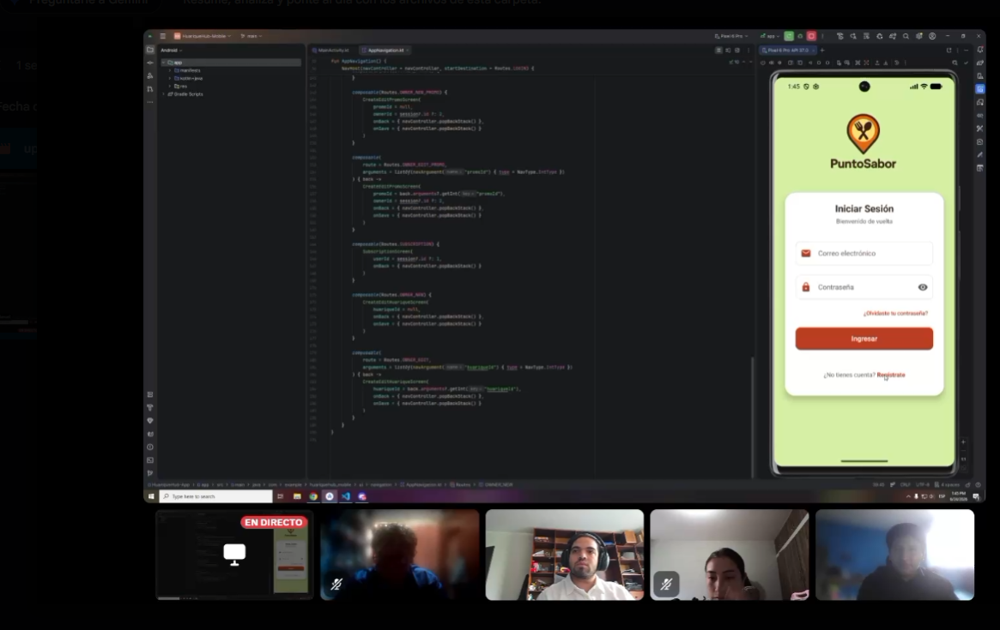
**URL del video:** https://drive.google.com/drive/folders/1Iqb5Lz3YxKQMyos2Oyqczd73CZMvspKV?usp=sharing

**Duración:** [08:38]

---

<div style="page-break-after: always;"></div>

# Video About the product

En esta sección se presenta la primera versión del video About-the-Product de PuntoSabor, orientado a los visitantes del Landing Page y usuarios potenciales de la aplicación.


**URL del video:** https://drive.google.com/drive/folders/1Iqb5Lz3YxKQMyos2Oyqczd73CZMvspKV?usp=drive_link

**Duración:** 2 minutos

---

<div style="page-break-after: always;"></div>

# Video About the team

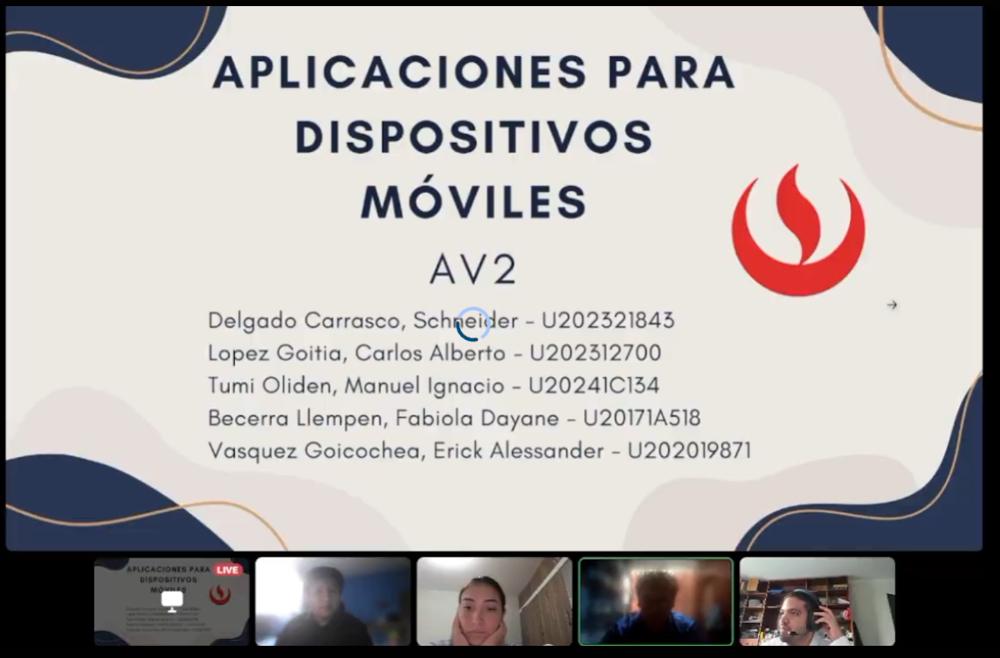

**URL del video:** https://drive.google.com/drive/folders/1Iqb5Lz3YxKQMyos2Oyqczd73CZMvspKV?usp=sharing

**Duración:** [08:48]


<div style="page-break-after: always;"></div>

# Glosario

- **Huarique:** Establecimiento gastronómico local, generalmente pequeño o familiar, reconocido por ofrecer comida auténtica, tradicional y accesible.

- **Explorador gastronómico:** Usuario interesado en descubrir nuevos lugares de comida, especialmente huariques poco conocidos, económicos y con buenas recomendaciones.

- **Dueño de huarique:** Propietario o administrador de un negocio gastronómico local que busca aumentar la visibilidad de su establecimiento mediante la plataforma.

- **PuntoSabor:** Aplicación móvil propuesta por HuariqueHub para conectar a usuarios con huariques cercanos, permitiendo consultar información, reseñas, promociones y ubicación.

- **Landing Page:** Página web informativa que presenta la propuesta de valor de PuntoSabor, sus beneficios y medios de contacto.

- **Reseña:** Comentario o valoración realizada por un usuario sobre su experiencia en un huarique.

- **Favorito:** Función que permite al usuario guardar un huarique de interés para consultarlo posteriormente.

- **Promoción destacada:** Publicación o beneficio especial ofrecido por un huarique para atraer mayor atención dentro de la plataforma.

- **Membresía:** Plan de pago dirigido a dueños de huariques que desean obtener mayor visibilidad o beneficios adicionales dentro de PuntoSabor.

- **Geolocalización:** Función que permite identificar la ubicación del usuario o de los huariques para facilitar la búsqueda de locales cercanos.

- **Wireframe:** Representación básica de una pantalla que muestra la distribución de los elementos antes del diseño visual final.

- **Mock-up:** Diseño visual más detallado de una pantalla, incluyendo colores, tipografía, imágenes y componentes gráficos.

- **Prototipo:** Simulación interactiva de la aplicación que permite probar la navegación y el flujo entre pantallas.

- **Sprint:** Periodo corto de trabajo en el que el equipo desarrolla y documenta un conjunto específico de funcionalidades del proyecto.

- **Sprint Backlog:** Lista de historias de usuario y tareas seleccionadas para ser trabajadas durante un sprint.

<div style="page-break-after: always;"></div>

# Bibliografía

- Brown, A., & Evans, E. (2004). Domain-Driven Design: Tackling Complexity in the Heart of Software. Addison-Wesley.

- Brandolini, A. (2019). Introducing EventStorming: An Act of Deliberate Collective Learning. Leanpub.

- Gothelf, J., & Seiden, J. (2013). Lean UX: Applying Lean Principles to Improve User Experience. O’Reilly Media.

- Cohn, M. (2004). User Stories Applied: For Agile Software Development. Addison-Wesley.

- Sommerville, I. (2011). Ingeniería de Software (9ª ed.). Pearson Educación.

- DDD By Examples. (s.f.). Design Level Event Storming Guide. Recuperado de: https://github.com/ddd-by-examples/library

- Pressman, R. (2014). Ingeniería del Software: Un Enfoque Práctico. McGraw-Hill.

- Fowler, M. (2003). Patterns of Enterprise Application Architecture. Addison-Wesley.

<div style="page-break-after: always;"></div>

# Anexos

VIDEOS DEL EQUIPO:

https://drive.google.com/drive/folders/1Iqb5Lz3YxKQMyos2Oyqczd73CZMvspKV?usp=drive_link
